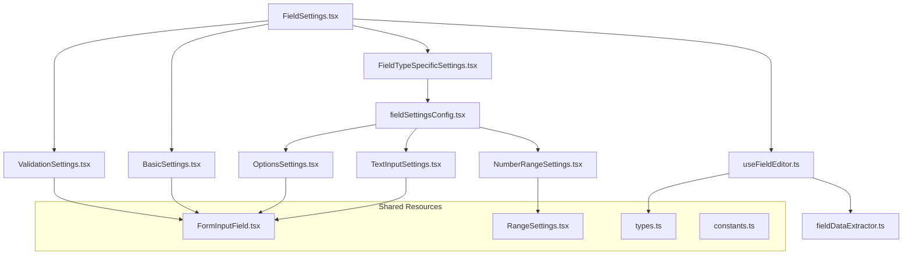

# Field Settings Architecture Guide

> **For Claude AI**: This document provides the complete architecture and patterns for the Field Settings system in dculus-forms. Use this as your primary reference when making changes to field settings components.

## 📋 Quick Reference

### Core Files
- `types.ts` - All TypeScript interfaces and types
- `constants.ts` - All magic strings, CSS classes, error messages
- `fieldSettingsConfig.tsx` - Field type to component mapping
- `FormInputField.tsx` - Universal reusable input component
- `RangeSettings.tsx` - Shared min/max range component
- `useFieldEditor.ts` - Main form management hook
- `fieldDataExtractor.ts` - Type-safe data extraction utilities

### Key Principles
1. **Always use shared components** (`FormInputField`, `RangeSettings`) instead of duplicating code
2. **Import constants** from `constants.ts` - never hardcode strings
3. **Use proper TypeScript interfaces** from `types.ts`
4. **Follow configuration-driven approach** - update `fieldSettingsConfig.tsx` for new field types
5. **Memoize expensive operations** for performance

## 🏗️ Architecture Overview



## 🔧 Component Patterns

### Pattern 1: Basic Settings Component

```typescript
import React from 'react';
import { FormInputField } from './FormInputField';
import { FIELD_SETTINGS_CONSTANTS } from './constants';
import { BaseFieldSettingsProps } from './types';

export const YourSettings: React.FC<BaseFieldSettingsProps> = ({
  control,
  errors,
  isConnected
}) => {
  return (
    <div className={FIELD_SETTINGS_CONSTANTS.CSS_CLASSES.SECTION_SPACING}>
      <h4 className={FIELD_SETTINGS_CONSTANTS.CSS_CLASSES.SECTION_TITLE}>
        {FIELD_SETTINGS_CONSTANTS.SECTION_TITLES.YOUR_SECTION}
      </h4>
      
      <FormInputField
        name="yourField"
        label={FIELD_SETTINGS_CONSTANTS.LABELS.YOUR_LABEL}
        placeholder={FIELD_SETTINGS_CONSTANTS.PLACEHOLDERS.YOUR_PLACEHOLDER}
        control={control}
        error={errors.yourField}
        disabled={!isConnected}
      />
    </div>
  );
};
```

### Pattern 2: Range Settings Component

```typescript
import React from 'react';
import { RangeSettings } from './RangeSettings';
import { FIELD_SETTINGS_CONSTANTS } from './constants';
import { BaseFieldSettingsProps } from './types';

export const YourRangeSettings: React.FC<BaseFieldSettingsProps> = (props) => {
  return (
    <RangeSettings
      {...props}
      rangeType="number" // or "date"
      minFieldName="yourMin"
      maxFieldName="yourMax"
      title={FIELD_SETTINGS_CONSTANTS.SECTION_TITLES.YOUR_RANGE}
      minLabel={FIELD_SETTINGS_CONSTANTS.LABELS.YOUR_MINIMUM}
      maxLabel={FIELD_SETTINGS_CONSTANTS.LABELS.YOUR_MAXIMUM}
      useGridLayout={true} // false for stacked layout
    />
  );
};
```

### Pattern 3: Complex Component with Multiple Inputs

```typescript
import React from 'react';
import { Controller } from 'react-hook-form';
import { FormInputField } from './FormInputField';
import { ErrorMessage } from './ErrorMessage';
import { FIELD_SETTINGS_CONSTANTS } from './constants';
import { BaseFieldSettingsProps } from './types';

export const ComplexSettings: React.FC<BaseFieldSettingsProps> = ({
  control,
  errors,
  isConnected
}) => {
  return (
    <div className={FIELD_SETTINGS_CONSTANTS.CSS_CLASSES.SECTION_SPACING}>
      <h4 className={FIELD_SETTINGS_CONSTANTS.CSS_CLASSES.SECTION_TITLE}>
        Complex Settings
      </h4>
      
      {/* Standard input using FormInputField */}
      <FormInputField
        name="standardField"
        label="Standard Field"
        control={control}
        error={errors.standardField}
        disabled={!isConnected}
      />
      
      {/* Custom input when FormInputField doesn't fit */}
      <div className={FIELD_SETTINGS_CONSTANTS.CSS_CLASSES.INPUT_SPACING}>
        <Controller
          name="customField"
          control={control}
          render={({ field }) => (
            <YourCustomInput
              {...field}
              disabled={!isConnected}
              className={errors.customField ? FIELD_SETTINGS_CONSTANTS.CSS_CLASSES.ERROR_INPUT : ''}
            />
          )}
        />
        <ErrorMessage error={errors.customField} />
      </div>
    </div>
  );
};
```

## 📝 Adding New Field Types

### Step 1: Update Field Configuration

Add to `fieldSettingsConfig.tsx`:

```typescript
export const FIELD_SETTINGS_CONFIG = {
  // ... existing configs
  
  [FieldType.YOUR_NEW_FIELD]: {
    components: [
      { component: TextInputSettings }, // Reuse existing components
      { component: YourCustomSettings }, // Or create new ones
    ],
    supportsCharacterLimits: false,
    supportsPrefix: true,
    hasOptions: false,
  },
};
```

### Step 2: Create Custom Component (if needed)

```typescript
// YourCustomSettings.tsx
import React from 'react';
import { FormInputField } from './FormInputField';
import { FIELD_SETTINGS_CONSTANTS } from './constants';
import { BaseFieldSettingsProps } from './types';

export const YourCustomSettings: React.FC<BaseFieldSettingsProps> = ({
  control,
  errors,
  isConnected
}) => {
  return (
    <FormInputField
      name="customProperty"
      label="Custom Property"
      placeholder="Enter custom value"
      type="text" // or "number", "email", "date"
      control={control}
      error={errors.customProperty}
      disabled={!isConnected}
      transform={{
        // Optional: transform values
        output: (value: string) => value.toUpperCase()
      }}
    />
  );
};
```

### Step 3: Add Constants (if needed)

Update `constants.ts`:

```typescript
export const FIELD_SETTINGS_CONSTANTS = {
  // ... existing constants
  
  LABELS: {
    // ... existing labels
    YOUR_CUSTOM_LABEL: 'Your Custom Label',
  },
  
  PLACEHOLDERS: {
    // ... existing placeholders  
    YOUR_CUSTOM_PLACEHOLDER: 'Enter your custom value',
  },
  
  ERROR_MESSAGES: {
    // ... existing error messages
    YOUR_CUSTOM_ERROR: 'Your custom field is required',
  },
};
```

### Step 4: Add Data Extraction

Update `fieldDataExtractor.ts`:

```typescript
const FIELD_DATA_EXTRACTORS = {
  // ... existing extractors
  
  [FieldType.YOUR_NEW_FIELD]: (field: FormField) => ({
    ...extractBaseFieldData(field),
    customProperty: (field as any).customProperty || '',
    // Add other field-specific properties
  }),
};
```

### Step 5: Export New Component

Update `index.ts`:

```typescript
// Field-specific settings components
export { YourCustomSettings } from './YourCustomSettings';
```

## 🔍 Common Tasks

### Modifying Existing Components

**Always check these files when modifying field settings:**

1. **Component file** - The actual React component
2. **constants.ts** - For any text, CSS classes, or configuration
3. **types.ts** - For TypeScript interfaces
4. **fieldSettingsConfig.tsx** - For field type mappings
5. **fieldDataExtractor.ts** - For data extraction logic

### Adding New Input Types

**Instead of creating custom inputs, extend `FormInputField`:**

```typescript
// In FormInputField.tsx
export interface FormInputFieldProps {
  // ... existing props
  customType?: 'your-custom-type'; // Add new type
}

// In the component
if (customType === 'your-custom-type') {
  return <YourCustomInput {...props} />;
}
```

### Adding New Validation Rules

1. **Update validation schema** in `packages/types/src/validation.ts`
2. **Add error messages** to `constants.ts`
3. **Update field data extraction** if needed

## ⚠️ Important Rules

### DO ✅

```typescript
// Use shared components
<FormInputField name="label" label={CONSTANTS.LABELS.LABEL} ... />

// Use constants
className={FIELD_SETTINGS_CONSTANTS.CSS_CLASSES.SECTION_SPACING}

// Use proper types
interface YourProps extends BaseFieldSettingsProps { ... }

// Memoize expensive operations
const expensiveValue = useMemo(() => heavyComputation(), [deps]);

// Use configuration-driven approach
const config = getFieldSettingsConfig(field.type);
```

### DON'T ❌

```typescript
// Don't duplicate input components
<Input /> // Use FormInputField instead

// Don't hardcode strings
className="space-y-4" // Use constants

// Don't use any types unnecessarily
props: any // Use proper interfaces

// Don't create new switch statements
switch(field.type) { ... } // Use configuration

// Don't inline expensive computations
const value = heavyComputation(); // Memoize instead
```

## 🧪 Testing Patterns

### Component Testing

```typescript
import { render, screen } from '@testing-library/react';
import { useForm } from 'react-hook-form';
import { YourSettings } from './YourSettings';

const TestWrapper = ({ children }: { children: React.ReactNode }) => {
  const form = useForm();
  return (
    <form>
      {React.cloneElement(children as React.ReactElement, {
        control: form.control,
        errors: {},
        isConnected: true,
      })}
    </form>
  );
};

test('renders your settings correctly', () => {
  render(
    <TestWrapper>
      <YourSettings />
    </TestWrapper>
  );
  
  expect(screen.getByLabelText('Your Label')).toBeInTheDocument();
});
```

### Hook Testing

```typescript
import { renderHook } from '@testing-library/react';
import { useFieldEditor } from '../useFieldEditor';

test('extracts field data correctly', () => {
  const mockField = {
    id: 'test',
    type: FieldType.TEXT_INPUT_FIELD,
    label: 'Test Field',
  };
  
  const { result } = renderHook(() =>
    useFieldEditor({
      field: mockField,
      onSave: jest.fn(),
    })
  );
  
  expect(result.current.form.getValues('label')).toBe('Test Field');
});
```

## 🚀 Performance Guidelines

### Memoization Checklist

- ✅ Field data extraction: `useMemo(() => extractFieldData(field), [field?.id, field?.type])`
- ✅ Validation schema: `useMemo(() => getValidationSchema(field?.type), [field?.type])`
- ✅ Option handlers: `useMemo(() => ({ addOption, updateOption, removeOption }), [deps])`
- ✅ Expensive computations: Wrap in `useMemo` or `useCallback`

### Component Optimization

```typescript
// Wrap expensive components in React.memo
export const ExpensiveComponent = React.memo(({ field, ...props }) => {
  // Component implementation
}, (prevProps, nextProps) => {
  // Custom comparison logic if needed
  return prevProps.field?.id === nextProps.field?.id;
});

// Use proper dependencies in effects
useEffect(() => {
  // Effect logic
}, [field?.id, field?.type]); // Only re-run when field changes
```

## 🐛 Debugging Guide

### Common Issues

1. **TypeScript Errors**
   ```typescript
   // Problem: Using wrong interface
   interface Props extends SomeWrongInterface
   
   // Solution: Use correct interface from types.ts
   interface Props extends BaseFieldSettingsProps
   ```

2. **Missing Constants**
   ```typescript
   // Problem: Hardcoded string
   <h4>Field Settings</h4>
   
   // Solution: Use constant
   <h4>{FIELD_SETTINGS_CONSTANTS.SECTION_TITLES.FIELD_SETTINGS}</h4>
   ```

3. **Component Not Rendering**
   ```typescript
   // Problem: Not registered in config
   // Solution: Add to fieldSettingsConfig.tsx
   [FieldType.YOUR_FIELD]: {
     components: [{ component: YourComponent }],
     // ...
   }
   ```

### Debugging Steps

1. **Check field type configuration** in `fieldSettingsConfig.tsx`
2. **Verify data extraction** in `fieldDataExtractor.ts`
3. **Review component props** using React DevTools
4. **Check constants usage** - ensure no hardcoded strings
5. **Validate TypeScript types** - run `pnpm type-check`

## 📚 Reference

### Available Interfaces

```typescript
// From types.ts
BaseFieldSettingsProps        // Basic props for all components
FieldAwareSettingsProps      // When component needs field instance
OptionsSettingsProps         // For option-based components
WatchableSettingsProps       // When component needs watch/setValue
ErrorMessageProps            // For error display components
FieldSettingsConfig          // For field type configuration
```

### Available Components

```typescript
// Reusable components
FormInputField              // Universal input component
RangeSettings              // Min/max range component
ErrorMessage               // Error display component

// Specific components  
BasicSettings              // Label, hint, default value
ValidationSettings         // Required, character limits
TextInputSettings         // Placeholder settings
PrefixSettings            // Prefix configuration
OptionsSettings           // Options management
NumberRangeSettings       // Number min/max
DateRangeSettings         // Date min/max
```

### Available Utilities

```typescript
// From fieldDataExtractor.ts
extractFieldData(field)           // Main extraction function
extractBaseFieldData(field)       // Base field properties
extractValidationData(field)      // Validation settings
extractOptionData(field)          // Options array
extractNumberRangeData(field)     // Number ranges
extractDateRangeData(field)       // Date ranges

// From fieldSettingsConfig.tsx
getFieldSettingsConfig(fieldType) // Get field configuration
fieldSupportsFeature(fieldType, feature) // Check feature support

// From useFieldEditor.ts
useFieldEditor({ field, onSave, onCancel }) // Main hook
```

### Constants Structure

```typescript
FIELD_SETTINGS_CONSTANTS = {
  VALIDATION_LIMITS: { /* limits and constraints */ },
  CSS_CLASSES: { /* reusable CSS classes */ },
  ERROR_MESSAGES: { /* error message strings */ },
  PLACEHOLDERS: { /* input placeholder texts */ },
  SECTION_TITLES: { /* section heading texts */ },
  LABELS: { /* input label texts */ },
  BUTTONS: { /* button text strings */ },
  INFO_MESSAGES: { /* informational messages */ },
}
```

---

## 📋 Checklist for Changes

When modifying field settings, ensure you:

- [ ] Used proper TypeScript interfaces from `types.ts`
- [ ] Imported constants from `constants.ts` (no hardcoded strings)
- [ ] Used `FormInputField` or `RangeSettings` instead of custom inputs
- [ ] Updated `fieldSettingsConfig.tsx` for new field types
- [ ] Added data extraction logic to `fieldDataExtractor.ts`
- [ ] Exported new components in `index.ts`
- [ ] Added proper JSDoc documentation
- [ ] Memoized expensive operations
- [ ] Ran `pnpm type-check` to verify TypeScript compliance
- [ ] Tested component behavior with different field types

**Remember**: The architecture prioritizes reusability, type safety, and maintainability. Always prefer extending existing components over creating new ones, and use the configuration-driven approach for field type mapping.