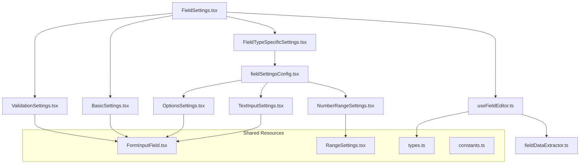

# Field Settings Architecture Guide

> **For Claude AI**: This document provides the complete architecture and patterns for the Field Settings system in dculus-forms. Use this as your primary reference when making changes to field settings components.

## 📋 Quick Reference

### Core Files
- `types.ts` - All TypeScript interfaces and types
- `constants.ts` - All magic strings, CSS classes, error messages
- `fieldSettingsConfig.tsx` - Field type to component mapping
- `FormInputField.tsx` - Universal reusable input component
- `RangeSettings.tsx` - Shared min/max range component
- `useFieldEditor.ts` - Main form management hook
- `fieldDataExtractor.ts` - Type-safe data extraction utilities

### Key Principles
1. **Always use shared components** (`FormInputField`, `RangeSettings`) instead of duplicating code
2. **Import constants** from `constants.ts` - never hardcode strings
3. **Use proper TypeScript interfaces** from `types.ts`
4. **Follow configuration-driven approach** - update `fieldSettingsConfig.tsx` for new field types
5. **Memoize expensive operations** for performance

## 🏗️ Architecture Overview



## 🔧 Component Patterns

### Pattern 0: Specialized Validation Settings (IMPORTANT!)

**Use this pattern for field types with unique validation requirements (like text character limits or checkbox selection limits):**

```typescript
// Example: SelectionLimitSettings.tsx for checkbox fields
import React from 'react';
import { Controller, Control } from 'react-hook-form';
import { Input, Label } from '@dculus/ui';
import { ErrorMessage } from './ErrorMessage';

interface SelectionLimitSettingsProps {
  control: Control<any>;
  errors: Record<string, any>;
  isConnected: boolean;
}

export const SelectionLimitSettings: React.FC<SelectionLimitSettingsProps> = ({
  control,
  errors,
  isConnected
}) => {
  return (
    <div className="space-y-4">
      <div className="space-y-2">
        <Label htmlFor="field-min-selections" className="text-xs font-medium text-gray-700 dark:text-gray-300">
          Minimum Selections
        </Label>
        <Controller
          name="validation.minSelections"  // ⚠️ CRITICAL: Use nested validation path
          control={control}
          render={({ field }) => (
            <Input
              {...field}
              id="field-min-selections"
              type="number"
              min="0"
              placeholder="No minimum"
              disabled={!isConnected}
              className="text-sm"
              value={field.value || ''}
              onChange={(e) => {
                const value = e.target.value === '' ? undefined : parseInt(e.target.value);
                field.onChange(value);
              }}
            />
          )}
        />
        <ErrorMessage error={errors.validation?.minSelections?.message} />
      </div>

      <div className="space-y-2">
        <Label htmlFor="field-max-selections" className="text-xs font-medium text-gray-700 dark:text-gray-300">
          Maximum Selections
        </Label>
        <Controller
          name="validation.maxSelections"  // ⚠️ CRITICAL: Use nested validation path
          control={control}
          render={({ field }) => (
            <Input
              {...field}
              id="field-max-selections"
              type="number"
              min="1"
              placeholder="No maximum"
              disabled={!isConnected}
              className="text-sm"
              value={field.value || ''}
              onChange={(e) => {
                const value = e.target.value === '' ? undefined : parseInt(e.target.value);
                field.onChange(value);
              }}
            />
          )}
        />
        <ErrorMessage error={errors.validation?.maxSelections?.message} />
      </div>
    </div>
  );
};
```

**⚠️ CRITICAL REQUIREMENTS for Specialized Validation:**

1. **Field names MUST use `validation.` prefix**: `validation.minSelections`, `validation.maxSelections`
2. **Error paths MUST be nested**: `errors.validation?.minSelections?.message`
3. **Follow the complete implementation checklist** (see "Adding Specialized Validation Fields" section below)

## 🔧 Component Patterns

### Pattern 1: Basic Settings Component

```typescript
import React from 'react';
import { FormInputField } from './FormInputField';
import { FIELD_SETTINGS_CONSTANTS } from './constants';
import { BaseFieldSettingsProps } from './types';

export const YourSettings: React.FC<BaseFieldSettingsProps> = ({
  control,
  errors,
  isConnected
}) => {
  return (
    <div className={FIELD_SETTINGS_CONSTANTS.CSS_CLASSES.SECTION_SPACING}>
      <h4 className={FIELD_SETTINGS_CONSTANTS.CSS_CLASSES.SECTION_TITLE}>
        {FIELD_SETTINGS_CONSTANTS.SECTION_TITLES.YOUR_SECTION}
      </h4>
      
      <FormInputField
        name="yourField"
        label={FIELD_SETTINGS_CONSTANTS.LABELS.YOUR_LABEL}
        placeholder={FIELD_SETTINGS_CONSTANTS.PLACEHOLDERS.YOUR_PLACEHOLDER}
        control={control}
        error={errors.yourField}
        disabled={!isConnected}
      />
    </div>
  );
};
```

### Pattern 2: Range Settings Component

```typescript
import React from 'react';
import { RangeSettings } from './RangeSettings';
import { FIELD_SETTINGS_CONSTANTS } from './constants';
import { BaseFieldSettingsProps } from './types';

export const YourRangeSettings: React.FC<BaseFieldSettingsProps> = (props) => {
  return (
    <RangeSettings
      {...props}
      rangeType="number" // or "date"
      minFieldName="yourMin"
      maxFieldName="yourMax"
      title={FIELD_SETTINGS_CONSTANTS.SECTION_TITLES.YOUR_RANGE}
      minLabel={FIELD_SETTINGS_CONSTANTS.LABELS.YOUR_MINIMUM}
      maxLabel={FIELD_SETTINGS_CONSTANTS.LABELS.YOUR_MAXIMUM}
      useGridLayout={true} // false for stacked layout
    />
  );
};
```

### Pattern 3: Complex Component with Multiple Inputs

```typescript
import React from 'react';
import { Controller } from 'react-hook-form';
import { FormInputField } from './FormInputField';
import { ErrorMessage } from './ErrorMessage';
import { FIELD_SETTINGS_CONSTANTS } from './constants';
import { BaseFieldSettingsProps } from './types';

export const ComplexSettings: React.FC<BaseFieldSettingsProps> = ({
  control,
  errors,
  isConnected
}) => {
  return (
    <div className={FIELD_SETTINGS_CONSTANTS.CSS_CLASSES.SECTION_SPACING}>
      <h4 className={FIELD_SETTINGS_CONSTANTS.CSS_CLASSES.SECTION_TITLE}>
        Complex Settings
      </h4>
      
      {/* Standard input using FormInputField */}
      <FormInputField
        name="standardField"
        label="Standard Field"
        control={control}
        error={errors.standardField}
        disabled={!isConnected}
      />
      
      {/* Custom input when FormInputField doesn't fit */}
      <div className={FIELD_SETTINGS_CONSTANTS.CSS_CLASSES.INPUT_SPACING}>
        <Controller
          name="customField"
          control={control}
          render={({ field }) => (
            <YourCustomInput
              {...field}
              disabled={!isConnected}
              className={errors.customField ? FIELD_SETTINGS_CONSTANTS.CSS_CLASSES.ERROR_INPUT : ''}
            />
          )}
        />
        <ErrorMessage error={errors.customField} />
      </div>
    </div>
  );
};
```

## 🔬 Adding Specialized Validation Fields

**Use this comprehensive checklist when adding validation constraints to field types (like character limits for text fields or selection limits for checkbox fields):**

### Step 1: Create Specialized Validation Class in Types Package

**File**: `packages/types/src/index.ts`

```typescript
// Example: CheckboxFieldValidation class
export class CheckboxFieldValidation extends FillableFormFieldValidation {
  minSelections?: number;
  maxSelections?: number;
  
  constructor(
    required: boolean, 
    minSelections?: number, 
    maxSelections?: number
  ) {
    super(required);
    this.type = FieldType.CHECKBOX_FIELD_VALIDATION;
    this.minSelections = minSelections;
    this.maxSelections = maxSelections;
  }
}
```

**Add to FieldType enum:**
```typescript
export enum FieldType {
  // ... existing types
  CHECKBOX_FIELD_VALIDATION = 'checkbox_field_validation',
}
```

### Step 2: Update Field Class to Use Specialized Validation

**File**: `packages/types/src/index.ts`

```typescript
export class CheckboxField extends FillableFormField {
  // ... existing properties
  validation: CheckboxFieldValidation; // ← Specify the specialized type
  
  constructor(
    // ... other parameters
    validation: CheckboxFieldValidation, // ← Use specialized validation
    // ... rest of parameters
  ) {
    super(id, label, '', prefix, hint, placeholder, validation);
    this.type = FieldType.CHECKBOX_FIELD;
    this.validation = validation; // ← Assign the specialized validation
    // ... rest of constructor
  }
}
```

### Step 3: Update Deserialization Function

**File**: `packages/types/src/index.ts`

```typescript
const getValidation = (data: any, fieldType: FieldType) => {
  // ... existing validation creation logic
  
  if (fieldType === FieldType.CHECKBOX_FIELD) {
    return new CheckboxFieldValidation(
      data.validation.required || false,
      data.validation.minSelections,
      data.validation.maxSelections
    );
  }
  
  // ... rest of validation logic
};

// Update the field creation case
case FieldType.CHECKBOX_FIELD:
  return new CheckboxField(
    // ... parameters
    getValidation(data, FieldType.CHECKBOX_FIELD) as CheckboxFieldValidation,
    // ... rest of parameters
  );
```

### Step 4: Create Validation Schema

**File**: `packages/types/src/validation.ts`

```typescript
export const checkboxFieldValidationSchema = baseFieldValidationSchema.extend({
  // ... existing properties
  validation: z.object({
    required: z.boolean().default(false),
    minSelections: z.number().min(0, 'Minimum selections must be 0 or greater').optional(),
    maxSelections: z.number().min(1, 'Maximum selections must be 1 or greater').optional(),
  }).optional().refine(
    (validation) => {
      if (!validation) return true;
      const { minSelections, maxSelections } = validation;
      if (minSelections !== undefined && maxSelections !== undefined) {
        return minSelections <= maxSelections;
      }
      return true;
    },
    {
      message: 'Minimum selections must be less than or equal to maximum selections',
      path: ['maxSelections'],
    }
  ),
  // ... rest of validation schema
});
```

### Step 5: Update Field Data Extraction

**File**: `apps/form-app/src/hooks/types.ts`

```typescript
export interface CheckboxValidationFieldData {
  validation: {
    required: boolean;
    minSelections?: number;
    maxSelections?: number;
  };
}
```

**File**: `apps/form-app/src/hooks/fieldDataExtractor.ts`

```typescript
export function extractCheckboxValidationData(field: FormField): CheckboxValidationFieldData {
  const validation = (field as any).validation || {};
  
  return {
    validation: {
      required: validation.required || false,
      minSelections: validation.minSelections || undefined,
      maxSelections: validation.maxSelections || undefined,
    },
  };
}

// Update field extractor
[FieldType.CHECKBOX_FIELD]: (field: FormField) => ({
  ...extractBaseFieldData(field),
  ...extractOptionData(field),
  ...extractCheckboxValidationData(field), // ← Add validation extraction
}),
```

### Step 6: Update useFieldEditor Hook

**File**: `apps/form-app/src/hooks/useFieldEditor.ts`

```typescript
// Add validation field watching
const minSelectionsValue = watch('validation.minSelections');
const maxSelectionsValue = watch('validation.maxSelections');

// Add cross-field validation triggering
useEffect(() => {
  // ... existing validation triggers
  else if (field?.type === FieldType.CHECKBOX_FIELD) {
    trigger(['validation.minSelections', 'validation.maxSelections', 'options']);
  }
}, [/* ... existing deps */, minSelectionsValue, maxSelectionsValue, field?.type, trigger]);

// Update validation handling in handleSave
if (field.type === FieldType.CHECKBOX_FIELD) {
  const validationData = anyData.validation || {};
  updates.validation = {
    ...((field as any)?.validation || {}),
    required: anyData.required !== undefined ? anyData.required : validationData.required || false,
    minSelections: validationData.minSelections,
    maxSelections: validationData.maxSelections,
  };
}
```

### Step 7: Update Form Builder Store YJS Integration

**File**: `apps/form-app/src/store/useFormBuilderStore.ts`

```typescript
// Update validation extraction
if (validationYMap && validationYMap instanceof Y.Map) {
  validationObj = {
    // ... existing properties
    minSelections: validationYMap.get('minSelections'),
    maxSelections: validationYMap.get('maxSelections'),
  };
}

// Update field creation
case FieldType.CHECKBOX_FIELD: {
  const validation = new CheckboxFieldValidation(
    fieldData.required || false,
    fieldData.validation?.minSelections,
    fieldData.validation?.maxSelections
  );
  // ... rest of field creation
}

// Update YJS validation map creation
else if (fieldData.type === FieldType.CHECKBOX_FIELD) {
  const validationMap = new Y.Map();
  validationMap.set('required', fieldData.required || false);
  validationMap.set('type', FieldType.CHECKBOX_FIELD_VALIDATION);
  if (fieldData.validation?.minSelections !== undefined) {
    validationMap.set('minSelections', fieldData.validation.minSelections);
  }
  if (fieldData.validation?.maxSelections !== undefined) {
    validationMap.set('maxSelections', fieldData.validation.maxSelections);
  }
  fieldMap.set('validation', validationMap);
}

// Update validation handling in updateField
else if (fieldType === FieldType.CHECKBOX_FIELD) {
  if (validationData.minSelections !== undefined) {
    validationMap.set('minSelections', validationData.minSelections);
  }
  if (validationData.maxSelections !== undefined) {
    validationMap.set('maxSelections', validationData.maxSelections);
  }
}
```

### Step 8: Create UI Component and Add to Configuration

**Create**: `SelectionLimitSettings.tsx` (following Pattern 0 above)

**Update**: `fieldSettingsConfig.tsx`

```typescript
[FieldType.CHECKBOX_FIELD]: {
  components: [
    { component: OptionsSettings, /* ... */ },
    { component: SelectionLimitSettings }, // ← Add your component
  ],
  // ... rest of configuration
},
```

### ✅ Testing Checklist for Specialized Validation

- [ ] Field creation with validation works
- [ ] Validation values save and persist on reload
- [ ] Cross-field validation triggers (min ≤ max)
- [ ] YJS collaborative editing syncs validation data
- [ ] Error messages display correctly
- [ ] TypeScript compilation passes
- [ ] Form submission respects validation constraints

## 📝 Adding New Field Types

### Step 1: Update Field Configuration

Add to `fieldSettingsConfig.tsx`:

```typescript
export const FIELD_SETTINGS_CONFIG = {
  // ... existing configs
  
  [FieldType.YOUR_NEW_FIELD]: {
    components: [
      { component: TextInputSettings }, // Reuse existing components
      { component: YourCustomSettings }, // Or create new ones
    ],
    supportsCharacterLimits: false,
    supportsPrefix: true,
    hasOptions: false,
  },
};
```

### Step 2: Create Custom Component (if needed)

```typescript
// YourCustomSettings.tsx
import React from 'react';
import { FormInputField } from './FormInputField';
import { FIELD_SETTINGS_CONSTANTS } from './constants';
import { BaseFieldSettingsProps } from './types';

export const YourCustomSettings: React.FC<BaseFieldSettingsProps> = ({
  control,
  errors,
  isConnected
}) => {
  return (
    <FormInputField
      name="customProperty"
      label="Custom Property"
      placeholder="Enter custom value"
      type="text" // or "number", "email", "date"
      control={control}
      error={errors.customProperty}
      disabled={!isConnected}
      transform={{
        // Optional: transform values
        output: (value: string) => value.toUpperCase()
      }}
    />
  );
};
```

### Step 3: Add Constants (if needed)

Update `constants.ts`:

```typescript
export const FIELD_SETTINGS_CONSTANTS = {
  // ... existing constants
  
  LABELS: {
    // ... existing labels
    YOUR_CUSTOM_LABEL: 'Your Custom Label',
  },
  
  PLACEHOLDERS: {
    // ... existing placeholders  
    YOUR_CUSTOM_PLACEHOLDER: 'Enter your custom value',
  },
  
  ERROR_MESSAGES: {
    // ... existing error messages
    YOUR_CUSTOM_ERROR: 'Your custom field is required',
  },
};
```

### Step 4: Add Data Extraction

Update `fieldDataExtractor.ts`:

```typescript
const FIELD_DATA_EXTRACTORS = {
  // ... existing extractors
  
  [FieldType.YOUR_NEW_FIELD]: (field: FormField) => ({
    ...extractBaseFieldData(field),
    customProperty: (field as any).customProperty || '',
    // Add other field-specific properties
  }),
};
```

### Step 5: Export New Component

Update `index.ts`:

```typescript
// Field-specific settings components
export { YourCustomSettings } from './YourCustomSettings';
```

## 🔍 Common Tasks

### Modifying Existing Components

**Always check these files when modifying field settings:**

1. **Component file** - The actual React component
2. **constants.ts** - For any text, CSS classes, or configuration
3. **types.ts** - For TypeScript interfaces
4. **fieldSettingsConfig.tsx** - For field type mappings
5. **fieldDataExtractor.ts** - For data extraction logic

### Adding New Input Types

**Instead of creating custom inputs, extend `FormInputField`:**

```typescript
// In FormInputField.tsx
export interface FormInputFieldProps {
  // ... existing props
  customType?: 'your-custom-type'; // Add new type
}

// In the component
if (customType === 'your-custom-type') {
  return <YourCustomInput {...props} />;
}
```

### Adding New Validation Rules

1. **Update validation schema** in `packages/types/src/validation.ts`
2. **Add error messages** to `constants.ts`
3. **Update field data extraction** if needed

## ⚠️ Important Rules

### DO ✅

```typescript
// Use shared components
<FormInputField name="label" label={CONSTANTS.LABELS.LABEL} ... />

// Use constants
className={FIELD_SETTINGS_CONSTANTS.CSS_CLASSES.SECTION_SPACING}

// Use proper types
interface YourProps extends BaseFieldSettingsProps { ... }

// Memoize expensive operations
const expensiveValue = useMemo(() => heavyComputation(), [deps]);

// Use configuration-driven approach
const config = getFieldSettingsConfig(field.type);
```

### DON'T ❌

```typescript
// Don't duplicate input components
<Input /> // Use FormInputField instead

// Don't hardcode strings
className="space-y-4" // Use constants

// Don't use any types unnecessarily
props: any // Use proper interfaces

// Don't create new switch statements
switch(field.type) { ... } // Use configuration

// Don't inline expensive computations
const value = heavyComputation(); // Memoize instead
```

## 🧪 Testing Patterns

### Component Testing

```typescript
import { render, screen } from '@testing-library/react';
import { useForm } from 'react-hook-form';
import { YourSettings } from './YourSettings';

const TestWrapper = ({ children }: { children: React.ReactNode }) => {
  const form = useForm();
  return (
    <form>
      {React.cloneElement(children as React.ReactElement, {
        control: form.control,
        errors: {},
        isConnected: true,
      })}
    </form>
  );
};

test('renders your settings correctly', () => {
  render(
    <TestWrapper>
      <YourSettings />
    </TestWrapper>
  );
  
  expect(screen.getByLabelText('Your Label')).toBeInTheDocument();
});
```

### Hook Testing

```typescript
import { renderHook } from '@testing-library/react';
import { useFieldEditor } from '../useFieldEditor';

test('extracts field data correctly', () => {
  const mockField = {
    id: 'test',
    type: FieldType.TEXT_INPUT_FIELD,
    label: 'Test Field',
  };
  
  const { result } = renderHook(() =>
    useFieldEditor({
      field: mockField,
      onSave: jest.fn(),
    })
  );
  
  expect(result.current.form.getValues('label')).toBe('Test Field');
});
```

## 🚀 Performance Guidelines

### Memoization Checklist

- ✅ Field data extraction: `useMemo(() => extractFieldData(field), [field?.id, field?.type])`
- ✅ Validation schema: `useMemo(() => getValidationSchema(field?.type), [field?.type])`
- ✅ Option handlers: `useMemo(() => ({ addOption, updateOption, removeOption }), [deps])`
- ✅ Expensive computations: Wrap in `useMemo` or `useCallback`

### Component Optimization

```typescript
// Wrap expensive components in React.memo
export const ExpensiveComponent = React.memo(({ field, ...props }) => {
  // Component implementation
}, (prevProps, nextProps) => {
  // Custom comparison logic if needed
  return prevProps.field?.id === nextProps.field?.id;
});

// Use proper dependencies in effects
useEffect(() => {
  // Effect logic
}, [field?.id, field?.type]); // Only re-run when field changes
```

## 🐛 Debugging Guide

### Common Issues

1. **TypeScript Errors**
   ```typescript
   // Problem: Using wrong interface
   interface Props extends SomeWrongInterface
   
   // Solution: Use correct interface from types.ts
   interface Props extends BaseFieldSettingsProps
   ```

2. **Missing Constants**
   ```typescript
   // Problem: Hardcoded string
   <h4>Field Settings</h4>
   
   // Solution: Use constant
   <h4>{FIELD_SETTINGS_CONSTANTS.SECTION_TITLES.FIELD_SETTINGS}</h4>
   ```

3. **Component Not Rendering**
   ```typescript
   // Problem: Not registered in config
   // Solution: Add to fieldSettingsConfig.tsx
   [FieldType.YOUR_FIELD]: {
     components: [{ component: YourComponent }],
     // ...
   }
   ```

### Debugging Steps

1. **Check field type configuration** in `fieldSettingsConfig.tsx`
2. **Verify data extraction** in `fieldDataExtractor.ts`
3. **Review component props** using React DevTools
4. **Check constants usage** - ensure no hardcoded strings
5. **Validate TypeScript types** - run `pnpm type-check`

## 📚 Reference

### Available Interfaces

```typescript
// From types.ts
BaseFieldSettingsProps        // Basic props for all components
FieldAwareSettingsProps      // When component needs field instance
OptionsSettingsProps         // For option-based components
WatchableSettingsProps       // When component needs watch/setValue
ErrorMessageProps            // For error display components
FieldSettingsConfig          // For field type configuration
```

### Available Components

```typescript
// Reusable components
FormInputField              // Universal input component
RangeSettings              // Min/max range component
ErrorMessage               // Error display component

// Specific components  
BasicSettings              // Label, hint, default value
ValidationSettings         // Required, character limits
TextInputSettings         // Placeholder settings
PrefixSettings            // Prefix configuration
OptionsSettings           // Options management
NumberRangeSettings       // Number min/max
DateRangeSettings         // Date min/max
CharacterLimitSettings    // Text field min/max character limits
SelectionLimitSettings    // Checkbox field min/max selection limits
```

### Available Utilities

```typescript
// From fieldDataExtractor.ts
extractFieldData(field)           // Main extraction function
extractBaseFieldData(field)       // Base field properties
extractValidationData(field)      // Text field validation (minLength/maxLength)
extractCheckboxValidationData(field) // Checkbox validation (minSelections/maxSelections)
extractOptionData(field)          // Options array
extractNumberRangeData(field)     // Number ranges
extractDateRangeData(field)       // Date ranges

// From fieldSettingsConfig.tsx
getFieldSettingsConfig(fieldType) // Get field configuration
fieldSupportsFeature(fieldType, feature) // Check feature support

// From useFieldEditor.ts
useFieldEditor({ field, onSave, onCancel }) // Main hook
```

### Constants Structure

```typescript
FIELD_SETTINGS_CONSTANTS = {
  VALIDATION_LIMITS: { /* limits and constraints */ },
  CSS_CLASSES: { /* reusable CSS classes */ },
  ERROR_MESSAGES: { /* error message strings */ },
  PLACEHOLDERS: { /* input placeholder texts */ },
  SECTION_TITLES: { /* section heading texts */ },
  LABELS: { /* input label texts */ },
  BUTTONS: { /* button text strings */ },
  INFO_MESSAGES: { /* informational messages */ },
}
```

## 📋 Existing Specialized Validation Examples

### Text Field Character Limits (✅ Implemented)

**Components**: `CharacterLimitSettings.tsx`
**Validation Class**: `TextFieldValidation` (minLength, maxLength)
**Field Types**: `TEXT_INPUT_FIELD`, `TEXT_AREA_FIELD`
**Form Path**: `validation.minLength`, `validation.maxLength`

### Checkbox Selection Limits (✅ Implemented)

**Components**: `SelectionLimitSettings.tsx`
**Validation Class**: `CheckboxFieldValidation` (minSelections, maxSelections)
**Field Types**: `CHECKBOX_FIELD`
**Form Path**: `validation.minSelections`, `validation.maxSelections`

### Number Range Constraints (✅ Implemented)

**Components**: `NumberRangeSettings.tsx`
**Properties**: Stored directly on `NumberField` class (min, max)
**Field Types**: `NUMBER_FIELD`
**Form Path**: `min`, `max` (direct properties, not nested in validation)

### Date Range Constraints (✅ Implemented)

**Components**: `DateRangeSettings.tsx`
**Properties**: Stored directly on `DateField` class (minDate, maxDate)
**Field Types**: `DATE_FIELD`
**Form Path**: `minDate`, `maxDate` (direct properties, not nested in validation)

## 🔄 Architecture Decision: When to Use Validation Object vs Direct Properties

### Use Validation Object Pattern (✅ Recommended for New Validations)
- **Examples**: TextFieldValidation, CheckboxFieldValidation
- **When**: Validation constraints that are part of field validation logic
- **Benefits**: Better type safety, consistent validation handling, easier to extend
- **Form Paths**: `validation.minLength`, `validation.maxSelections`, etc.

### Direct Properties Pattern (🔄 Legacy)
- **Examples**: NumberField.min/max, DateField.minDate/maxDate  
- **When**: Existing implementations (maintained for compatibility)
- **Form Paths**: `min`, `max`, `minDate`, `maxDate`

**⚠️ For new specialized validation, always use the validation object pattern following the CheckboxFieldValidation example.**

---

## 📋 Checklist for Changes

### For Basic Field Settings Changes:

- [ ] Used proper TypeScript interfaces from `types.ts`
- [ ] Imported constants from `constants.ts` (no hardcoded strings)
- [ ] Used `FormInputField` or `RangeSettings` instead of custom inputs
- [ ] Updated `fieldSettingsConfig.tsx` for new field types
- [ ] Added data extraction logic to `fieldDataExtractor.ts`
- [ ] Exported new components in `index.ts`
- [ ] Added proper JSDoc documentation
- [ ] Memoized expensive operations
- [ ] Ran `pnpm type-check` to verify TypeScript compliance
- [ ] Tested component behavior with different field types

### For Specialized Validation Fields (CRITICAL):

- [ ] **Types Package Updates**:
  - [ ] Created specialized validation class (e.g., `CheckboxFieldValidation`)
  - [ ] Added new validation type to `FieldType` enum
  - [ ] Updated field class to use specialized validation
  - [ ] Updated `deserializeFormField` function with new validation handling
- [ ] **Validation Schema**:
  - [ ] Added validation schema in `packages/types/src/validation.ts`
  - [ ] Included cross-field validation (min ≤ max)
  - [ ] Added field-specific constraints validation
- [ ] **Data Extraction**:
  - [ ] Added interface in `apps/form-app/src/hooks/types.ts`
  - [ ] Created extraction function in `fieldDataExtractor.ts`
  - [ ] Updated field extractor to include validation data
- [ ] **Form Editor Integration**:
  - [ ] Added validation field watching in `useFieldEditor.ts`
  - [ ] Added cross-field validation triggering
  - [ ] Updated validation handling in `handleSave`
- [ ] **YJS Store Integration**:
  - [ ] Updated validation extraction from YJS maps
  - [ ] Updated field creation with specialized validation
  - [ ] Updated YJS validation map storage
  - [ ] Updated `updateField` validation handling
- [ ] **UI Component**:
  - [ ] Used `validation.` prefixed form field names
  - [ ] Used nested error paths (`errors.validation?.field?.message`)
  - [ ] Added to field settings configuration
- [ ] **Testing**:
  - [ ] Values save and persist on page reload
  - [ ] Cross-field validation works (min ≤ max)
  - [ ] YJS collaborative editing syncs validation data
  - [ ] Error messages display correctly
  - [ ] TypeScript compilation passes without errors

**Remember**: The architecture prioritizes reusability, type safety, and maintainability. Always prefer extending existing components over creating new ones, and use the configuration-driven approach for field type mapping.