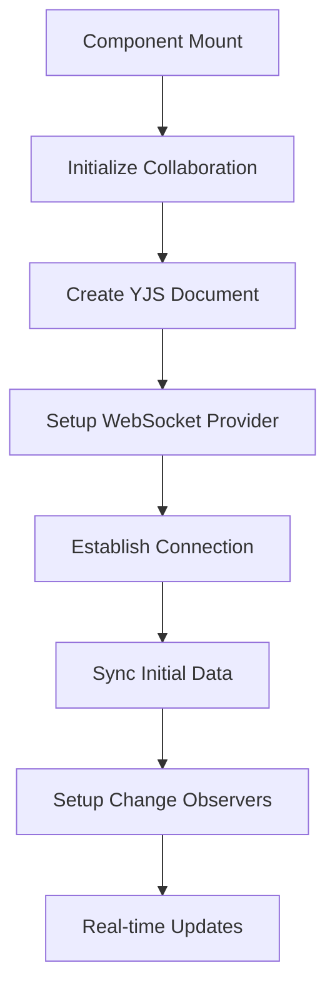

# CollaborativeFormBuilder Component Documentation

## Overview

The `CollaborativeFormBuilder` is the main component for collaborative real-time form building in the Dculus Forms application. It provides a comprehensive interface for creating, editing, and managing forms with real-time collaboration capabilities using YJS (Yjs) for operational transformation and conflict resolution.

**Location**: `apps/form-app/src/pages/CollaborativeFormBuilder.tsx`

## Architecture Overview

### Core Technologies

- **React 18** with TypeScript for UI components and type safety
- **YJS (Yjs)** with HocuspocusProvider for real-time collaborative editing
- **@dnd-kit** for drag-and-drop functionality
- **Zustand** for state management with persistence
- **Apollo Client** for GraphQL data fetching
- **React Router** for navigation and URL parameter handling

### Key Design Patterns

1. **Separation of Concerns**: Clear separation between UI components, business logic, and state management
2. **Hook-based Architecture**: Custom hooks for drag-and-drop, field creation, and collision detection
3. **Real-time Collaboration**: YJS integration for operational transformation and conflict-free replicated data types (CRDTs)
4. **Tab-based Interface**: Modular tab system for different builder modes (Layout, Page Builder, Settings, Preview)
5. **Component Composition**: Reusable components with clear prop interfaces

## Component Structure

### Main Component Props

```typescript
interface CollaborativeFormBuilderProps {
  className?: string;  // Optional CSS classes for styling customization
}
```

### URL Structure

The component handles URL parameters for navigation and state management:

- **Route Pattern**: `/dashboard/form/:formId/collaborate/:tab?`
- **Parameters**:
  - `formId`: Required form identifier for collaboration session
  - `tab`: Optional tab parameter (layout | page-builder | settings | preview)
  - **Default Tab**: `page-builder` when no tab is specified

### Constants and Configuration

```typescript
const VALID_TABS: readonly BuilderTab[] = ['layout', 'page-builder', 'settings', 'preview'];
const DEFAULT_TAB: BuilderTab = 'page-builder';
const DEFAULT_SIDEBAR_WIDTH = 320; // pixels
```

## State Management

### Zustand Store Integration

The component integrates with `useFormBuilderStore` which provides:

#### Connection State
- `isConnected`: Real-time collaboration connection status
- `isLoading`: Loading state during initialization
- `initializeCollaboration()`: Establishes YJS connection
- `disconnectCollaboration()`: Cleanup collaboration resources

#### Form Data State
- `pages`: Array of form pages with fields
- `selectedPageId`: Currently selected page identifier
- `selectedFieldId`: Currently selected field identifier
- `setSelectedPage()`, `setSelectedField()`: Selection handlers

#### Field Operations
- `addField()`: Add field to end of page
- `addFieldAtIndex()`: Insert field at specific position
- `updateField()`: Update field properties
- `reorderFields()`: Drag-and-drop field reordering
- `reorderPages()`: Page ordering management

#### Layout Management
- `updateLayout()`: Theme, colors, spacing configuration

## Real-time Collaboration

### YJS Integration

The component leverages YJS for conflict-free collaborative editing:

1. **Document Structure**: Each form has a dedicated YJS document
2. **Provider**: HocuspocusProvider manages WebSocket connections
3. **Data Types**: Y.Map and Y.Array for structured data synchronization
4. **Conflict Resolution**: Automatic operational transformation

### Collaboration Flow



## Component Lifecycle

### Mount Phase

1. **URL Parameter Processing**: Extract and validate `formId` and `tab`
2. **GraphQL Data Fetching**: Load form metadata via `GET_FORM_BY_ID`
3. **Collaboration Initialization**: Establish YJS connection
4. **Auto-selection Logic**: Select first page if none selected

### Update Phase

1. **Real-time Synchronization**: YJS change propagation
2. **State Updates**: Zustand store updates trigger re-renders
3. **URL Navigation**: Tab changes update browser history

### Unmount Phase

1. **Connection Cleanup**: Disconnect YJS provider
2. **Observer Removal**: Clean up change listeners
3. **Resource Deallocation**: Memory cleanup

## Tab System Architecture

### Tab Components

#### 1. LayoutTab (`layout`)
- **Purpose**: Theme, colors, spacing, background customization
- **Props**: `onLayoutChange: (updates: Partial<FormLayout>) => void`

#### 2. PageBuilderTab (`page-builder`) - Default
- **Purpose**: Main form building interface with drag-and-drop
- **Props**:
  - `sidebarWidth`: Right sidebar width for pages list
  - `onSidebarWidthChange`: Sidebar resize handler
  - `selectedFieldId`: Currently selected field
  - `onFieldEdit`, `onFieldUpdate`, `onFieldDeselect`: Field interaction handlers

#### 3. SettingsTab (`settings`)
- **Purpose**: Form-level configuration and metadata
- **Props**: None (accesses store directly)

#### 4. PreviewTab (`preview`)
- **Purpose**: Live form preview for testing
- **Props**: `formId: string`

### Tab Navigation

- **Keyboard Shortcuts**: Tab switching via `TabKeyboardShortcuts`
- **Visual Indicator**: `TabNavigation` with connection status
- **URL Synchronization**: Browser history integration

## Drag-and-Drop System

### DndKit Integration

The component uses @dnd-kit for comprehensive drag-and-drop functionality:

#### Context Setup
```typescript
<DndContext
  sensors={sensors}                          // Pointer sensor with 8px activation distance
  collisionDetection={collisionDetectionStrategy}
  onDragStart={handleDragStart}
  onDragOver={handleDragOver}
  onDragEnd={handleDragEnd}
>
```

#### Draggable Elements
1. **Field Types**: From FieldTypesPanel to form pages
2. **Form Fields**: Reordering within pages
3. **Form Pages**: Page order management

#### Drop Zones
1. **Page Areas**: Accept field type drops
2. **Field Positions**: Insert fields at specific indices
3. **Field Reordering**: Between existing fields

### Collision Detection

Custom collision detection via `useCollisionDetection` hook handles:
- **Field Type Drops**: New field creation
- **Field Reordering**: Position calculations
- **Page Management**: Multi-page handling

## Custom Hooks

### useDragAndDrop

**Location**: `apps/form-app/src/hooks/useDragAndDrop.ts`

**Purpose**: Centralized drag-and-drop logic

**Interface**:
```typescript
interface UseDragAndDropProps {
  pages: FormPage[];
  onAddField: (pageId: string, fieldType: FieldTypeConfig, insertIndex?: number) => void;
  onReorderFields: (pageId: string, oldIndex: number, newIndex: number) => void;
  onReorderPages: (oldIndex: number, newIndex: number) => void;
}

interface DragHandlers {
  activeId: string | null;
  draggedItem: FieldTypeConfig | FormField | FormPage | null;
  handleDragStart: (event: DragStartEvent) => void;
  handleDragOver: (event: DragOverEvent) => void;
  handleDragEnd: (event: DragEndEvent) => void;
}
```

### useFieldCreation

**Location**: `apps/form-app/src/hooks/useFieldCreation.ts`

**Purpose**: Field data generation with type-specific defaults

**Features**:
- Default field configurations per field type
- Option arrays for select/radio/checkbox fields
- Placeholder text generation

### useCollisionDetection

**Location**: `apps/form-app/src/hooks/useCollisionDetection.ts`

**Purpose**: Custom collision detection strategy for drag-and-drop

## Error Handling

### Error Boundaries

The component handles several error conditions:

1. **Missing Form ID**: Shows `ErrorState` with guidance
2. **GraphQL Errors**: Displays form loading failures
3. **Collaboration Failures**: Graceful degradation to offline mode
4. **Network Issues**: Connection status indicators

### Loading States

- **Initial Load**: Shows collaboration connection progress
- **Form Data Loading**: GraphQL query loading states
- **Collaboration Sync**: YJS document synchronization status

## Performance Optimizations

### Memoization

- **useCallback**: Event handlers to prevent unnecessary re-renders
- **useMemo**: Expensive computations like drag overlay rendering
- **React.memo**: Component-level memoization where applicable

### Code Splitting

- Dynamic imports for tab components
- Lazy loading of heavy dependencies

### Real-time Updates

- Debounced field updates to reduce YJS operations
- Batched state updates to minimize re-renders

## Testing Strategy

### Unit Testing

**Test File**: `apps/form-app/src/components/form-builder/__tests__/CollaborativeFormBuilder.test.tsx`

**Key Test Scenarios**:
1. **Component Rendering**: Proper UI element display
2. **URL Parameter Handling**: Tab navigation and form ID validation
3. **State Management**: Store integration and updates
4. **Error Handling**: Error boundary functionality
5. **Hook Integration**: Custom hook behavior

### Integration Testing

**Recommended E2E Tests**:
1. **Form Creation Flow**: Complete form building workflow
2. **Real-time Collaboration**: Multi-user editing scenarios
3. **Drag-and-Drop Operations**: Field and page management
4. **Tab Navigation**: Interface switching
5. **Data Persistence**: Form saving and loading

### Mock Setup

```typescript
// Example test setup
const mockFormBuilderStore = {
  isConnected: true,
  isLoading: false,
  pages: [],
  selectedPageId: null,
  selectedFieldId: null,
  initializeCollaboration: jest.fn(),
  disconnectCollaboration: jest.fn(),
  // ... other store methods
};

jest.mock('../store/useFormBuilderStore', () => ({
  useFormBuilderStore: () => mockFormBuilderStore,
}));
```

## Dependencies

### Core Dependencies

```typescript
// React ecosystem
import React, { useEffect, useCallback, useState, useMemo } from 'react';
import { useParams, useNavigate } from 'react-router-dom';
import { useQuery } from '@apollo/client';

// Drag and drop
import {
  DndContext,
  DragOverlay,
  PointerSensor,
  useSensor,
  useSensors,
} from '@dnd-kit/core';

// State management
import { useFormBuilderStore } from '../store/useFormBuilderStore';

// Custom hooks
import { useDragAndDrop } from '../hooks/useDragAndDrop';
import { useCollisionDetection } from '../hooks/useCollisionDetection';
import { useFieldCreation } from '../hooks/useFieldCreation';

// GraphQL queries
import { GET_FORM_BY_ID } from '../graphql/queries';

// Component imports
import { 
  TabNavigation, 
  TabKeyboardShortcuts, 
  LayoutTab, 
  PageBuilderTab, 
  SettingsTab, 
  PreviewTab, 
  type BuilderTab 
} from '../components/form-builder/tabs';
```

### Shared Package Dependencies

```typescript
// UI components
import { Button, Card, Input } from '@dculus/ui';

// Utilities
import { generateId, cn } from '@dculus/utils';

// Type definitions
import {
  FormField,
  FormPage,
  FormLayout,
  FieldType,
  FormSchema
} from '@dculus/types';
```

## Environment Configuration

### Development Setup

1. **WebSocket URL**: Configured via `getWebSocketUrl()` utility
2. **GraphQL Endpoint**: Apollo Client configuration
3. **Authentication**: Better-auth integration
4. **Database**: Prisma with MongoDB

### Environment Variables

```bash
# Real-time collaboration
VITE_WEBSOCKET_URL=ws://localhost:1234
VITE_API_URL=http://localhost:4000
VITE_GRAPHQL_URL=http://localhost:4000/graphql
VITE_FORM_VIEWER_URL=http://localhost:5173

# Authentication
VITE_BETTER_AUTH_URL=http://localhost:4000/api/auth
```

## Common Patterns

### Adding New Features

1. **Create Custom Hook**: For complex logic (e.g., `useNewFeature`)
2. **Update Store**: Add state and actions to `useFormBuilderStore`
3. **Component Integration**: Add to appropriate tab component
4. **Type Definitions**: Update interfaces in `@dculus/types`
5. **Testing**: Add unit and integration tests

### Field Type Extension

1. **Define Field Class**: Extend `FillableFormField` in `@dculus/types`
2. **Add Field Config**: Update `FieldTypesPanel` configuration
3. **Serialization**: Add to YJS serialization helpers
4. **Form Rendering**: Update form viewer components

## Troubleshooting

### Common Issues

1. **Collaboration Not Working**:
   - Check WebSocket connection URL
   - Verify YJS provider status
   - Ensure form ID is valid

2. **Drag-and-Drop Issues**:
   - Check DndKit sensor configuration
   - Verify collision detection setup
   - Ensure proper drop zone implementation

3. **State Synchronization Problems**:
   - Check Zustand store configuration
   - Verify YJS document structure
   - Review observer setup

### Debug Tools

```typescript
// Enable in development
if (typeof window !== 'undefined') {
  (window as any).useFormBuilderStore = useFormBuilderStore;
  (window as any).debugFormBuilder = true;
}
```

## Future Enhancements

### Planned Features

1. **Multi-user Cursors**: Real-time collaboration indicators
2. **Version History**: YJS-based undo/redo functionality
3. **Advanced Field Types**: Rich text, file upload, signature fields
4. **Template System**: Pre-built form templates
5. **Performance Monitoring**: Real-time collaboration metrics

### Architecture Improvements

1. **Service Worker**: Offline form editing capabilities
2. **Virtual Scrolling**: Large form performance optimization
3. **Micro-frontends**: Isolated feature modules
4. **Advanced Testing**: Visual regression testing

## Summary

The `CollaborativeFormBuilder` component represents a sophisticated real-time collaborative form building interface with:

- **Real-time Collaboration** via YJS operational transformation
- **Comprehensive Drag-and-Drop** using @dnd-kit
- **Modular Architecture** with tab-based interface
- **Type-safe Development** with TypeScript throughout
- **Performance Optimizations** for large forms
- **Extensible Design** for future enhancements

The component serves as the cornerstone of the Dculus Forms form building experience, providing both powerful functionality and intuitive user experience for collaborative form creation.
