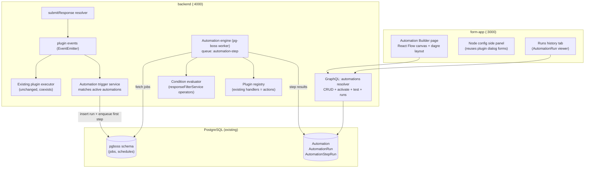
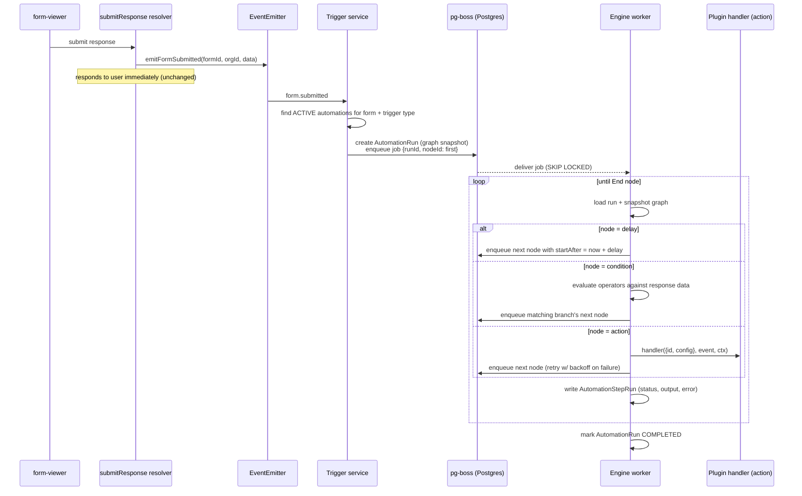
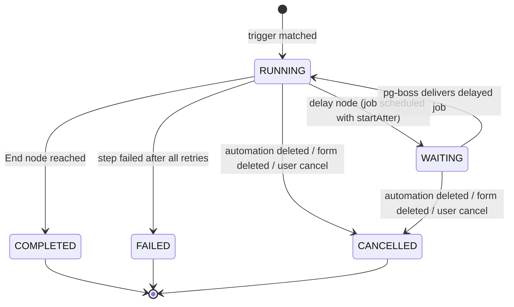
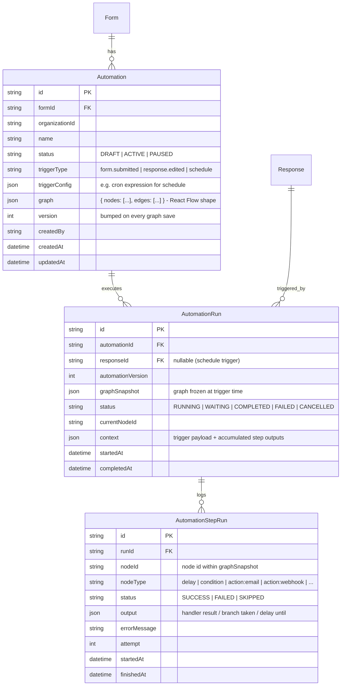

# Form Automations — Architecture Deep-Dive & Implementation Strategy

> Typeform/Jotform-style workflow automations for dculus-forms: **trigger → rules (delay, condition) → actions (email, webhook, integrations)**, built on the existing plugin system.

- **Status**: Proposed (decisions confirmed 2026-07-24)
- **Decisions locked**: pg-boss execution engine (Postgres-only, no Redis) · MVP = delay + condition branches + actions + multiple triggers (no approvals in v1) · Automations **coexist** with the existing Plugins feature · No billing gating in v1 (hook points documented)

---

## 1. What we are building (competitor reference)

From the Typeform screenshots (`screenshot/`) and Jotform Workflows research:

| Capability | Typeform | Jotform | Ours (v1) |
|---|---|---|---|
| Visual canvas builder | Vertical node flow, `+` between nodes | Drag-and-drop flowchart | ✅ Vertical canvas (React Flow) |
| Trigger: form submitted | ✅ "Start when form is Completed" | ✅ | ✅ |
| Rule: time delay | ✅ minutes/hours/days | ✅ | ✅ (pg-boss `startAfter`) |
| Rule: condition / branching | Limited | ✅ if/else + multi-branch | ✅ if/else (reuse filter operators) |
| Action: send email | ✅ | ✅ | ✅ (reuse email plugin handler) |
| Action: webhook | ✅ | ✅ | ✅ (reuse webhook handler) |
| Action: integrations | Slack, Sheets, Mailchimp, HubSpot… | 100s | ✅ Slack, Google/Microsoft Sheets (existing handlers) |
| Draft / Activate states | ✅ | ✅ | ✅ |
| Run history / debugging | Partial | ✅ Workflow tracking | ✅ `AutomationRun` + step log |
| Approvals (human step) | ❌ | ✅ core feature | 🔜 Phase 3 (designed for, not built) |
| Parallel split branches | ❌ | ✅ | 🔜 Phase 3 |

---

## 2. Current architecture — what exists and what we reuse

### 2.1 Backend plugin system (`apps/backend/src/plugins/`)

```
core/
  registry.ts        Map<type, PluginHandler> — registerPlugin()/getPluginHandler()
  executor.ts        executePlugin() → handler(plugin, event, ctx) + PluginDelivery log
  events.ts          in-process EventEmitter; emitFormSubmitted(), emitPluginTest()
  context.ts         plugin logger/context factory
  exportRegistry.ts  plugin export columns for Excel/CSV
  backfill.ts        PluginBackfillJob — re-run plugin over historic responses
email/  webhook/  quiz/  google-sheets/  microsoft-sheets/  ai-tagger/   (7 registered types incl. slack)
```

**Key properties today** (these are the gaps automations must close):

- Execution is **in-process, fire-and-forget** (`EventEmitter` in `events.ts`) — a backend restart loses in-flight work.
- **No retry, no scheduling, no delay** — `executePluginsForForm()` runs matching plugins sequentially, once.
- Every execution is logged to `PluginDelivery` (status, payload, response, error) — a pattern we extend for step-level run logs.
- `PluginHandler` signature: `(plugin: {id, config}, event: PluginEvent, context) => Promise<any>` — **automation actions can call these handlers unchanged**.

### 2.2 Directly reusable assets (reuse map)

| Existing asset | Where | Reused for |
|---|---|---|
| Plugin handlers (email, webhook, slack, sheets…) | `plugins/*/handler.ts` | Action node execution — call via `getPluginHandler(type)` |
| Plugin registry | `plugins/core/registry.ts` | Action-type catalog |
| `PluginManifest` (name/icon/category) | `packages/plugins/src/manifests/` | Action picker UI in the canvas (same icons/branding) |
| `emitFormSubmitted()` emit point | `graphql/resolvers/responses.ts:397` | Automation trigger tap-in (same event payload) |
| Filter operators (22: EQUALS, CONTAINS, GREATER_THAN, DATE_*, IS_EMPTY…) | `services/responseFilterService.ts` | Condition-node evaluation — same semantics as Responses filtering |
| `substituteMentions()` + `createFieldLabelsMap()` | `@dculus/utils` | Variable substitution in action configs (`@Field` mentions in emails/webhooks) |
| OAuth flows (Google/Microsoft) | `plugins/google-sheets/oauth.ts`, `Integrations.tsx`, `OAuth*Callback.tsx` | Integration connections for actions |
| Plugin config dialogs | `form-app/components/plugins/dialogs/*` | Action config panels (extract form bodies, reuse in side panel) |
| `PluginDeliveryLog` UI | `components/plugins/shared/` | Run-history UI pattern |
| Auth guards | `requireAuth`, `requireOrganizationMembership`, `FormPermission` | Automation CRUD permission checks (EDITOR+ to edit, VIEWER to see) |
| Zustand slice pattern | `form-app/src/store/slices/` | `automationSlice` for builder state |
| i18n system (en/ta) | `form-app/src/locales/` | `automations.json` namespace |
| Sentry + pino logging | `lib/logger.ts`, `instrument.ts` | Engine observability |

### 2.3 Infra constraints (verified)

- **No Redis, no queue library** — backend deps are Postgres (`pg`, Prisma), Express, Apollo, Hocuspocus. → pg-boss fits with **zero new infrastructure**; it creates its own schema (`pgboss`) in the existing PostgreSQL database.
- Frontend has **no React Flow yet**; has `zustand`, `zod`, `react-hook-form`, `dnd-kit`, `@radix-ui`, shadcn via `@dculus/ui`.
- Deployment: Azure + Cloudflare (`docs/deployment/`); single backend process runs Express + Hocuspocus — the pg-boss worker rides in the same process (option to split later).

---

## 3. Target architecture



The trigger service subscribes to the **same** event emitter the plugin executor uses today — form submission behavior is unchanged; automations are an additional listener.

### 3.1 Execution flow



### 3.2 Run state machine



---

## 4. Data model (Prisma)

The flow graph is stored as **JSON on the Automation row** (nodes + edges, same shape React Flow uses), not as relational node rows — simpler CRUD, atomic saves, and the builder round-trips it directly. Each run **snapshots the graph** so editing an automation never corrupts in-flight runs.



### Graph JSON node types (v1)

```typescript
type AutomationNode =
  | { id: string; type: 'trigger';   data: { triggerType: TriggerType } }
  | { id: string; type: 'delay';     data: { amount: number; unit: 'minutes'|'hours'|'days' } }
  | { id: string; type: 'condition'; data: { rules: ConditionRule[]; combinator: 'AND'|'OR' } }
    // ConditionRule = { fieldId, operator: FilterOperator, value } — FilterOperator is the
    // existing 22-operator set from responseFilterService (EQUALS, CONTAINS, DATE_AFTER, …)
  | { id: string; type: 'action';    data: { actionType: PluginType; config: PluginConfig } }
    // config is the SAME shape as FormPlugin.config for that type → handlers work unchanged
  | { id: string; type: 'end' };

// Edges: { id, source, target, sourceHandle?: 'true' | 'false' }  (condition branches)
```

**Migration note**: per repo convention, the schema change ships as a committed migration in `apps/backend/prisma/migrations/` with `IF NOT EXISTS` guards, plus `pnpm db:generate` + `pnpm db:push` locally. pg-boss manages its own `pgboss` schema migrations automatically on `boss.start()`.

---

## 5. Library strategy

| Concern | Choice | Why | Alternatives rejected |
|---|---|---|---|
| Durable jobs, delays, retries, cron | **pg-boss** (MIT) | Runs on the existing PostgreSQL — zero new infra. Delayed jobs (`startAfter`) for delay nodes up to days, retries with exponential backoff, dead-letter queues, cron scheduling (for the `schedule` trigger), transactional enqueue, `SKIP LOCKED` safety across multiple backend instances. ~750k weekly downloads. Throughput ceiling (~hundreds of jobs/sec) is far above form-submission volume. | **BullMQ**: needs Redis (new infra in Azure + docker-compose). **graphile-worker**: solid, lower-level SQL-centric API, fewer built-ins (no dead-letter/cron dashboard). **Temporal/Trigger.dev/Inngest**: heavy external dependency for a linear-flow feature. **n8n embed**: fair-code license, not embeddable in a SaaS for free. |
| Canvas builder UI | **@xyflow/react** (React Flow v12, MIT) + **@dagrejs/dagre** (auto vertical layout) | De-facto standard node editor; controlled nodes/edges pair naturally with a zustand slice; custom node components let us render Typeform-style cards; custom edges render the `+` add-step button between nodes; dagre `rankdir: 'TB'` gives the vertical auto-layout so users never position nodes manually. | Building on `dnd-kit`: no edges/zoom/viewport. `@projectstorm/react-diagrams`: less active. Sequential list UI (no canvas): rejected — screenshots show canvas UX, and branching needs one. |
| Condition evaluation | **In-house, reusing `responseFilterService` operators** | The 22 operators + semantics already exist and match the Responses filter UX users know. Evaluation input is a single response object — trivially extracted into a shared pure function. | `json-logic-js`: new mental model, duplicate semantics, still needs mapping UI. |
| Variable substitution | **Existing `substituteMentions()`** (`@dculus/utils`) | Already powers thank-you pages + email plugin; same `@Field` mention UX in automation action configs. | Handlebars/Liquid: unnecessary second templating system. |
| Validation | **zod** (already in repo) | Graph schema + node config validation on save and on activate (server-side). | — |

New dependencies added: `pg-boss` (backend), `@xyflow/react` + `@dagrejs/dagre` (form-app). Everything else is reuse.

---

## 6. Engine design details

### 6.1 One queue, one job shape

A single pg-boss queue `automation-step` with jobs `{ runId, nodeId }`. Each job executes exactly one node, persists an `AutomationStepRun`, then enqueues the successor. This makes every hop durable — a crash/restart resumes from the last completed node (pg-boss redelivers unacked jobs).

- **Delay node**: enqueue successor with `startAfter: new Date(now + delay)`. Survives restarts/deploys because the schedule lives in Postgres. Cap delay at e.g. 30 days (validation).
- **Action node**: wraps `getPluginHandler(actionType)` with per-job retry policy (`retryLimit: 3, retryBackoff: true`). After final failure → run `FAILED`, step log carries the error (mirrors `PluginDelivery` semantics). Non-retryable errors (invalid config, 4xx webhook) short-circuit.
- **Condition node**: pure function; picks the outgoing edge whose `sourceHandle` matches the boolean result; missing branch → skip to End.
- **Schedule trigger**: pg-boss cron (`boss.schedule(...)`) per active scheduled automation; on fire, creates one run per matching scope (e.g. "daily digest" automations). Registered/unregistered on activate/pause.
- **Idempotency**: job `singletonKey = {runId}:{nodeId}:{attempt}` prevents double-enqueue; step execution checks for an existing SUCCESS `AutomationStepRun` before re-running (protects against redelivery after ack loss).

### 6.2 Trigger tap-in (no change to submission latency)

`initializeAutomationTriggers()` adds a listener on the existing `plugin:event` emitter (`plugins/core/events.ts`). On `form.submitted`, it queries `Automation` where `formId`, `status: ACTIVE`, `triggerType: 'form.submitted'`, creates the `AutomationRun` with graph snapshot, and enqueues the first job — all async, errors logged + Sentry-captured, never blocking the submit response (same contract as today's plugin execution).

New trigger events added to the emitter as thin emits at the relevant service points:
- `response.edited` — from response edit flow (`responseEditTrackingService` touchpoint)
- `schedule` — no emitter; pg-boss cron drives it

### 6.3 Scenario coverage

| Scenario | Behavior |
|---|---|
| Backend restart/deploy during a 2-day delay | pg-boss job persists in Postgres; fires on schedule after restart. In-flight (locked) jobs are redelivered after expiry. |
| Automation edited while runs in flight | Runs execute against their `graphSnapshot`; edits only affect new runs. `version` increments for audit. |
| Automation paused/deleted mid-run | Trigger service stops creating runs. Engine checks automation status before each **action** node (delays/conditions still traverse); paused → run `CANCELLED` with step log entry. Delete → cascade cancels runs, `boss.cancel` outstanding jobs by run. |
| Form deleted | `Automation` cascades from `Form`; run cancellation as above. |
| Response deleted mid-run | Action nodes needing response data mark run `CANCELLED` (not FAILED) with reason. |
| OAuth token expired mid-run (Sheets) | Existing handler refresh logic runs; on hard auth failure → retries exhausted → run `FAILED`, surfaced in run history with re-auth hint. |
| Duplicate submission bursts | One run per response; pg-boss `SKIP LOCKED` guarantees single-worker step execution even with multiple backend replicas. |
| Builder preview submissions (`isPreview`) | Skipped — same guard the response-copy email uses. |
| Test mode ("Test automation" button) | Creates a run flagged `test: true` in context with sample/latest response data; delay nodes **fast-forward** (log-only) so users see end-to-end results immediately; deliveries clearly marked test (reuses `plugin.test` handler paths where available). |
| Activation validation | Server-side zod + graph checks on `activate`: single trigger, no cycles, no orphan nodes, all action configs valid (per-type zod schemas), integration connections present — mirrors Typeform's "Setup required / Integration required" states in the canvas. |
| Infinite loops (automation triggers itself) | v1 graphs are DAGs (validated). Guard rail: automations never fire from writes performed by automation actions (no `form.submitted` re-entry exists; future email-reply triggers must carry a `sourceRunId` and be suppressed). |
| Billing (future) | Hook point: run-creation in trigger service is the single choke point — plan check + `automation_runs` usage metric slot into it later (chargebeeService + Subscription counters, like views/submissions). |

---

## 7. GraphQL API (new `automations` resolver)

Follows the plugins resolver conventions (`requireAuth` + org membership + form permission; JSON scalars for graph/config):

```graphql
type Query {
  formAutomations(formId: ID!): [Automation!]!
  automation(id: ID!): Automation
  automationRuns(automationId: ID!, pagination: ...): AutomationRunPage!
  automationRun(id: ID!): AutomationRun          # includes stepRuns
}
type Mutation {
  createAutomation(input: CreateAutomationInput!): Automation!      # EDITOR+
  updateAutomationGraph(id: ID!, graph: JSON!): Automation!         # EDITOR+, bumps version
  setAutomationStatus(id: ID!, status: AutomationStatus!): Automation!  # activate validates graph
  deleteAutomation(id: ID!): Boolean!
  testAutomation(id: ID!, responseId: ID): AutomationRun!           # fast-forward delays
  cancelAutomationRun(runId: ID!): AutomationRun!
}
```

Errors use `GRAPHQL_ERROR_CODES` (add `AUTOMATION_NOT_FOUND`, `AUTOMATION_INVALID_GRAPH`).

---

## 8. Frontend builder (form-app)

**Route**: `/forms/:formId/automations` (list) and `/forms/:formId/automations/:automationId` (builder) — new "Automations" entry beside Plugins in the form dashboard nav. The Plugins page is untouched (coexistence).

**Builder page composition** (mirrors the Typeform screenshots):

- **Canvas**: React Flow, vertical dagre layout, zoom/pan, dotted background. Custom node components: `TriggerNode` (form + "is Completed"), `DelayNode`, `ConditionNode` (true/false handles), `ActionNode` (manifest icon + name + warning badge when config invalid — "Setup required"), `EndNode`.
- **Add-step UX**: custom edge renders a `+` button at its midpoint → popover with **Rules** (Time delay, Condition) and **Actions** (from `PluginManifest` list, same icons as the plugin gallery) → inserts node, re-runs dagre layout.
- **Config side panel**: clicking a node opens a right panel; action panels reuse the extracted form bodies of the existing plugin dialogs (`EmailPluginDialog`, `WebhookPluginDialog`, `SlackPluginDialog`…) including `@Field` mention editors and OAuth "Connect" flows from `Integrations.tsx`.
- **Header**: name (inline edit), `Draft/Active` badge, **Activate** button (runs server validation; invalid nodes get red outline + tooltip), "Test automation".
- **Runs tab**: table of runs (status, trigger response, started/completed) → drill into step timeline (reuses `PluginDeliveryLog` visual pattern).
- **State**: new `automationBuilderSlice` (zustand) holding nodes/edges/selection/dirty state; saves via `updateAutomationGraph`. Single-user editing in v1 (no Y.js — collaborative editing of automations is out of scope; last-write-wins with version check).
- **i18n**: `locales/{en,ta}/automations.json`, registered in `locales/index.ts` (mandatory per repo convention).

---

## 9. Phased implementation plan

```mermaid
gantt
    dateFormat  X
    axisFormat  %s
    section Phase 1 — Foundation
    pg-boss + engine + Prisma models + trigger tap-in     :p1a, 0, 3
    GraphQL CRUD + validation                             :p1b, 1, 3
    section Phase 2 — Builder MVP
    React Flow canvas + linear flows (delay + actions)    :p2a, 3, 6
    Run history UI + test mode                            :p2b, 5, 7
    section Phase 3 — Branching & triggers
    Condition nodes (builder + engine)                    :p3a, 7, 9
    response.edited + schedule triggers                   :p3b, 8, 10
    section Phase 4 — Later
    Approvals, parallel branches, billing gating, more integrations :p4, 10, 12
```



**Phase 1 — Engine foundation (backend only)**
1. Prisma migration: `Automation`, `AutomationRun`, `AutomationStepRun`.
2. `services/automation/` — `engine.ts` (pg-boss worker + node executors), `triggerService.ts` (event tap-in), `conditionEvaluator.ts` (extracted operator logic shared with `responseFilterService`), `graphValidator.ts` (zod).
3. pg-boss bootstrap in `index.ts` next to plugin/subscription init.
4. `graphql/resolvers/automations.ts` + schema types.
5. Unit tests (vitest) for engine, evaluator, validator; integration tests (cucumber) for CRUD + a linear run.

**Phase 2 — Builder MVP (Typeform screenshot parity)**
6. Automations list + builder page, React Flow canvas, delay + action nodes, side panel reusing plugin dialog forms, Activate validation UX, i18n en/ta.
7. Runs history + step drill-down + Test automation.
8. E2E happy path (Playwright + Cucumber): create → configure email action → activate → submit form → assert run completed.

**Phase 3 — Branching + more triggers**
9. Condition node (builder UI: field/operator/value rows with AND/OR, true/false branches; engine already supports via edges).
10. `response.edited` emit + trigger; `schedule` trigger via pg-boss cron + cron config UI.

**Phase 4 (later)**: approvals (human-in-the-loop wait states — `WAITING_APPROVAL` run status slots into the existing state machine), parallel split/merge, billing gating at the run-creation choke point, more integration actions via the normal plugin-generator path (every new plugin automatically becomes an automation action).

---

## 10. Testing & operations

- **Unit (vitest)**: node executors, condition evaluator (all 22 operators), graph validator (cycles/orphans), snapshot isolation, idempotent re-delivery.
- **Integration (cucumber)**: CRUD + permission matrix (VIEWER cannot mutate), activate validation failures, full linear run against a real DB, delayed-step persistence across an engine restart.
- **E2E (Playwright)**: builder flow per Phase 2 step 8.
- **Observability**: engine logs via pino, failures to Sentry (as executor does today); pg-boss exposes queue depth — surface a `/health` detail. Dead-letter queue monitored for stuck jobs.
- **Ops note**: pg-boss maintenance (archive/expire) runs automatically; the `pgboss` schema lives in the primary DB — include it in backup/PgBouncer session-mode considerations (pg-boss needs a direct connection like migrations do; use `DIRECT_URL`-style connection, not the pooled one, for the worker).

---

## 11. Open items (flagged, not blocking)

1. **Multi-instance deploys**: pg-boss handles concurrent workers safely; cron registration should be idempotent (`boss.schedule` upserts by name) so replicas don't duplicate schedules.
2. **Automation limits without billing**: even ungated, cap automations per form (e.g. 20) and active delays per run to protect the queue.
3. **PII in run context**: `AutomationRun.context` stores response data (as `PluginDelivery.payload` already does); apply the same retention posture, and consider trimming context after run completion.
