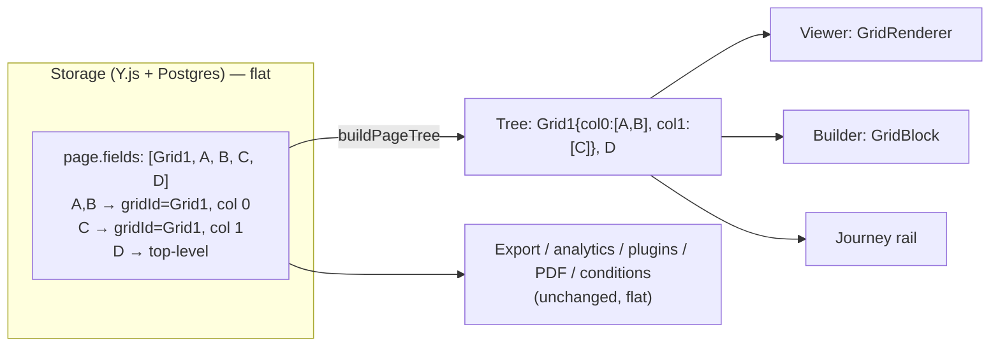
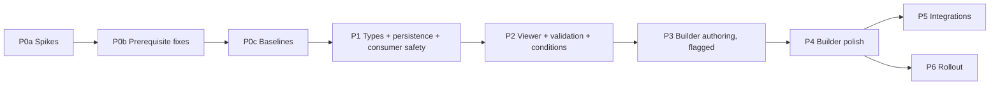

# Grid Layout (Column Containers) — Architecture & Implementation Plan

> Status: **Proposal v2 — revised after a code-level validation pass (2026-09-30); awaiting sign-off on §19**
> Scope: form-app (builder), form-viewer (public), `@dculus/types`, `@dculus/ui`, `@dculus/utils`, backend (Hocuspocus + consumers)
> Reference behaviour: Zoho Forms "Grid" (1 / 2 / 3-column containers, per-column % widths, drag-to-resize divider, floating settings/delete toolbar, drag fields into columns)

### What changed in v2
- **Existing store actions get guarded grid-aware branches** (§7.4). v1 claimed they could stay untouched; they cannot (moving a grid with `reorderFields` leaves its children behind, `duplicatePage` orphans `gridId`, `convertFieldType` drops it). The store is the only chokepoint covering canvas, rail, keyboard, card menus, AI and the permission wrapper.
- **No server write-back.** The server never writes to a live Y.Doc and `Form.formSchema` is a creation-time snapshot (§3.8). Canonicalization is read-side plus client write-side only (§6).
- **All consumer skips move to Phase 1**, because one grid in a Y.Doc breaks the whole field-analytics page (§12).
- **Phase 0b prerequisite bug fixes** (visual/raw index bug, missing `onDragCancel`, unreachable non-fillable branch, `deleted` not re-seeded) land before baselines (§16).
- Corrected: which code copies props generically vs by whitelist, the DnD topology (rail drop zones, silent-success drops), widths in the builder frame, `@dnd-kit/sortable` usage, dead code, test ids, backend response validation, conditions picker, Sheets handlers, AI resolver (§3, §8, §12, §13).
- New appendix of pre-existing bugs found during validation (§21).

---

## 1. Goals and non-goals

### Goals
1. Form authors can drop a **Grid** (1, 2 or 3 columns; up to 4 via settings) onto a page and drag any non-grid field into its columns.
2. Column widths are adjustable (percentages, drag divider + numeric input).
3. The public viewer, preview, response-edit page and embeds render the same layout; columns **stack on narrow containers** (phones, narrow embeds, builder mobile frame).
4. Real-time collaboration (Y.js) keeps working, including concurrent edits to the same grid.
5. **Zero change to the response data model**: responses stay `{ [fieldId]: value }`. Analytics, exports, plugins, quiz grading, PDF templates, conditional logic keep working with no or near-zero change.

### Non-goals (v1)
- Nested grids (grid inside a grid column). Blocked in the UI and in the store.
- Row/column **spans**, per-row alignment, vertical alignment, per-column background/padding.
- Grid-level conditional logic targeting (deferred to §11, phase 5).
- Table/matrix questions (rows × columns of inputs). That is a different feature.

---

## 2. Reference behaviour

From the Zoho screenshot and general market behaviour (Zoho, Jotform, Tally, Fillout, Cognito):

| Behaviour | Zoho | Decision here |
|---|---|---|
| Palette group "Grid" with 1-/2-/3-Column tiles | Yes | Yes (new `layout` category) |
| Empty columns show a dashed "Drag and drop fields here" zone | Yes | Yes |
| Percentage label above each column (36 / 30 / 34) | Yes | Yes |
| Draggable divider between columns (yellow `<>` handle) | Yes | Yes, plus keyboard + numeric inputs |
| Floating gear + trash on the grid's edge | Yes | Yes (gear selects the grid → settings panel) |
| Fields keep their own card chrome inside the column | Yes | Yes, but a **compact** card variant (§8.3) |
| Columns stack on mobile | Yes | Yes, by container width (not viewport) |
| Nesting | Not supported | Not supported |

---

## 3. Current-state findings (verified in code)

These facts drive the architecture. Each was checked against the repository; line numbers are as of 2026-09-30 and must be re-checked before editing.

### 3.1 The schema is flat and read in ~90 files
- `FormPage.fields: FormField[]` ([index.ts](../packages/types/src/index.ts#L136-L142)). About 90 files iterate `page.fields` directly (form-app, `packages/*`, backend services, plugins, PDF, export, analytics).
- Response data is keyed by field id only; `Response.data` never sees layout.
- There are three deserialization entry points, and only one sees the whole schema:
  - `deserializeFormSchema`: backend services, templates, `conditionalStrip`.
  - `deserializeFormField` **per field**: the public viewer ([FormViewer.tsx](../apps/form-viewer/src/pages/FormViewer.tsx#L163)) and the builder store ([CollaborationManager.ts](../apps/form-app/src/store/collaboration/CollaborationManager.ts#L204)).
  - Hand-written Y.Doc readers: backend `reconstructFormSchema` / `initializeHocuspocusDocument` and the AI chat snapshot (§3.3).
- Consequence: layout props must be handled **inside `deserializeFormField`**, and the viewer and builder cannot rely on schema-level canonical ordering (§6).

### 3.2 Unknown field types and unknown props are dropped silently
- `deserializeFormField` returns `null` with a `console.warn` for an unknown `type` ([index.ts](../packages/types/src/index.ts#L859-L863)); callers filter nulls ([L890](../packages/types/src/index.ts#L890)). **An older client silently loses a `grid_field`.**
- It copies only constructor arguments, plus `grading` / `suffix` through `withGrading` ([L716-L721](../packages/types/src/index.ts#L716-L721)). `deleted` is re-applied by `deserializeFormSchema` ([L887](../packages/types/src/index.ts#L887)). Any new prop is dropped on deserialize unless copied explicitly. `serializeFormField` spreads `...field`, so serialization keeps extras.

### 3.3 Where field properties are copied

| Location | Kind | Notes |
|---|---|---|
| `FieldData` + `extractFieldData` — [CollaborationManager.ts](../apps/form-app/src/store/collaboration/CollaborationManager.ts#L18-L165) | **Whitelist** (Y.Map → store) | `options` calls `.toArray()` unconditionally; `content` only for rich text |
| `serializeFieldToYMap` — [fieldHelpers.ts](../apps/form-app/src/store/helpers/fieldHelpers.ts#L478-L515) | **Whitelist** (instance → Y.Map) | Its non-fillable branch is unreachable because of the heuristic in §3.7, so rich-text `content` is not written on add (existing bug, §21) |
| `createYJSFieldMap` — [fieldHelpers.ts](../apps/form-app/src/store/helpers/fieldHelpers.ts#L408-L470) | **Generic** | Copies every defined key. `options` / `allowedMimeTypes` → `Y.Array`, `grading` → `Y.Map`. Adds a `validation` Y.Map to **every type except rich text** |
| `updateField` — [fieldsSlice.ts](../apps/form-app/src/store/slices/fieldsSlice.ts#L215-L345) | Generic `set` | Special-cases `options`, `allowedMimeTypes`, `grading`, checkbox `defaultValue`. Creates a `validation` map for any type that lacks one (L215-L231) |
| `convertFieldType` — [fieldsSlice.ts](../apps/form-app/src/store/slices/fieldsSlice.ts#L399-L478) | Rebuild | New id; carries only a few props |
| `reconstructFormSchema` — [hocuspocus.ts](../apps/backend/src/services/hocuspocus.ts#L451-L609) | **Whitelist**, 3 branches (rich text / file upload / everything else) | `options` kept only if it is a `Y.Array`. Any new type falls into the fillable `else` |
| `initializeHocuspocusDocument` — [hocuspocus.ts](../apps/backend/src/services/hocuspocus.ts#L738-L870) | **Whitelist**, 3 branches | Not an exact mirror: never writes `deleted`; checkbox reads `defaultValues` |
| AI chat snapshot — [routes/aiChat.ts](../apps/backend/src/routes/aiChat.ts#L34-L70) | **Whitelist** | Keeps `id, type, label, required, placeholder, hint, options`; does not filter deleted fields |

Operations that **recreate** a field's Y.Map through `extractFieldData` → `createYJSFieldMap`, losing any key missing from the whitelist:
- `reorderFields` (L554-L566), `moveFieldBetweenPages` (L726-L748, hard-deletes the source map), `duplicateField` (L601-L607), `copyFieldToPage` (L827-L839).
- `pagesSlice.duplicatePage` gives **every field a new id** ([pagesSlice.ts](../apps/form-app/src/store/slices/pagesSlice.ts#L204-L208)); `pagesSlice.reorderPages` rebuilds fields ([L318-L353](../apps/form-app/src/store/slices/pagesSlice.ts#L318-L353)).
- `convertFieldType` rebuilds through `createFormField` + `serializeFieldToYMap` with a new id.

### 3.4 There are two field renderers
- Viewer / preview / response-edit: `SinglePageForm` → `FormFieldRenderer` ([packages/ui/src/renderers](../packages/ui/src/renderers)).
- Builder canvas: `FormArea` → `DraggableFieldCard` → `FieldCard` → `FieldPreview` ([PageBuilderFormArea.tsx](../apps/form-app/src/components/form-builder/tabs/PageBuilderFormArea.tsx), [PageBuilderFieldCard.tsx](../apps/form-app/src/components/form-builder/tabs/PageBuilderFieldCard.tsx)). `FormRenderer` in BUILDER mode is used only for intro / thank-you screens (also inside the builder phone frame).
- Consequence: a grid needs **two** renderers (viewer and builder) and a shared pure layout helper so they agree.

### 3.5 Builder drag-and-drop
- One live `DndContext` in [PageBuilderTab.tsx](../apps/form-app/src/components/form-builder/tabs/PageBuilderTab.tsx) (`PointerSensor` `distance: 5` at L187, `sortableKeyboardCoordinates`). `@dnd-kit/sortable` is used for rail pages; fields use `@dnd-kit/core`.
- **Draggables:** canvas card (`existing-field`, [PageBuilderFieldCard.tsx](../apps/form-app/src/components/form-builder/tabs/PageBuilderFieldCard.tsx#L600-L609)); rail chip `rail-existing-field-{id}` with the **same** `existing-field` payload ([RailFieldChip.tsx](../apps/form-app/src/components/form-builder/rail/RailFieldChip.tsx#L48-L57)); palette tiles (`field-type`); rail pages (`page-item` via `useSortable`).
- **Droppables:** canvas `DropIndicator` `drop-indicator-{pageId}-{i}` → `{type:'field-insert', pageId, insertIndex}` ([PageBuilderFormArea.tsx](../apps/form-app/src/components/form-builder/tabs/PageBuilderFormArea.tsx#L154-L162)); rail `RailFieldInsertZone` `rail-drop-{pageId}-{i}` → the same `field-insert` payload ([RailPageGroup.tsx](../apps/form-app/src/components/form-builder/rail/RailPageGroup.tsx#L28-L49)); page `form-area` ([L446-L453](../apps/form-app/src/components/form-builder/tabs/PageBuilderFormArea.tsx#L446-L453)); rail `page-item`. Cards are not droppable.
- `handleDragEnd` ([L246-L397](../apps/form-app/src/components/form-builder/tabs/PageBuilderTab.tsx#L246-L397)):

| active | over | Result |
|---|---|---|
| any | `null` | Clears drag state after 300 ms |
| `page-item` | page | `reorderPages` |
| `existing-field` | `field-insert`, same page | `reorderFields(src, sourceIndex, insertIndex > src ? insertIndex - 1 : insertIndex)` |
| `existing-field` | `field-insert`, other page | `moveFieldBetweenPages(..., insertIndex)` |
| `existing-field` | anything else | **Nothing moves, but the field is still selected and highlighted** |
| `field-type` | `field-insert` | `addFieldAtIndex` + `highlightNewField` |
| `field-type` | `form-area` | `addField` (append) + highlight; the fallback timer also runs |

- Unhandled `existing-field` drops look successful, so an unhandled grid target would silently "work".
- **No `onDragCancel`**: Escape leaves `activeField` set and the drop indicators expanded.
- Collision detection: `pointerWithin`, else `rectIntersection`; first result wins ([L403-L407](../apps/form-app/src/components/form-builder/tabs/PageBuilderTab.tsx#L403-L407)). The comment claiming gap zones "win over the large field cards" is stale (cards are not droppable). `pointerWithin` orders by corner distance, so small targets tend to win, but not deterministically.
- While dragging, cards collapse (`shouldShowCompact`, a 300 ms `grid-template-rows` transition, PageBuilderFieldCard L175 / L375). After a drop, expansion is held for 400 ms (field drops) or 300 ms (others); auto-scroll starts at 750 ms. Droppable rects therefore **resize mid-drag**.
- The outer `DndContext` in `CollaborativeFormBuilder` (8 px sensor, `useDragAndDrop`, `useCollisionDetection`) is dead: nothing creates `type: 'field'`, and every live draggable is inside the inner context. The "8 px" comment in the e2e helper ([common.ts](../test/e2e/steps/helpers/common.ts#L31)) describes it, not the live 5 px sensor.
- **Index semantics (existing bug):** `insertIndex` is a *visual* index (the store's `page.fields` excludes soft-deleted fields). `reorderFields` converts it with `toRawIndex` (L523-L535). `addFieldAtIndex` (L154) and `moveFieldBetweenPages` (L741) use it as a raw Y.Array index, so a drop lands in the wrong slot when soft-deleted fields precede it. `restoreField`'s fallback path (L650) does the same. `duplicateField` is correct.
- **Undo:** delete-toast `restoreField` only, plus `useYjsUndoManager` (whole `formSchema`, 60 s capture window, used by AI chat). It captures **all** local edits in that window, not just the AI batch.
- **Mutation entry points.** Every field mutation goes through a store action, called from:
  - canvas DnD and palette: `PageBuilderTab`, `FieldPickerPopover`, `CollaborativeFormBuilder`;
  - card buttons: `PageBuilderFieldCard` (remove/restore, duplicate, move up/down, move/copy to page);
  - keyboard: `PageBuilderFormArea`;
  - settings delete: `PageBuilderSidebar`;
  - page menus: `RailPageGroup`, `PageSettingsPanel` (`duplicatePage`);
  - AI: `applyAIOp`, `DestructiveActionCard` (`removeField`, `convertFieldType`);
  - the permission wrapper `usePermissionAwareFormBuilder`.

  **The store actions are the only chokepoint that covers all of them.**

### 3.6 Selection, URL sync and keyboard
- `setSelectedField` resolves the page through `page.fields` ([selectionSlice.ts](../apps/form-app/src/store/slices/selectionSlice.ts#L67-L88)); `setSelection` stores its argument as given (L42-L44); `useBuilderSelectionUrlSync` uses `page.fields.some` (L91). Grid children stay in `page.fields`, so these keep working.
- The keyboard handler in `FormArea` ([L363-L432](../apps/form-app/src/components/form-builder/tabs/PageBuilderFormArea.tsx#L363-L432)) is window-level: Delete/Backspace (soft delete + undo toast), Cmd/Ctrl+D (`duplicateField`), Alt+↑/↓ (`reorderFields` ±1), ↑/↓ (selection). All use the flat `selectedPage.fields` index and need grid semantics (§7.4, §8.7).

### 3.7 Renderer / validation hazards
- **The "fillable" heuristic is true for every real type.** `isFillableField` in [zodSchemaBuilder.ts](../packages/ui/src/utils/zodSchemaBuilder.ts#L59-L62) and [FormFieldRenderer.tsx](../packages/ui/src/renderers/FormFieldRenderer.tsx#L87-L88), and `isFillableFormField` in [fieldHelpers.ts](../apps/form-app/src/store/helpers/fieldHelpers.ts#L73-L81) and [form-builder/utils.ts](../apps/form-app/src/components/form-builder/utils.ts#L3-L4), end with `field.type !== FieldType.FORM_FIELD`. Without an explicit check, a `GridField` would:
  - be cast to `FillableFormField` by `FormFieldRenderer` and render as a generic input or "Unsupported field";
  - go through the fillable branch of `serializeFieldToYMap` and get `label`, `defaultValue` and a `validation` map;
  - then be treated as fillable by the builder card (`isFillable = 'validation' in field`, [PageBuilderFieldCard.tsx](../apps/form-app/src/components/form-builder/tabs/PageBuilderFieldCard.tsx#L101)).
- `createPageSchema` / `createPageDefaultValues` give every field a schema entry (`z.any().optional()` by default) and a `''` default ([L441](../packages/ui/src/utils/zodSchemaBuilder.ts#L441)). `useFormInitialization` seeds `''` for every `page.fields` id ([L37-L41](../packages/ui/src/hooks/useFormInitialization.ts#L37-L41)). Submission (`PageRenderer.handleFormComplete`, [L159-L181](../packages/ui/src/renderers/PageRenderer.tsx#L159-L181)) flattens the store after `stripHiddenResponses`. Rich-text ids are therefore probably submitted as `''` today (confirm at runtime in Phase 0a). Grids must be excluded explicitly.
- `formHookUtils.ts` (`transformFormDataForSubmission`, `getDefaultValueForField`, `generatePageDefaultValues`) has **no callers**. It is out of scope.
- `useFormValidation.showAllValidationErrors` calls `setFocus` on every id inside try/catch, which is harmless.
- **The backend does not validate responses against the schema.** `submitResponse` only caps the key count (500) and value length (10 000) ([responses.ts](../apps/backend/src/graphql/resolvers/responses.ts#L351-L362)), then calls `stripConditionallyHiddenValues`, which passes unknown ids through ([conditionalStrip.ts](../apps/backend/src/lib/conditionalStrip.ts#L51-L54)). A stray grid key would be stored and count toward the 500.
- **Conditions:** `pageFieldIds` contains every non-deleted field, **including rich text** ([conditions.ts](../packages/types/src/conditions.ts#L413-L426)). A page auto-hides only when all of them are hidden, so a never-hidden grid id would block auto-hide (rich text already does). `detectConditionCycles` builds the same map (L630-L652); `evaluateTerm` rejects unknown types (L356-L358).
- `formSchemaPublic` requires OPEN access, filters deleted fields and strips `grading` ([forms.ts](../apps/backend/src/graphql/resolvers/forms.ts#L151-L175)); otherwise it is a JSON pass-through.
- `SinglePageForm` filters hidden ids (L151-L157), checks emptiness on the **unfiltered** `page.fields` (L160), renders inside `div.space-y-4` (L181-L192), and relies on upstream deleted-filtering.

### 3.8 Source of truth: the Y.Doc. `Form.formSchema` is a creation-time snapshot
- These read the live Y.Doc through `getFormSchemaFromHocuspocus`, with the DB column only as a fallback: GraphQL `formSchema` / `formSchemaPublic`, submit / thank-you / edit, export, field analytics, the ai-tagger plugin, `duplicateForm`, and response-edit tracking.
- `Form.formSchema` is written **only at creation** ([formService.ts](../apps/backend/src/services/formService.ts#L160)) and by the one-off quiz migration. No mutation updates it. Hocuspocus `store` writes only `CollaborativeDocument` ([hocuspocus.ts](../apps/backend/src/services/hocuspocus.ts#L115-L160)); `onChange` only reads (metadata stats). **The server never writes to a live Y.Doc.**
- Stale readers of `Form.formSchema` (existing bug: fields added after creation are invisible to them):
  - [email/handler.ts](../apps/backend/src/plugins/email/handler.ts#L354)
  - [google-sheets/handler.ts](../apps/backend/src/plugins/google-sheets/handler.ts#L376)
  - [microsoft-sheets/handler.ts](../apps/backend/src/plugins/microsoft-sheets/handler.ts#L424)
  - [pdfGenerationJobService.ts](../apps/backend/src/services/pdfGenerationJobService.ts#L46-L55)
  - [responseCopyService.ts](../apps/backend/src/services/responseCopyService.ts#L60-L64)
- A form created from a template containing grids carries those grids in the column, so these readers must tolerate grids too.

### 3.9 Responsive constraints
- **Tailwind:** `tailwindcss@3.4.19` in four **separate** configs (`packages/ui`, form-app, form-viewer, admin-app), with no shared preset. The plugin list is only `tailwindcss-animate`, and form-viewer does not declare it in its package.json (it resolves through hoisting). There is **no container-query plugin**. form-app and form-viewer scan `packages/ui/src` and `packages/utils/src`; admin-app scans `packages/ui` only.
- `sm:` / `md:` are viewport media queries and do not react to the builder phone frame. The repo already works around this twice:
  - `useContainerBreakpoint`: ResizeObserver, measures in `useLayoutEffect`, default breakpoint 560 px, used by `IntroHero` ([useContainerBreakpoint.ts](../packages/ui/src/layouts/shared/useContainerBreakpoint.ts#L18-L44)).
  - The `MOBILE_CANVAS_CSS` shim ([mobileCanvasStyles.ts](../apps/form-app/src/components/form-builder/shared/mobileCanvasStyles.ts#L18-L45)).
- **Available field width** (content box of the form card):

| Context | Width |
|---|---|
| Desktop L1–L5, L7–L9 (`max-w-2xl`) | 624 compact / **608** normal / 592 spacious |
| Desktop L6 (`max-w-3xl`) | 720 / **704** / 688 |
| Real 390 px phone | **334** (318 spacious; 326 in L6) |
| Builder phone frame (`w-[390px] border-[10px]`, 370 px inside) | ~**322** canvas (`FormArea` `p-6`), ~**314** preview |

  Three columns on a phone would be ~100 px each, so stacking is mandatory.
- **Popups** inside fields (Select, DatePicker, phone country list) portal to `body` through Radix, so `container-type` containment cannot clip them. The renderer's rich text is read-only. The builder-only Lexical mention menu is absolute and not portalled, but it is not rendered inside columns in v1.
- No ancestor of the fields in layouts / renderers sets `transform`, `contain` or `overflow: hidden`.
- Embeds render in an iframe ([embed.js](../apps/form-viewer/src/embed/embed.js#L93-L97)), so container queries see the iframe width.
- **Browser targets are not configured** (no browserslist, no `build.target`). Any "Safari 16+" statement is a decision (D5), not a repo fact.

### 3.10 Consumers already tolerant of a label-less container
Most consumers gate on `field instanceof FillableFormField` or a truthy `label` (for example `unifiedExportService`, `responseCopyService`, the email handler, `Responses.tsx`, `createResponsesColumns`, `PdfTemplates.tsx`, `AutomationBuilder.tsx`). A `GridField` **with no `label` property** is skipped by them for free. The consumers that filter with a deny-list, or don't filter at all, are listed in §12 and must be fixed in Phase 1.

---

## 4. Architecture options and decision

### Option A — Nested container
`GridField.columns: { id; width; fields: FormField[] }[]`

- ✅ Mirrors the visual model.
- ❌ ~90 consumers must recurse or flatten; any miss silently drops a field from export/analytics/validation.
- ❌ Y.js: nested `Y.Array` inside a field Y.Map; every reorder/move/duplicate must deep-copy it; whitelists must learn a recursive shape.
- ❌ Selection, URL sync, conditions, mentions, PDF designer, AI tools all need tree awareness.

### Option B — Flat list + parent pointer (**chosen**)
Grid is a non-fillable `GridField` in `page.fields`. Each child keeps its normal place in `page.fields` and gains two optional scalar props: `gridId` and `gridColumn`.

- ✅ **Membership is one scalar write** (atomic, LWW-safe in Y.js). Moving a field between columns changes two scalars.
- ✅ Every existing flat consumer keeps working and still sees all real fields. Grid is skipped like rich text.
- ✅ Selection, URL sync, conditions, response tables, export, analytics, PDF, plugins: unchanged.
- ✅ Old clients degrade gracefully (grid vanishes, children show as top-level) — with the caveat in §14.
- ⚠️ Requires a canonical-order invariant and a pure normalizer (§5.3), whitelist plumbing for three keys (§7.2–7.3), and a guarded grid-aware branch in each existing structural store action (§7.4).

### Option C — Grid holds ordered id lists
`GridField.columns: { width; fieldIds: string[] }[]`

- ✅ Children untouched.
- ❌ Two sources of truth (page order + id lists); moving a field edits two lists in one grid; duplicate/delete/restore/move-to-page must keep lists consistent; concurrent edits to an id list need `Y.Array<Y.Array<string>>` to merge well.

### Decision
**Option B.** Layout is derived from the flat list by a pure function in `@dculus/types` (`buildPageTree`), used by the viewer, the builder canvas, the rail and the read-side canonicalizer. Everything else keeps reading a flat list.



---

## 5. Data model

### 5.1 Types (`packages/types/src/index.ts`)

```ts
export enum FieldType { /* … */ GRID_FIELD = 'grid_field' }

export const MAX_GRID_COLUMNS = 4;
export const MIN_GRID_COLUMN_PERCENT = 10;

// Base class — optional, NOT constructor params (same pattern as FillableFormField.grading)
export class FormField {
  id: string;
  type: FieldType;
  deleted?: boolean;
  gridId?: string;      // id of the GridField this field lives in; absent = top level
  gridColumn?: number;  // 0-based column index inside that grid; absent = 0
}

export class GridField extends NonFillableFormField {
  columnWidths: number[]; // integer percentages, length 1..MAX_GRID_COLUMNS, sum === 100
  constructor(id: string, columnWidths: number[] = [50, 50]) {
    super(id);
    this.type = FieldType.GRID_FIELD;
    this.columnWidths = sanitizeGridColumnWidths(columnWidths);
  }
}
```

Notes:
- **No `label` property on `GridField`.** Several consumers gate on `'label' in field` or a truthy label (§3.10). Adding one would leak the grid into them. If a builder-only display name is ever wanted, call it `name`.
- Column **count is `columnWidths.length`** (single source of truth; no separate `columnCount`).
- Widths are integer percentages summing to 100 (matches Zoho's 36/30/34). They are rendered as `minmax(0, Nfr)` tracks, so rounding never overflows.
- `deserializeFormField` gets a `GRID_FIELD` case (not routed through `withGrading`) and a **generic post-step for every type** that copies `gridId` / `gridColumn`. Validation: `gridId` is a non-empty string of at most 64 chars; `gridColumn` is a non-negative integer. The post-step must live in `deserializeFormField`, not only in `deserializeFormSchema`, because the viewer and the builder store call it per field (§3.1).
- Readers of `columnWidths` accept a plain array **or** a `Y.Array` (the `allowedMimeTypes` pattern), then sanitize. Do not copy the `options` reader, which calls `.toArray()` unconditionally.
- `FIELD_TYPE_ICON_MAP` and `FIELD_TYPE_TRANSLATION_KEYS` in `@dculus/utils` are `Record<FieldType, string>`, so adding the enum value fails type-check until both get an entry. That is a useful forcing function.

### 5.2 Invariants

| # | Invariant | Enforced by |
|---|---|---|
| I1 | A grid is always top-level. `gridId` on a `GridField` is ignored (no nesting). | `buildPageTree`, store guard |
| I2 | `gridId` must reference a live (non-deleted) `GridField` on the **same page**; otherwise the field is treated as top-level. | `buildPageTree` |
| I3 | `gridColumn` is clamped to `[0, columnWidths.length − 1]`. | `buildPageTree` |
| I4 | `columnWidths`: length 1..4, each ≥ `MIN_GRID_COLUMN_PERCENT`, sum = 100. Invalid input falls back to an equal split. | `sanitizeGridColumnWidths` (types trust boundary, like `sanitizeConditions`) |
| I5 | **Canonical order**: in the flat list, a grid is immediately followed by its children, ordered by (column, previous relative order). | Written by grid-aware store actions (`ensureCanonical` before and after, same transaction). Applied on read by `deserializeFormSchema` and `reconstructFormSchema` output, which never write back. A page with no grid is never touched. |
| I6 | Position among siblings = relative flat index among fields sharing `(gridId, gridColumn)`. | store actions place by anchor |
| I7 | On any page that contains a grid, mutations resolve positions from **id anchors to raw Y.Array indexes inside the transaction**, never from visual indexes. | grid-aware branches (§7.4) |

Repairs are applied **on read** everywhere (tolerant). They are **written only by explicit user actions** on the affected page. There is no server write-back (§6).

### 5.3 Pure helpers — new `packages/types/src/grid.ts`

```ts
export type PageNode =
  | { kind: 'field'; field: FormField }
  | { kind: 'grid';  grid: GridField; columns: { index: number; widthPercent: number; fields: FormField[] }[] };

buildPageTree(fields: FormField[]): PageNode[]          // repairs I1–I3, drops deleted, order-independent grouping
flattenPageTree(nodes: PageNode[]): FormField[]         // canonical (I5) order
canonicalizeFields(fields: FormField[]): FormField[]    // keeps deleted at their relative spot; returns the same array when there is no grid
getGridChildren(fields, gridId): FormField[]
isLayoutField(field): field is GridField                // the ONE predicate consumers use
pageHasGrid(fields): boolean                            // gate for every grid-aware branch
countQuestionFields(fields): number                     // excludes layout fields only (rich text stays counted)
nodeAnchorForVisualIndex(fields, index): { beforeNodeId: string | null } // index → top-level node boundary
sanitizeGridColumnWidths(input: unknown, fallbackCount?: number): number[]
resizeAdjacentColumns(widths, dividerIndex, deltaPercent): number[]   // trades width between i and i+1, clamps to min
setColumnCount(widths, count): number[]                 // equalizes on change
visibleColumns(node, hiddenFieldIds): { fields, widthPercent }[]      // drops empty columns, renormalizes widths (viewer)
```

These are exported from the `@dculus/types` barrel. **Do not import Tailwind or React here**; the module stays pure so the backend can use it. The backend reads `@dculus/types` from `dist/`, so rebuild the package in the same PR and in CI before backend tests.

`deserializeFormSchema` calls `canonicalizeFields` per page (a no-op without grids), so backend consumers and templates get canonical order. The viewer and the builder do **not** go through it (§3.1). They derive layout with `buildPageTree`, which groups by pointer and does not depend on storage order.

### 5.4 Backward compatibility
- New optional props only; no migration for existing forms. Forms without a grid are byte-identical.
- `formSchema` travels as the `JSON` scalar everywhere (`schema.ts`: `formSchema: JSON`, `formSchemaPublic: JSON`), so GraphQL needs no change.
- Templates are stored through `deserializeFormSchema` → `serializeFormSchema` ([templateService.ts](../apps/backend/src/services/templateService.ts#L76-L93)), so `deserializeFormField` must know `GRID_FIELD` before any grid template exists.
- `duplicateForm`, `createFormFromTemplate` and template-based `createForm` keep field ids, so `gridId` references stay valid. `pagesSlice.duplicatePage` does **not** keep ids and must remap (§7.4).

---

## 6. Canonicalization and conflict handling

Y.js merges concurrent edits at the property/array level, so the flat model can hold states that no single user produced. Resolutions:

| Concurrent scenario | Resulting state | Resolution |
|---|---|---|
| A deletes a grid while B drops a field into it | child has `gridId` → deleted grid | I2: child renders top-level at its flat position |
| A shrinks 3→2 columns while B drops into column 2 | `gridColumn = 2` on a 2-col grid | I3: clamp to last column |
| A and B resize the same grid | `columnWidths` LWW (plain JSON array value, not `Y.Array`) | Last write wins; the array is replaced atomically so the sum stays 100 |
| A moves field X out of the grid while B reorders inside | X has no `gridId`; position from flat order | Top-level at its flat index; next grid action on that page canonicalizes |
| A moves a grid while B adds a child | child not adjacent to its grid | Tree is derived from pointers, so rendering is correct; next grid action on that page canonicalizes |

`columnWidths` is stored as a **plain JSON array** in the Y.Map (whole-array LWW), deliberately not a `Y.Array<number>`, so two concurrent resizes cannot interleave into a sum other than 100.

**Where canonicalization runs**
1. **Read side, pure, never writes:**
   - `buildPageTree` in every renderer (viewer, preview, response edit, builder canvas, rail);
   - `deserializeFormSchema` (backend services, templates);
   - `reconstructFormSchema` output (GraphQL `formSchema`, export, analytics, submit).
2. **Write side:** only grid-aware store actions, for the pages they touch. They call `ensureCanonical(pageFields)` before and after the mutation, inside the same `ydoc.transact`.
3. **No server write-back.** The server never writes to a live document today (§3.8). Adding an `onChange` writer would need origin-guarded loop prevention and coordination across backend replicas, so it is out of scope.
   - Storage can therefore stay non-canonical after concurrent edits, until the next grid action on that page.
   - This is safe because layout is derived from pointers, and every mutation on a grid page resolves positions from id anchors (I7), never from indexes.
4. The builder store's `page.fields` keeps **storage order** (it is not canonicalized). The existing index-based code on grid-less pages therefore keeps matching the Y.Array. Clients never canonicalize speculatively on load, which avoids write storms when several sessions are open.

Trade-off accepted: a grid op that changes flat position recreates the moved field's Y.Map (the same as today's `reorderFields`), so a concurrent edit to *that field's own properties* in the same instant can be lost. Membership-only changes that keep the flat position do a scalar `set` and lose nothing.

---

## 7. Y.js, store and backend plumbing

### 7.1 Y.js shape
- A field Y.Map gains scalar keys `gridId` and `gridColumn`, written **only when defined**. Never write `undefined`, so grid-less documents stay byte-identical.
- A grid Y.Map is `{ id, type: 'grid_field', columnWidths: number[] (plain JSON array), deleted? }`, with **no `validation` map** and no nested Y types.
- `columnWidths` is always replaced as a whole array; mutating it in place would not sync.

### 7.2 Client plumbing (form-app)

| File | Change |
|---|---|
| [CollaborationManager.ts](../apps/form-app/src/store/collaboration/CollaborationManager.ts) | `FieldData` += `gridId?`, `gridColumn?`, `columnWidths?`. `extractFieldData` reads the layout keys for **every** type and reads `columnWidths` as Array or `Y.Array`. `deserializePagesFromYJS` passes them to `deserializeFormField` |
| [fieldHelpers.ts](../apps/form-app/src/store/helpers/fieldHelpers.ts) | `isFillableFormField` returns `false` for `isLayoutField` **first**. `serializeFieldToYMap` gets an explicit grid branch before the heuristic and copies layout keys on the fillable path. `createYJSFieldMap` writes no `validation` map for `GRID_FIELD`. `createFormFieldInstance` + `FIELD_CONFIGS` get a grid case (today the `default` returns a bare `FormField` with type `form_field`) |
| [form-builder/utils.ts](../apps/form-app/src/components/form-builder/utils.ts) | The same heuristic fix |
| [fieldsSlice.ts](../apps/form-app/src/store/slices/fieldsSlice.ts) | `updateField` skips the auto-created `validation` map for grids and sets `columnWidths` as a whole array. Grid-aware branches (§7.4). `convertFieldType` carries layout keys |
| [pagesSlice.ts](../apps/form-app/src/store/slices/pagesSlice.ts) | `duplicatePage` remaps `gridId` through its old→new id map. `reorderPages` needs only the whitelist |
| [PageBuilderFieldCard.tsx](../apps/form-app/src/components/form-builder/tabs/PageBuilderFieldCard.tsx#L101) | `isFillable = !isLayoutField(field) && 'validation' in field` |
| [fieldDataExtractor.ts](../apps/form-app/src/hooks/fieldDataExtractor.ts) | `FIELD_DATA_EXTRACTORS[GRID_FIELD]` (otherwise the base extractor applies) |
| [usePermissionAwareFormBuilder.ts](../apps/form-app/src/hooks/usePermissionAwareFormBuilder.ts) | Wrap the new actions: `addGrid`/`addFieldToGrid`/`duplicateGrid` → `canAddFields`, `placeField` → `canReorderFields`, `setGridColumnWidths`/`ungroupGrid` → `canEditFields`, `removeGrid` → `canDeleteFields` |
| [setupTests.ts](../apps/form-app/src/setupTests.ts) | The `@dculus/types` mock gets the enum value and a `GridField` mock class (store tests `jest.unmock` the real package) |

Add one helper, `copyLayoutKeys(from, to)`, and use it in every row above so a future layout prop is one edit.

### 7.3 Backend
- [hocuspocus.ts](../apps/backend/src/services/hocuspocus.ts), `reconstructFormSchema`:
  - add a `grid_field` branch **before** the generic `else`, copying `id, type, columnWidths, deleted` and accepting Array or `Y.Array`;
  - append layout keys in the three existing branches through one helper;
  - run `canonicalizeFields` on each page's output (read-only; a no-op without grids).
- `initializeHocuspocusDocument`:
  - add a mirrored `grid_field` branch: plain array, no validation map, **writes `deleted`**;
  - write layout keys in all branches.
  
  It is used by create-from-template, template-based `createForm` and `duplicateForm`. (Re-seeding `deleted` for every type is the separate Phase 0b fix, §21.)
- [routes/aiChat.ts](../apps/backend/src/routes/aiChat.ts): the Y.Doc snapshot (L34-L70) skips `grid_field`, and `countFields` (L106-L108) excludes it.
- [formMetadataService.ts](../apps/backend/src/services/formMetadataService.ts#L39-L49): exclude `grid_field` from the single `fieldCount` total. Rich text stays counted (R2).
- `templateService.stripDeletedFields` runs only on template create/update. It needs no change; I2 repairs children of a deleted grid.
- The consumer skips in §12 (list B) ship in **Phase 1**.

### 7.4 Store actions

**New actions** (`fieldsSlice`). Each one:
- runs in one `ydoc.transact`;
- resolves ids to raw Y.Array indexes inside the transaction (I7);
- wraps the mutation in `ensureCanonical(pageFields)` before and after (§6).

```ts
addGrid(pageId, columns: 1|2|3|4, at?: { beforeNodeId?: string | null }): string
addFieldToGrid(pageId, type, data, target: GridTarget): string
placeField(args: { pageId; fieldId; target: PlaceTarget })          // move within a page: into, out of, or between columns; a grid moves as a block
setGridColumnWidths(pageId, gridId, widths: number[])               // also handles count change; shrinking merges removed columns into the last column
ungroupGrid(pageId, gridId)                                         // children become top-level, in place
removeGrid(pageId, gridId, { deleteChildren: boolean }): GridSnapshot  // soft-delete grid (+ non-deleted children)
restoreGrid(pageId, snapshot: GridSnapshot)                         // undo toast; restores exactly the ids in the snapshot
duplicateGrid(pageId, gridId)                                       // new ids for grid + children, gridId remapped

type GridTarget  = { gridId: string; column: number; beforeFieldId?: string | null };
type PlaceTarget = GridTarget | { gridId?: undefined; beforeNodeId?: string | null }; // top-level slot
```

**Grid-aware branches in existing actions.** Every existing structural action gets exactly one guarded early branch:

```ts
if (involvesGrid(sourcePage, targetPage, field)) return gridAware.xxx(...);
// existing body below, unchanged
```

`involvesGrid` is true when the source or target page contains a non-deleted `grid_field`, or the field is a grid or has a `gridId`.
- On grid-less pages the existing code runs unchanged (R2).
- Doing this in the store rather than in callers covers every entry point in §3.5 at once: canvas, rail, keyboard, card menu, AI and the permission wrapper.

| Existing action | Behaviour when `involvesGrid` |
|---|---|
| `addField(pageId, type)` | `GRID_FIELD` → `addGrid` at the end. Other types append top-level; the existing append is already canonical |
| `addFieldAtIndex(visualIdx)` | `nodeAnchorForVisualIndex` → insert before that top-level node. If the index points inside a grid block, insert after the block (D11). The new field never inherits membership. `GRID_FIELD` → `addGrid` at the anchor |
| `reorderFields(old, new)` | Translated to `placeField` on the tree:<br>• a top-level node (a grid moves as a block) swaps with the previous/next top-level node;<br>• a child swaps with the previous/next sibling in its column;<br>• at a column edge the child leaves the grid, landing before/after the block (D10).<br>Used by keyboard Alt+↑/↓, card Move up/down and AI `REORDER`. DnD uses anchors directly (§8.4) |
| `moveFieldBetweenPages` | Grid → moves the grid and its children (ids kept). Child → layout keys cleared, top-level at the target anchor |
| `copyFieldToPage` | Grid → copies the block with new ids and remapped `gridId`. Child → the copy lands top-level |
| `duplicateField` | Grid → `duplicateGrid`. Child → the copy goes right after the original in the same column |
| `removeField` | Grid → `removeGrid({ deleteChildren: true })` |
| `restoreField` | Grid → restores the grid only. The undo-toast callers use `restoreGrid` instead (below) |
| `convertFieldType` | Grid → rejected (toast). Child → keeps `gridId` / `gridColumn` and its flat position |
| `pagesSlice.duplicatePage` | Remap `gridId` through the old→new id map |
| `pagesSlice.reorderPages` | No semantic change; the whitelist is enough |

- The three callers that show the delete undo toast (`PageBuilderFieldCard` L620-L630, `FormArea` keyboard L377-L385, `PageBuilderSidebar` L75) call `removeGrid` / `restoreGrid` for a grid, so undo brings the children back.
- Guards: a grid cannot be dropped into a grid. A grid child dropped on another page loses `gridId` / `gridColumn`.
- Grid branches place by anchor (`beforeFieldId` / `beforeNodeId`), not by integer index, so concurrent inserts do not shift the intended slot. This also sidesteps the visual/raw index bug (§3.5).

### 7.5 What must NOT change
- On pages without a grid, keep every existing action body, payload shape and index semantic as is. The index bug is changed only by its own Phase 0b fix.
- `extractFieldData` → `createYJSFieldMap` recreation on reorder stays; it is safe once the layout keys are whitelisted.

---

## 8. Builder implementation

### 8.1 Palette
- `FieldTypeConfig.category` is `'input' | 'choice' | 'content' | 'advanced'` ([FieldTypesPanel.tsx](../apps/form-app/src/components/form-builder/FieldTypesPanel.tsx#L29)). Add `'layout'`, and update:
  - `getCategoriesConfig` (L125);
  - **both** copies of `CATEGORY_ORDER` ([FieldLibrary.tsx](../apps/form-app/src/components/form-builder/field-library/FieldLibrary.tsx#L23), [FieldPickerPopover.tsx](../apps/form-app/src/components/form-builder/field-library/FieldPickerPopover.tsx#L28));
  - the category pills (FieldPickerPopover L223-L252);
  - [fieldTypeVisuals.ts](../apps/form-app/src/components/form-builder/shared/fieldTypeVisuals.ts).
- The three tiles ("1 Column", "2 Columns", "3 Columns") share `FieldType.GRID_FIELD`. Add an optional `FieldTypeConfig.preset?: { columns: number }`. The draggable id today is `field-type-${idPrefix}${type}` (L234); append `-${columns}` for presets, because dnd-kit ids must be unique.
- **Test ids.** Today the tile test id is `field-type-${idPrefix}${slug(translated label)}` (L265), so it changes with the prefix and the locale. Add an optional `FieldTypeConfig.testIdSlug`, used only when present. Grid presets use `1-column` / `2-columns` / `3-columns`, giving `field-type-2-columns` in every locale. Existing tiles are unchanged.
- `useFieldCreation.createFieldData` has four branches (choice, file upload, rich text, default) ([useFieldCreation.ts](../apps/form-app/src/hooks/useFieldCreation.ts#L6-L52)). Add `GRID_FIELD` → `{ columnWidths: equalSplit(columns) }`.
- Adding a grid:
  - click-to-add → `addField` (append);
  - the "insert here" popover → `addFieldAtIndex` (grid-aware branch);
  - drag-to-add → top-level `field-insert` slots.
- Icon/label maps that need a `grid_field` entry:
  - [fieldTypeVisuals.ts](../apps/form-app/src/components/form-builder/shared/fieldTypeVisuals.ts#L27-L44)
  - [CompactFieldCard.tsx](../apps/form-app/src/components/form-builder/CompactFieldCard.tsx#L33-L67) (also missing Phone today)
  - [FieldSettingsHeader.tsx](../apps/form-app/src/components/form-builder/field-settings/FieldSettingsHeader.tsx#L7-L34)
  - [form-builder/types.ts](../apps/form-app/src/components/form-builder/types.ts#L21-L32)
  - [fieldTypeUtils.ts](../packages/utils/src/fieldTypeUtils.ts#L37-L95) (type-check enforced)
  - [field-drag-preview.tsx](../packages/ui/src/field-drag-preview.tsx#L59-L108) (exported, but no app uses it)
- The grid tiles render only when `VITE_ENABLE_GRID_LAYOUT` is on (D7).

### 8.2 Canvas: `GridBlock`
New component `tabs/PageBuilderGridBlock.tsx`, rendered by `FieldListWithDropZones` when `buildPageTree(page.fields)` yields a `grid` node. `FieldListWithDropZones` iterates **top-level nodes**. On pages without a grid, the nodes are exactly `page.fields`, so the rendered list, `DropIndicator` ids and `insertIndex` values are identical to today.

```
GridBlock  (data-testid="grid-block-{id}", selectable, role="group", aria-label)
├─ header: percent labels · toolbar (drag handle, settings, duplicate, delete)   ← floating on hover/selected, like Zoho
├─ columns wrapper  (CSS grid, tracks = minmax(0, Nfr))
│  ├─ GridColumn  (droppable "grid-column", data-testid="grid-column-{id}-{i}", stable min-height while dragging)
│  │  ├─ ColumnDropIndicator index 0  (droppable "grid-slot", id "grid-slot-{id}-{i}-{n}")
│  │  ├─ DraggableFieldCard (compact)  + ColumnDropIndicator …
│  │  └─ EmptyColumnPlaceholder  ("Drag and drop fields here")
│  └─ ColumnDivider  (resize handle between columns i and i+1)
```

- The top-level `DropIndicator` data gains an **optional** `beforeNodeId` (null = end of page). This is additive: grid-less pages ignore it, and on grid pages the handlers use it instead of `insertIndex`. `RailFieldInsertZone` gets the same field.
- Child cards keep `data-testid="field-content-{n}"`, where `n` is their **page-level** visual position (unique per page). Do not introduce per-column index ids: they would repeat across columns, causing Playwright strict-mode failures and dnd-kit id collisions.
- The grid's drag handle uses the `existing-field` payload plus `isGrid: true`. The grid card is **not** a drop target for other grids (I1).

### 8.3 Compact field card
- **Today:**
  - The header shows the grip, category icon, the field **type** label (the field's own label appears only in compact mode, L289), up to two badges, and the Required switch (L264-L368).
  - The six actions (Settings, Move up, Move down, Duplicate, Move/Copy via `PageActionsSelector`, Delete) sit in the collapsible body, shown on hover (L477-L549), with hard-coded English `title`s.
  - At ~30 % of 608 px, that hover row does not fit.
- **Add `density?: 'default' | 'compact'`.** Compact:
  - header: grip + icon + truncated **field label** + a required dot;
  - the hover action row is replaced by a translated `⋯` menu;
  - the `FieldPreview` body is kept (it still collapses during drag);
  - clicking the card selects it.
- `GridColumn` passes `density="compact"`. Keep `draggable-field-{id}` and `field-content-{n}` unchanged.

### 8.4 Drag-and-drop protocol

| `over.data.current.type` | Registered by | Data | Handles |
|---|---|---|---|
| `field-insert` (existing; **one additive optional field**) | canvas `DropIndicator`, rail `RailFieldInsertZone` | `{ pageId, insertIndex, beforeNodeId? }` | New field / existing field / new grid / grid block at top level |
| `grid-slot` (new) | `ColumnDropIndicator` | `{ pageId, gridId, column, beforeFieldId, priority }` | New or existing field into a column at a position |
| `grid-column` (new) | `GridColumn` body | `{ pageId, gridId, column, priority }` | Drop on empty space in a column → append |
| `form-area` (existing) | page card | `{ pageId }` | Append at top level |

Rules:
1. `useDroppable({ disabled })` on `grid-slot` / `grid-column` when the active item is a grid (no nesting).
2. **Collision detection** wraps the current function:
   - When no grid droppable is registered, delegate to today's `pointerWithin`-then-`rectIntersection` logic unchanged (unit-tested for identical results).
   - Otherwise, take the `pointerWithin` hits, rank them by `data.current.priority` (`grid-slot` > `grid-column` > `field-insert` > `form-area` / `page-item`), then by corner distance.
   - Grid droppables are **never** returned from the `rectIntersection` fallback, which would pick a column when the pointer is outside it.
   - Top-level `DropIndicator`s must not overlap column rects.
3. **Measuring:** set `measuring={{ droppable: { strategy: MeasuringStrategy.Always } }}` on the inner `DndContext`, and give columns a stable min-height while dragging, so the 300 ms collapse does not move targets under the pointer.
4. **`handleDragEnd`:**
   - New `grid-slot` / `grid-column` branches call `addFieldToGrid` / `placeField`, each ending with an explicit `return` (unhandled drops look successful today, §3.5).
   - On pages with grids, the existing `field-insert` branches (canvas and rail) call `placeField` / `addGrid` / `addFieldAtIndex` with `beforeNodeId`, instead of `reorderFields` / `moveFieldBetweenPages` with indexes. The `insertIndex > src ? insertIndex - 1 : insertIndex` adjustment assumes a single-item move and is wrong for a grid block.
   - Grid-less pages run the existing branches unchanged.
5. **`onDragCancel`** resets `activeField` / over state (Phase 0b fix; today Escape leaves indicators expanded).
6. **`DragOverlay`:** palette drags of a grid use `FieldTypeDisplay`; moving an existing grid uses a slim placeholder, not a full `FieldCard` with children.
7. **Highlight after drop:** `existing-field` drops highlight the active id directly and `field-type` drops diff ids (`highlightNewField`), so both work for children.
8. **Rail:** rail chips of grid children use the same payload.
   - A chip dropped into a canvas column goes through `grid-slot`.
   - A child dropped on a rail top-level insert zone leaves its grid via `placeField`.
   - The rail draws a grid as a parent chip with child chips (§8.8).
9. Configure `accessibility.announcements` on the inner `DndContext` to announce "column N of M".
10. Do **not** touch the outer `DndContext` / `useDragAndDrop` / `useCollisionDetection` (dead code).

### 8.5 Column resize
- Use **pointer events with `setPointerCapture`**. This is new to the repo: the sidebar resizer in [PageBuilderSidebar.tsx](../apps/form-app/src/components/form-builder/tabs/PageBuilderSidebar.tsx#L88-L110) uses `document` `mousemove`/`mouseup` listeners and is not a model to copy.
- Divider: `role="separator" aria-orientation="vertical" aria-valuenow aria-valuemin aria-valuemax tabIndex=0`, with a translated `aria-label`.
- During drag: keep widths in **local component state** and update the CSS variable `--gc` every frame. **Commit once on pointer-up** via `setGridColumnWidths`: one Y transaction, which avoids collaboration churn and a full `pages` rebuild per pixel (`updateFromYJS` rebuilds everything, §14).
- Math: `resizeAdjacentColumns(widths, i, delta)` trades width only between columns `i` and `i+1`, clamps to `MIN_GRID_COLUMN_PERCENT`, and snaps to integers (5 % steps by default, 1 % with Shift; D6).
- Keyboard: ←/→ ±1 %, Shift+←/→ ±5 %, Home/End to min/max.
- Remote updates during a drag are ignored until pointer-up (local state wins), then reconciled.

### 8.6 Grid settings panel
- `FieldSettingsV2.tsx` `switch (field.type)` ([L334](../apps/form-app/src/components/form-builder/FieldSettingsV2.tsx#L334)) gets `GRID_FIELD` → `GridSettings`. It is a new file in `field-settings-v2/`, exported from its `index.ts`.
- `FieldSettingsWrapper` is local to `FieldSettingsV2.tsx` (L249-L267). Render `GridSettings` inside it, so the delete footer and the `field-settings-panel` test id behave like other fields. The delete footer calls `removeGrid`.
- Controls:
  - column count (1–4) segmented control. Shrinking merges columns and shows a toast "Fields in removed columns moved to column N";
  - per-column width number inputs (sum must be 100) and a "Distribute equally" button;
  - actions: Duplicate grid, **Ungroup** (keep fields), **Delete grid** (with its fields; undo toast).
- `useFieldEditor` needs no change (grid settings write through `setGridColumnWidths`, not the autosave form). Add the `FIELD_DATA_EXTRACTORS` entry anyway, so a grid never falls into the base extractor.

### 8.7 Selection, keyboard, URL
- Selecting the grid is the existing `setSelection({ kind: 'field', fieldId: gridId })`, which works because the grid is in `page.fields`. Clicking a child selects the child (`stopPropagation`).
- Keyboard handler in `FormArea`:
  - ↑/↓ move the selection through the **tree reading order**: grid header → column-0 fields → column-1 fields → next node;
  - ←/→ move the selection across columns;
  - Alt+↑/↓ keep calling `reorderFields`, whose grid branch owns the semantics (§7.4);
  - Alt+←/→ move a child between columns via `placeField`;
  - Delete/Backspace and Cmd/Ctrl+D on a grid use `removeGrid` (with a `restoreGrid` undo toast) and `duplicateGrid`.
- `useBuilderSelectionUrlSync` needs no change (children are in `page.fields`).
- The delete undo toast for a grid with children also offers an inline "Ungroup instead" action.

### 8.8 Journey rail and counts
- [JourneyRail.tsx](../apps/form-app/src/components/form-builder/rail/JourneyRail.tsx#L32-L40) numbers questions with `running += page.fields.length`. Use `countQuestionFields`, which excludes grids only; rich text stays counted (R2).
- [RailPageGroup.tsx](../apps/form-app/src/components/form-builder/rail/RailPageGroup.tsx) (which also defines `RailFieldInsertZone`, L28) renders the grid as a collapsible parent chip with indented child chips. Insert zones carry `beforeNodeId`.
- Other `page.fields.length` counts to switch to `countQuestionFields`:
  - [CollaborativeFormBuilder.tsx](../apps/form-app/src/pages/CollaborativeFormBuilder.tsx#L221-L224) (tab badge);
  - the `FormArea` `PageHeader`;
  - `PageActionsSelector`;
  - [JSONPreview.tsx](../apps/form-app/src/components/form-builder/JSONPreview.tsx#L53).
- The dashboard shows backend `metadata.fieldCount` ([Dashboard.tsx](../apps/form-app/src/components/Dashboard.tsx#L544)), fixed in `formMetadataService` (§7.3).
- Dead code, leave alone: `PageSelector`, `PageThumbnailsSidebar` → `PageThumbnail`, `DraggablePageItem`, `PageCard`.

### 8.9 Builder mobile frame
The 390 px frame includes a 10 px border: the canvas gets about 322 px and the preview about 314 px (§3.9). Both are below every stacking threshold, so grids stack through container queries with **no** change to `MOBILE_CANVAS_CSS`. Intro/thank-you screens in the frame use `FormRenderer` and contain no grids. Add an e2e/visual check.

---

## 9. Viewer / renderer implementation

### 9.1 Rendering
[SinglePageForm.tsx](../packages/ui/src/renderers/SinglePageForm.tsx) currently maps `visibleFields` to `FormFieldRenderer`. Replace with:

```tsx
const tree = useMemo(() => buildPageTree(visibleFields), [visibleFields]);
{tree.map(node => node.kind === 'grid'
   ? <GridRenderer key={node.grid.id} node={node} …props />
   : <FormFieldRenderer key={node.field.id} field={node.field} … />)}
```

- New `packages/ui/src/renderers/GridRenderer.tsx`:
  - computes `visibleColumns(node, hiddenFieldIds)`;
  - if no field is visible, renders nothing (no empty wrapper, no gap);
  - otherwise renders a CSS grid, and each column renders its fields through the same `FormFieldRenderer` props (control, `fieldStyles`, `mode`, `requiredOverride`).
- `useForm` / RHF is name-based (`Controller name={field.id}`), so `Controller`s inside grid columns work unchanged. `zodSchemaBuilder`, `useFormInitialization`, `useFormValidation` and `useStoreSync` keep iterating flat `page.fields`, **except** that they must skip layout fields (§9.3).
- The viewer deserializes per field ([FormViewer.tsx](../apps/form-viewer/src/pages/FormViewer.tsx#L163)), so its `page.fields` is in storage order, not canonical order. `buildPageTree` groups by pointer, so rendering is correct either way.
- Empty-page check: grid-less pages keep today's `page.fields.length === 0`. Pages with grids are empty when `countQuestionFields(page.fields) === 0`.
- Pass `hiddenFieldIds` **before** building the tree, so hidden children disappear and empty columns collapse.
- `FormRenderer.fieldToPageMap` (`page.fields?.forEach`, used only during EDIT-mode initialization) already maps children; no change.
- Add `data-testid="viewer-grid-{id}"` and `viewer-grid-column-{id}-{i}`. The wrapper currently has no field test ids; e2e uses `input[name=<fieldId>]`.

### 9.2 Responsive: container queries, not viewport queries
- Add `@tailwindcss/container-queries` as an **explicit devDependency and plugin** in all four Tailwind configs: `packages/ui` (Storybook), form-app, form-viewer, admin-app. They are separate configs with no shared preset. form-app, form-viewer and admin-app scan `packages/ui/src`, so the literal classes in `GridRenderer` are generated in each app.
- While there, declare `tailwindcss-animate` in form-viewer's package.json (it only resolves through hoisting today).
- Use pre-computed literal class strings, because interpolated classes are not scanned ([embedShell.ts](../packages/ui/src/layouts/shared/embedShell.ts#L38-L45)):

```tsx
// wrapper: '@container w-full'
// per-column-count literal class:
2: 'grid grid-cols-1 gap-x-4 @md:[grid-template-columns:var(--gc)]'
3: 'grid grid-cols-1 gap-x-4 @lg:[grid-template-columns:var(--gc)]'
4: 'grid grid-cols-1 gap-x-4 @xl:[grid-template-columns:var(--gc)]'
style={{ '--gc': widths.map(w => `minmax(0, ${w}fr)`).join(' ') }}
```

- **Thresholds against the measured widths (§3.9):**
  - desktop content is 592–624 px (688–720 px in L6), so 2, 3 and 4 columns sit side by side;
  - a real phone gives 318–334 px and the builder frame 314–322 px, so everything stacks;
  - `@md` 448 / `@lg` 512 / `@xl` 576 px leave margin on both sides. Tune in QA.
- **Graceful degradation:** the base class is `grid-cols-1` (mobile-first), so browsers without container-query support get the stacked layout. No browserslist or build target is configured, so the support statement is decision D5.
- Container queries resolve against the grid wrapper, so they work in the builder phone frame, `PreviewTab` and embed iframes alike.
- `container-type: inline-size` goes only on the grid wrapper. Field popups portal to `body` (§3.9), so containment does not clip them. Confirm this in the Phase 0a spike.
- Fallback if the plugin is rejected: `useContainerBreakpoint`, which already measures in `useLayoutEffect` (no first-paint flash).
- **Horizontal gap:** add a helper next to `withSpacing` in [theme.ts](../packages/ui/src/layouts/shared/theme.ts#L57-L101). The compact/normal/spacious presets have only a vertical `fieldGap` today. Vertical gaps inside columns remain each field's `mb-*` from `fieldStyles.container`.

### 9.3 Layout fields must be excluded from value plumbing
Add an explicit `isLayoutField(field)` early return, placed **before** the fillable heuristic, in:
- `zodSchemaBuilder.ts`: `isFillableField` (L59), `createFieldSchema`, `createPageSchema`, `createPageDefaultValues` (L441), `validatePageData`;
- `useFormInitialization` (L37-L41), `useFormValidation` (focus loop, L52-L70), `useFormSubmission` (through `validatePageData`);
- `FormFieldRenderer`: return `null` before the heuristic (L87).

`formHookUtils.ts` is dead code (§3.7); a skip there is optional, for consistency only.

**Acceptance:** a submission through a grid form contains **no** key for the grid id. The backend would otherwise store it, because it does not validate against the schema (§3.7).

### 9.4 Errors, focus, order
- Errors render under each field (`ErrorMessage`) and in the `viewer-page` summary; nothing changes.
- Tab/DOM order is column-major (col 0 top→bottom, then col 1). This matches the stacked mobile order and Zoho. `showAllValidationErrors` focus order follows flat canonical order = same.
- There is no scroll-to-first-error today; out of scope.

### 9.5 EDIT / PREVIEW / BUILDER modes
`GridRenderer` is mode-agnostic; `FormFieldRenderer` handles `mode`. Response-edit (`RendererMode.EDIT`) and Preview get grids automatically. BUILDER mode of `FormRenderer` is used only for intro/thank-you, so no builder-mode grid rendering is needed there.

### 9.6 Storybook
Add `grid_field` scenarios to `packages/ui/src/stories/mocks/index.ts` (`createGridPages`: 2-col, 3-col with uneven widths, hidden-children, empty grid) and stories in `PageRenderer.stories.tsx` / `FieldPreview.stories.tsx`.

---

## 10. Field-type touchpoint checklist for `GridField`

Follows [.claude/agents/new-field-generator.md](../.claude/agents/new-field-generator.md), adapted for a **layout** type (no value, no analytics, no filters, no quiz).

| Layer | File | Change |
|---|---|---|
| Types | `packages/types/src/index.ts` | `FieldType.GRID_FIELD`, `GridField`, `gridId` / `gridColumn` on `FormField`, `deserializeFormField` case + generic layout post-step, `deserializeFormSchema` canonicalize |
| Types | `packages/types/src/grid.ts` (new) + barrel | Helpers in §5.3 |
| Types | `packages/types/src/validation.ts` | `getFieldValidationSchema` case, like `RICH_TEXT_FIELD` at [L721](../packages/types/src/validation.ts#L721), plus `GridFormData` |
| Types | `packages/types/src/conditions.ts` | Exclude layout fields from `pageFieldIds` in `evaluateConditions` and `detectConditionCycles` (§11) |
| Utils | `packages/utils/src/fieldTypeUtils.ts` | Icon map, translation key (both `Record<FieldType>`); not fillable; **not** analytics-enabled |
| Utils | `packages/utils/src/fieldValueFormatters.ts` | `GRID_FIELD` → `''`, next to rich text at [L288](../packages/utils/src/fieldValueFormatters.ts#L288) |
| Utils / UI | `mentionSubstitution.ts`, `mentionFields.ts` | No change (they require a label); add a test |
| UI | `renderers/{SinglePageForm,GridRenderer,FormFieldRenderer}.tsx` | §9.1–9.3 |
| UI | `field-preview.tsx`, `field-drag-preview.tsx` | Preview, icon, label |
| UI | `zodSchemaBuilder.ts`, `useFormInitialization.ts`, `useFormValidation.ts` | §9.3 |
| UI | 4 Tailwind configs + package.json files | Container-query plugin (§9.2) |
| Builder | `FieldTypesPanel`, `FieldLibrary`, `FieldPickerPopover`, `fieldTypeVisuals`, `CompactFieldCard`, `FieldSettingsHeader`, `form-builder/types.ts`, `useFieldCreation`, `FieldSettingsV2`, `field-settings-v2/GridSettings.tsx`, `fieldDataExtractor` | §8.1, §8.6 |
| Builder | `PageBuilderFormArea`, `PageBuilderFieldCard` (density, `isFillable`), `PageBuilderTab` (DnD, `onDragCancel`), `PageBuilderGridBlock` (new), `PageBuilderSidebar` (delete), `rail/*`, `CollaborativeFormBuilder` / `JSONPreview` / `PageActionsSelector` (counts) | §8 |
| Builder | `store/{collaboration/CollaborationManager, helpers/fieldHelpers, slices/fieldsSlice, slices/pagesSlice}`, `components/form-builder/utils.ts`, `hooks/usePermissionAwareFormBuilder.ts`, `setupTests.ts` | §7.2, §7.4 |
| Builder | `conditions/conditionFieldConfig.ts` | Skip layout fields on the DO (target) side (§11) |
| Builder | `lib/applyAIOp.ts`, `tool-parts/DestructiveActionCard.tsx` | No code change (the store branches cover them); regression tests (§13) |
| Backend | `services/hocuspocus.ts`, `services/formMetadataService.ts`, `routes/aiChat.ts` | §7.3 |
| Backend | `fieldAnalytics/index.ts`, `fieldAnalyticsService.ts`, `fakeResponseService.ts`, `pdfTemplateService.ts`, google-sheets and microsoft-sheets handlers, `lib/aiFormEditTools.ts` | §12 list B (Phase 1) |
| Form-app | `pages/PdfTemplateDesigner.tsx` | §12 list B |
| i18n | `apps/form-app/src/locales/{en,ta}/{fieldTypesPanel,common,…}.json` + new `gridLayout.json` (register in `locales/index.ts`) | §14 |

---

## 11. Conditional logic

### v1 (phase 2)
- **Pickers.** The trigger (IF) side already excludes grids, because grid is not in `TRIGGER_OPERATORS` ([conditionFieldConfig.ts](../apps/form-app/src/components/form-builder/conditions/conditionFieldConfig.ts#L93-L94)). The **target (DO) side has no filter** ([L131-L133](../apps/form-app/src/components/form-builder/conditions/conditionFieldConfig.ts#L131-L133)): add an `isLayoutField` skip, otherwise grids appear as "Untitled" show/hide targets.
- **Page auto-hide.** `evaluateConditions` / `detectConditionCycles` build `pageFieldIds` **excluding layout fields**, so a page whose real fields are all hidden still auto-hides. Rich text stays in the list (unchanged behaviour, R2). Children are ordinary ids in `hiddenFieldIds`, `stripHiddenResponses` and `requiredOverrides`; nothing else changes.
- **Viewer.** A grid with no visible children renders nothing. Hidden columns collapse, and widths renormalize among the remaining columns (D4).

### v1.1 (phase 5, optional)
Allow `showField` / `hideField` on a grid id: expand to children inside `evaluateConditions` before the fixed-point loop (treat a hidden grid as hiding all its children so validation and `stripHiddenResponses` see them). Requires: UI target picker entry ("Group: …"), `LogicSimulator`/`logicVisuals` labels, cycle-detection expansion (`ruleAffects` includes children), and tests for oscillation with expanded targets.

---

## 12. Downstream consumers

Legend:
- **A**: safe as-is.
- **B**: needs an `isLayoutField` skip. Ships in **Phase 1**, together with the type, because a hand-built grid or a grid template reaches these consumers before any authoring UI exists.
- **C**: behaviour decision.

| Consumer | Predicate today | Verdict / impact |
|---|---|---|
| `unifiedExportService` ([L338](../apps/backend/src/services/unifiedExportService.ts#L338), [L485](../apps/backend/src/services/unifiedExportService.ts#L485)) | `'label' in field && label` (truthy) | A |
| `responseCopyService` ([L170](../apps/backend/src/services/responseCopyService.ts#L170)) | `instanceof FillableFormField` | A |
| email handler ([L83](../apps/backend/src/plugins/email/handler.ts#L83)), `EmailPluginDialog` ([L58](../apps/form-app/src/components/plugins/dialogs/EmailPluginDialog.tsx#L58)), email `ConfigForm` ([L41](../apps/form-app/src/plugins/email/ConfigForm.tsx#L41)) | `instanceof FillableFormField && label` | A |
| quiz `ConfigForm` (L48), `gradingEngine` (needs `grading`), `quizGrading.ts` (L59, allow-list) | allow-lists | A |
| `Responses.tsx` (L327, L453), `createResponsesColumns` (L465), `PdfTemplates.tsx` (L108), `AutomationBuilder.tsx` (L58) | `instanceof FillableFormField` | A |
| `mentionFields`, `mentionSubstitution`, ai-tagger (via `createFieldLabelsMap`), `EndingSettingsPanel` | string label required | A (add a test) |
| webhook handler | payload is `response.data` | A |
| `conditionalStrip.ts`, `stripHiddenResponses`, `responseFilterService`, `responseQueryBuilder`, `responseEditTrackingService` (L137) | ids only / label guard | A |
| resolver `fieldAnalytics` `supportedTypes` ([L254-L266](../apps/backend/src/graphql/resolvers/fieldAnalytics.ts#L254-L266)) | allow-list | A (a grid gets a typed `UNSUPPORTED_FIELD_TYPE`) |
| `formSchemaPublic` | deleted filtered, `grading` stripped | A |
| `FieldChangeCard` (L77-L79) | icon switch with default | A |
| `CompactFieldCard` (L76-L92) | falls back to hard-coded "Field" | A, cosmetic: add a map entry (§8.1) |
| **`fieldAnalytics/index.ts`** ([L241-L246](../apps/backend/src/services/fieldAnalytics/index.ts#L241-L246)) | deny-list (rich text, base types) | **B, critical.** A grid passes, then L188 throws "Unsupported field type" inside `Promise.all`, so `allFieldsAnalytics` fails and **the whole analytics page breaks** |
| `fieldAnalyticsService.ts` ([L981](../apps/backend/src/services/fieldAnalyticsService.ts#L981)) | deny-list | B (only its test imports it; fix for consistency) |
| `pdfTemplateService.buildSampleResponseData` ([L284](../apps/backend/src/services/pdfTemplateService.ts#L284)) | `default: 'Sample answer'` | **B.** Writes `'Sample answer'` under the grid id, which also leaks into fake responses via `coerceAiSampleData` |
| `pdfTemplateService` `buildAiFieldEntries` (L333), `coerceAiSampleData` (L366) | deny-list | B |
| `PdfTemplateDesigner.tsx` ([L142](../apps/form-app/src/pages/PdfTemplateDesigner.tsx#L142)) | deny-list | B (a grid shows in the placeholder panel with label `''`) |
| `fakeResponseService.ts` ([L38](../apps/backend/src/services/fakeResponseService.ts#L38)) | deny-list | B (a grid is sent to the AI as a field with an empty label) |
| **Google Sheets** ([L265](../apps/backend/src/plugins/google-sheets/handler.ts#L265), [L382](../apps/backend/src/plugins/google-sheets/handler.ts#L382)), **Microsoft Sheets** ([L310](../apps/backend/src/plugins/microsoft-sheets/handler.ts#L310), [L430](../apps/backend/src/plugins/microsoft-sheets/handler.ts#L430)) | no filter; header = `label ?? field.id` | **B.** A grid becomes a blank column headed by its id (rich text already does; see §21). They read the stale `Form.formSchema` (§3.8) |
| `aiFormEditTools.listFields` ([L141-L159](../apps/backend/src/lib/aiFormEditTools.ts#L141-L159)) | none | B (prints `grid_field\|"undefined"`) |
| `aiFormEditTools.resolveField` ([L66-L75](../apps/backend/src/lib/aiFormEditTools.ts#L66-L75)) | `wanted.includes(label)` | **B.** For a label-less field `includes('')` is always true, so the AI can resolve any 3+ char reference to a grid. Skip layout fields (rich text has the same bug; §21) |
| AI chat snapshot ([routes/aiChat.ts](../apps/backend/src/routes/aiChat.ts#L34-L70), `countFields` L106-L108) | whitelist, no filter | B (§7.3) |
| `conditionFieldConfig` DO side ([L131-L133](../apps/form-app/src/components/form-builder/conditions/conditionFieldConfig.ts#L131-L133)) | none | B (§11) |
| `formMetadataService` ([L39-L49](../apps/backend/src/services/formMetadataService.ts#L39-L49)) | counts all non-deleted fields | B (§7.3) |
| `migrate-quiz-plugin-to-native.ts` `NON_GRADABLE_FIELD_TYPES` | legacy quiz ids only | N/A (can never reference a grid) |
| Builder counts (`JourneyRail`, tab badge, `PageHeader`, `PageActionsSelector`, `JSONPreview`) | `page.fields.length` | C: `countQuestionFields` (§8.8) |
| `applyAIOp.ts`, `DestructiveActionCard` | store actions | C: covered by the store branches (§7.4, §13) |
| `templateService.stripDeletedFields` | on template save | C: no change (I2) |

Every B site uses the single predicate `isLayoutField`; do not add more `type !== …` comparisons.

---

## 13. AI form builder

- **Backend AI tools:**
  - `aiFormEditTools.listFields` **hides `grid_field` entries** (the AI reasons about questions), but may show a child's grid membership as context.
  - `resolveField` skips layout fields (§12).
  - The AI chat route snapshot skips grids and excludes them from `countFields`.
- **AI ops run through the store**, so the grid-aware branches (§7.4) keep the invariants with no change to `applyAIOp.ts`:
  - `addFieldAtIndex(idx + 1)` after a grid child inserts **after the grid block**, top-level;
  - `reorderFields` moves by tree node;
  - `moveFieldBetweenPages` on a child clears its layout keys;
  - `DestructiveActionCard` `removeField` on a grid deletes the block;
  - `convertFieldType` on a grid is rejected.
- Add regression tests in [applyAIOp.test.ts](../apps/form-app/src/lib/__tests__/applyAIOp.test.ts) for insert-after-child, reorder-with-grid, relocate-child, and removing a field that is a grid child.
- `useYjsUndoManager` undoes **every** local edit in its 60 s window, including grid actions the user made next to an AI batch. This behaviour already exists; document it in the AI undo UI rather than change it here.
- **No `addGrid` AI tool in v1.** If one is added later, update every independent type map:
  - `FIELD_TYPE_TOKENS`, `STORED_TYPE_TO_TOKEN`, the `addField` enum;
  - both backend `TYPE_MAP`s ([aiFormEditTools.ts](../apps/backend/src/lib/aiFormEditTools.ts#L141), [routes/aiChat.ts](../apps/backend/src/routes/aiChat.ts#L94));
  - `applyAIOp` `AI_TYPE_MAP` ([L15](../apps/form-app/src/lib/applyAIOp.ts#L15));
  - [AIFormBar.tsx](../apps/form-app/src/components/form-builder/AIFormBar.tsx#L19) and [CreateFormWizard.tsx](../apps/form-app/src/pages/CreateFormWizard.tsx#L132).

---

## 14. Rollout, compatibility, i18n, a11y, security, performance

### Rollout / mixed-version risk
- Older frontend bundles (cached tabs, Cloudflare Pages propagation) do not know the grid. Their effects on a document that contains one:
  - **Old builder, child fields:** reorder, move, copy, duplicate, `reorderPages` or `duplicatePage` run their `extractFieldData` whitelist, which **drops the layout keys** and silently ungroups the field for everyone.
  - **Old builder, the grid itself:** `deserializeFormField` returns `null`, so the grid disappears from that client's store. If that client runs `reorderPages`, the grid Y.Map is rebuilt without `columnWidths` (I4 falls back to an equal split) and with a stray `validation` map (ignored).
  - **Old viewers:** ignore layout keys and render children top-level in storage order (graceful).
- Mitigation:
  1. Ship types + Y.js plumbing + consumer skips + viewer (phases 1–2) first. They are invisible: no grid can be authored.
  2. Gate the palette behind `VITE_ENABLE_GRID_LAYOUT` (no feature-flag system exists today; D7).
  3. Enable only after deploy propagation.
  4. The collaboration provider reconnects on deploy, so a stale-bundle reload nudge is acceptable.
- Stale `Form.formSchema` readers (§3.8) see grids only for forms created from grid templates. They are covered by the §12 B skips.

### i18n (mandatory: `en` + `ta`)
- New namespace `gridLayout` (`apps/form-app/src/locales/{en,ta}/gridLayout.json`, registered in `locales/index.ts`), covering:
  - palette labels and empty-column text;
  - column labels and settings;
  - delete/ungroup dialogs and toasts, including "Cannot convert a grid";
  - the compact `⋯` menu items;
  - aria labels ("Resize columns", "Column 1 of 3, 36 percent") and dnd announcements.
- Add `fieldTypes.grid_field` to `common.json` and the palette entries to `fieldTypesPanel.json`.
- Viewer-side strings: none visible.
- The existing `FieldCard` button titles and permission-wrapper toasts are hard-coded English. That is out of scope, but the new grid UI must not copy the pattern.

### Accessibility
- Divider: `role="separator"`, keyboard operable, value announced.
- Grid block: `role="group"` with an `aria-label`; column zones labelled; dnd-kit `accessibility.announcements` on the **inner** `DndContext` announce "column N of M" for keyboard and screen-reader drags.
- Viewer: no landmark roles added (visual grouping only); DOM order equals stacked order.

### Security / validation
- `columnWidths`, `gridId` and `gridColumn` come from persisted JSON / Y.js. They are validated at the trust boundary in `deserializeFormField` (`sanitizeGridColumnWidths`; `gridId` a non-empty string of at most 64 chars; `gridColumn` a non-negative integer).
- Widths are emitted into a CSS custom property, so only numbers are ever interpolated, never raw strings: no CSS injection.
- Limits: at most 4 columns, and a soft cap of 50 children per grid to bound render cost.
- No new endpoints and no auth-model change. Grids inherit the existing form permission checks (`EDITOR` to modify), and the new store actions are wrapped in `usePermissionAwareFormBuilder` (§7.2).
- The backend does not validate response keys against the schema (§3.7), so the client-side exclusion in §9.3 is what keeps grid ids out of `Response.data`. Test it explicitly.

### Performance
- `updateFromYJS` rebuilds the entire `pages` array on every change (microtask-batched, no incremental diff). Resizing therefore commits once per gesture.
- `buildPageTree` is O(n) per page; memoize it on `page.fields` identity in `FormArea`, `SinglePageForm` and the rail.
- Container queries cost nothing at runtime; there is no `ResizeObserver` per grid.

---

## 15. Non-regression guarantees: mobile view, field validators, collaborative editor

These three areas are hard constraints. Each phase in §16 has an exit gate that includes them; a phase does not merge if a gate fails.

### 15.1 Ground rules (apply to every PR)
- **R1 — Additive and guarded.** New optional props, a new enum member, new files and new branches. No existing `case`, class name, Y.js key, error message or payload shape is modified. The only edits to existing structural store actions are one early `involvesGrid` branch each (§7.4), plus layout-key whitelist entries. The one existing payload that changes (`field-insert`) gains an optional key only.
- **R2 — Grid-less path is byte-identical.** On a page with no `GridField`, every code path (render, validate, Y.js write, backend reconstruct, counts) must produce exactly today's DOM / schema / Y.js content / JSON. Golden tests enforce this (§15.5).
- **R3 — Authoring is flagged; rendering is not.** Nobody can create a grid until phase 3 ships behind `VITE_ENABLE_GRID_LAYOUT`, so phases 1–2 cannot affect any existing form.
- **R4 — Characterization tests first.** Golden/characterization tests for current behaviour merge **before** the code they protect. Grid PRs never edit their existing assertions; reviewers reject diffs that do.
- **R5 — One phase, one rollback.** Every phase can be reverted alone without data repair (§15.4, Rollback).
- **R6 — Prerequisite bug fixes are separate and come first.** The Phase 0b fixes (§16, §21) intentionally change grid-less behaviour. They land as their own PRs with their own tests, **before** the golden baselines are recorded, so baselines capture fixed behaviour and R2 stays meaningful.

### 15.2 Mobile view

| Risk | Guarantee / guard |
|---|---|
| Grid-less pages change markup | `SinglePageForm` maps tree nodes; for a page with no grid, output is the same `FormFieldRenderer` children inside the same `div.space-y-4`. The grid wrapper is a **sibling element only when a grid exists**. Verified by a DOM snapshot recorded on `main` before phase 2. |
| Existing responsive rules disturbed | No edits to `MOBILE_CANVAS_CSS`, any `sm:`/`md:` class, layouts L1–L9 (`StandardIntroLayout`, `L6WizardLayout`, `L9PagesLayout`), `IntroHero`, or existing tokens in `theme.ts` (a new horizontal-gap helper is added beside them). |
| Tailwind plugin alters global CSS | `@tailwindcss/container-queries` only adds `@container` / `@{size}:` utilities. Phase 2 PR includes a **generated-CSS diff** (build `form-viewer` and `form-app` CSS before/after): the diff must contain additions only. |
| `@container` containment side-effects | `container-type: inline-size` applies layout/style/inline-size containment (a new containing block for fixed/absolute descendants, its own stacking context). It is applied **only on the grid wrapper**, never on the form card or page wrapper, so non-grid pages are unaffected. The field popups (Select, `DatePicker`, `PhoneNumberInput` country list) portal to `body` through Radix (verified, §3.9), and the renderer's rich text is read-only. Phase 2 still checks every popup inside a column, plus file-upload chips. |
| Builder phone frame | `FormArea` (not the renderer) draws the canvas, so `GridBlock` uses the same container-query classes and stacks in the 390 px frame (~322 px inside) without touching the shim. Verified in the frame and in `PreviewTab` (~314 px). |
| Narrow-cell overflow | Explicit checks for components with fixed widths: `PhoneNumberInput` compact `w-[92px]`, `AffixedInput` prefix/suffix `max-w-[40%]`, `DatePicker` trigger, file-upload drop zone. Columns use `minmax(0, Nfr)` so nothing forces overflow. |
| Field order on phones | Stacked order = DOM order = column-major canonical order; identical to tab order. |
| Bad mobile bug after release | **Viewer kill switch** `VITE_GRID_RENDER=stack` renders every grid as a single vertical list (no data change). Container-query fallback path exists (`useContainerBreakpoint`). |

**Mobile test matrix** (phase 2 gate, re-run in phases 3–4): container widths 320, 360, 375, 390, 414, 768, 1024; viewer, `PreviewTab` mobile frame, builder mobile frame, embed iframe (`embed.feature` widths), layouts L1–L9 (L6 at 704 px, L4/L7 hero variants), light/dark. Pass criteria: no horizontal scroll, no clipped popups, stacked below threshold, side-by-side above it.

**Automated visual guard**: Playwright screenshots of a grid-less fixture form at 390 px and 1280 px are captured on `main` (baseline PR), and must show **zero pixel diff** in every subsequent PR through phase 6.

### 15.3 Form field validators

| Surface | Change | Guard |
|---|---|---|
| `createFieldSchema` (`zodSchemaBuilder.ts`) | No change to any existing `case`; one early `if (isLayoutField(field)) return z.any().optional()` | Characterization tests per field type |
| `createPageSchema`, `createPageDefaultValues`, `validatePageData` | Skip layout fields | Parametrized equivalence test (below) |
| `useFormValidation` (`validatePage`, `showAllValidationErrors`) | Skip layout fields in the focus loop | Test asserts an identical error map and focus order |
| `useFormInitialization`, `useFormSubmission`, `useStoreSync` | Skip layout fields; no grid key enters the store | Payload test |
| `FormFieldRenderer` | `null` for layout fields, before the fillable heuristic; nothing else | DOM snapshot |
| Conditions: `requiredOverrides`, `hiddenFieldIds`, `stripHiddenResponses` | Unchanged; children are ordinary ids. Only the page auto-hide id list excludes grids | Existing `conditions.*.test.ts` untouched, plus new cases |
| Builder settings validation (`validation.ts`, `useFieldEditor`) | The grid gets its own schema; existing types untouched | `useFieldEditor.test.ts` untouched |
| Error messages and required/min/max rules | Not touched | Snapshot of messages per type |
| Backend `submitResponse` | Unchanged. It does no schema validation (key count and length caps only) | Integration test: a grid form submission stores no grid key |

**Equivalence test (core guarantee):** for every existing field type, build a fixture page twice: (a) fields top-level, (b) the same fields inside a 2-column grid. Assert identical: `createPageSchema` key set, `safeParse` results and error messages for valid / invalid / empty / required / hidden / required-override inputs, `validatePageData` result, default values, and the submitted `{ [fieldId]: value }` payload (no grid key). Validation is name-based (React Hook Form) so layout cannot change it; the test proves it.

**Characterization tests first (Phase 0a test-only PR).**
- Extend [zodSchemaBuilder.test.ts](../packages/ui/src/utils/zodSchemaBuilder.test.ts), and add a `useFormValidation` / `SinglePageForm` test covering every current field type and the hidden/required-override paths.
- Merge them green **before** any grid code lands.
- Also record what a rich-text field contributes to today's submission payload (§3.7). The equivalence test must not assert a behaviour that differs from reality.

### 15.4 Collaborative editor (Y.js / Hocuspocus)

| Risk | Guarantee / guard |
|---|---|
| Doc structure or observers change | No new Y types, no new observers, no change to the `formSchema → pages → fields → field Y.Map` shape. The new data is two scalar keys (`gridId`, `gridColumn`) plus `columnWidths` as a plain JSON array on the grid's own Y.Map. The existing per-field `observeDeep` already fires for scalar sets. |
| Existing docs change on load/save | Layout keys are written **only when defined**, so `createYJSFieldMap` / `extractFieldData` output for existing fields is unchanged (no `gridId: undefined` keys). Test: run the same operations on a grid-less doc before and after; `doc.toJSON()` must be deep-equal. |
| Server output changes | `reconstructFormSchema` / `initializeHocuspocusDocument` add branches, and keys only when present. `canonicalizeFields` returns the same array for pages without grids. Golden fixtures are recorded from `main`; `hocuspocus.test.ts` and `hocuspocusConditions.test.ts` are not edited. |
| Existing collab actions altered | Each structural action gains one guarded `involvesGrid` branch (§7.4); its existing body is untouched. A unit test proves `involvesGrid` is false for every grid-less fixture, and characterization tests prove every action's Y.Doc output on grid-less pages equals `main`. |
| Server writes to live docs | None, today or after this change (§6). |
| Write storms / lag | Resize commits once on pointer-up; every grid action is exactly one `ydoc.transact`; no client canonicalizes on load. |
| Concurrent edits corrupt layout | Layout is derived from pointers with repairs I1–I3, so children can never be lost, only re-parented to top level or clamped. Randomized **convergence test**: two or three `Y.Doc`s exchange updates in shuffled order while applying seeded random grid operations (add/move/resize/ungroup/delete/restore) plus ordinary field operations. Assert that all docs converge, the live field-id set equals the expected set, and `canonicalizeFields` is idempotent. |
| Undo (`useYjsUndoManager`) | One transaction per action is one undo step. The existing 60 s window captures all local edits, grid actions included (§13). |
| Concurrent-edit trade-off | Documented in §6: an op that changes flat position recreates only that field's Y.Map, exactly like today's `reorderFields`. |
| Rollback / old server | The Y.Doc is the source of truth (§3.8). If a phase is reverted, grid keys stay in the doc: older code drops the grid from its store and renders its children top-level. They reappear when the phase is re-enabled. No data repair is needed. |
| Mixed versions | Deploy order: types + backend (understands grids) → viewer → builder flag on. Stale builder tabs can drop layout keys (§14); mitigated by flag timing. |

**Collab test gates:**
- Existing suites unchanged and green: `hocuspocus.test.ts`, `hocuspocusConditions.test.ts`, `gradingRoundTrip.test.ts`, `updateFieldClear.test.ts`, `selectionSlice.test.ts`, `fieldHelpers.grading.test.ts`, `applyAIOp.test.ts`, and the e2e features `conditional-logic-collab.feature` and `journey-rail.feature`.
- New: the grid convergence test and a two-browser e2e (§17).

### 15.5 Golden / characterization assets to record on `main` first (after Phase 0b)
1. `fixtures/forms/*.json`: one grid-less form per field type, plus a multi-page form with conditions, quiz, file upload and a soft-deleted field.
2. Snapshots from those fixtures:
   - `deserializeFormSchema` output;
   - Y.Doc `toJSON()` after a fixed sequence that calls **every** structural store action (add, addAt, reorder, move, copy, duplicate, remove, restore, convert, duplicatePage, reorderPages);
   - backend `reconstructFormSchema` / `initializeHocuspocusDocument` output;
   - `SinglePageForm` DOM;
   - `createPageSchema` results;
   - `formMetadataService` counts.
3. Playwright baseline screenshots (390 px / 1280 px) for the viewer and the builder canvas.
4. Generated Tailwind CSS for form-viewer and form-app (for the plugin diff).

---

## 16. Delivery plan (phase by phase)

Each phase is one or more PRs, merges independently, and ends with an **exit gate**. Gate commands: `pnpm type-check`, `pnpm build`, `pnpm --filter backend test:coverage`, `pnpm --filter form-app test`, `pnpm --filter form-viewer test:unit`, `pnpm --filter @dculus/ui` tests, the phase's e2e tags, plus the guarantees in §15. Nothing is user-visible before phase 3.



### Phase 0a — Spikes (throwaway branches, no product change)
1. Container-query stacking in the viewer, `PreviewTab` (~314 px), the builder frame (~322 px) and an embed iframe. Confirm popups inside a `container-type` element; measure the Tailwind CSS diff.
2. dnd-kit priority collision + `MeasuringStrategy.Always` with a hard-coded 2-column block, including a **rail chip dropped into a column**. Confirm that:
   - a column drop beats `form-area`;
   - grid droppables never win from the `rectIntersection` fallback;
   - a grid-less page yields collisions identical to the current function.
3. Record at runtime what a rich-text field contributes to a submitted payload (§3.7), to fix the equivalence-test expectations.
4. Get answers to §19.

**Exit gate:** spike findings written into this doc; §19 decisions recorded.

### Phase 0b — Prerequisite bug fixes (separate PRs, each with its own tests; R6)
These change grid-less behaviour on purpose and must land **before** the baselines:
1. **Visual → raw index conversion** in `addFieldAtIndex` (L154), `moveFieldBetweenPages` (L741) and the `restoreField` fallback (L650). A regression test must place a field correctly when soft-deleted fields precede the slot.
2. **`onDragCancel`** on the inner `DndContext` in `PageBuilderTab`, resetting drag state (Escape currently leaves indicators expanded).
3. **`serializeFieldToYMap` non-fillable branch:** check `RICH_TEXT_FIELD` explicitly before the heuristic, so rich-text `content` is written on add.
4. **`initializeHocuspocusDocument` re-seeds `deleted`**, so `duplicateForm` stops resurrecting soft-deleted fields.

Optional and independent of grids (tracked in §21): switch the stale `Form.formSchema` readers to `getFormSchemaFromHocuspocus`.

**Exit gate:** each fix merged green; its behaviour change noted in the PR description.

### Phase 0c — Baselines (test-only PR)
1. Record the golden assets in §15.5 on `main` (characterization tests for validators, the `SinglePageForm` DOM, the hocuspocus round-trip, Y.Doc JSON after every structural store action, and metadata counts).
2. Playwright screenshot baselines and the generated-CSS baseline.

**Exit gate:** baselines green on `main`.

### Phase 1 — Types, helpers, persistence, consumer safety (invisible)
**Tasks**
1. `FieldType.GRID_FIELD`, `GridField`, `gridId`/`gridColumn`, the `deserializeFormField` case + generic layout post-step, `sanitizeGridColumnWidths`.
2. `packages/types/src/grid.ts` (§5.3) + barrel; `deserializeFormSchema` canonicalizes (a no-op without grids). Rebuild `@dculus/types` `dist/` for the backend.
3. Client Y.js plumbing (§7.2): `copyLayoutKeys`, the heuristic fixes in `fieldHelpers` / `form-builder/utils`, `PageBuilderFieldCard` `isFillable`, no validation map for grids, the `setupTests.ts` mock.
4. Backend `hocuspocus.ts` grid branches in both converters + layout keys + read-side canonicalization; `formMetadataService`; AI chat snapshot (§7.3).
5. `validation.ts`, `fieldTypeUtils.ts`, `fieldValueFormatters.ts` cases.
6. **All §12 B consumer skips**, via `isLayoutField`: field analytics (critical), PDF service + designer, fake responses, Google/Microsoft Sheets, `aiFormEditTools` `listFields` + `resolveField`, `conditionFieldConfig` DO side, `fieldAnalyticsService`.

**Exit gate**
- Golden snapshots from Phase 0c unchanged (R2).
- A round-trip test (types → client Y.Doc → backend reconstruct → deserialize) preserves grids with **every** field type as children. Every recreating operation in §3.3 on a child keeps `gridId`/`gridColumn` (store actions run without their grid branch, which comes in phase 3).
- The convergence fuzz test (§15.4) is green.
- A hand-built grid document:
  - loads in the existing builder and viewer without errors (children show top-level; the grid is ignored);
  - **the field-analytics page loads**;
  - export, the PDF designer, fake responses, Sheets headers and the AI `listFields` show no grid.
- The collab suites in §15.4 are green and unedited.

**Rollback:** revert the PR; no data is written (nothing can author grids).

### Phase 2 — Viewer, preview, edit-response rendering; validation; conditions
**Tasks**
1. `@tailwindcss/container-queries` in the four configs (explicit deps); `GridRenderer`; `SinglePageForm` tree mapping (§9.1–9.2); the horizontal gap helper.
2. Layout-field exclusions in validation / initialization / submission / `FormFieldRenderer` (§9.3, §15.3).
3. Evaluator page auto-hide change (§11 v1).
4. Storybook mocks/stories. Seed one grid fixture form for QA (not user-visible; for example a test template guarded by an env var).

**Exit gate**
- The validator equivalence test (§15.3) is green for every field type; characterization tests are unedited and green.
- The mobile matrix (§15.2) passes; the generated-CSS diff is additions only; grid-less baselines show zero pixel diff.
- A seeded 3-column grid form:
  - renders side by side on desktop and stacks on narrow containers in the viewer, preview, embed and builder mobile frame;
  - shows validation errors inside columns;
  - submits a payload with no grid key (verified in the stored `Response.data`);
  - collapses columns whose children are hidden;
  - leaves analytics, export, PDF and email for that form unchanged.
- The `VITE_GRID_RENDER=stack` kill switch is verified.

**Rollback:** revert the PR (or set the kill switch); no authoring exists yet.

### Phase 3 — Builder authoring, behind `VITE_ENABLE_GRID_LAYOUT`
**Tasks**
1. Palette entries and creation (`layout` category in both `CATEGORY_ORDER`s, three presets, unique draggable ids, `testIdSlug`) — §8.1.
2. New store actions (`addGrid`, `addFieldToGrid`, `placeField`, `setGridColumnWidths`) with `ensureCanonical`, **plus the `involvesGrid` branches in every existing structural action** and in `pagesSlice.duplicatePage` (§7.4). Wrap the new actions in `usePermissionAwareFormBuilder`.
3. `PageBuilderGridBlock`, `GridColumn`, drop indicators (`beforeNodeId`), compact `FieldCard` variant (§8.2–8.3).
4. DnD branches (canvas + rail) and collision priority (§8.4); column resize (§8.5); `GridSettings` panel (§8.6).

**Exit gate**
- **Flag off:** the builder is identical to today. The palette has no grid tiles; the screenshot baseline shows zero diff; `journey-rail.feature`, `field-library.feature`, `builder-shell.feature` and `builder-redesign-journey.feature` are unchanged and green.
- `involvesGrid` is false for every grid-less fixture, and every structural action's Y.Doc output on grid-less pages equals the Phase 0c baseline.
- The collision function returns identical results to the current one when no grid droppables are registered (unit test).
- **Flag on:**
  - add a 1/2/3-column grid by click and drag;
  - drop new and existing fields into columns (from the canvas and the rail);
  - move fields between columns and out;
  - resize by divider, keyboard and inputs;
  - nesting is blocked;
  - Move up/down and Alt+↑/↓ behave per §7.4.
- **Two-browser collab e2e:** A adds, moves and resizes, and B sees it live; concurrent ops converge; a grid-less page in the same form is unaffected.
- Store tests (`gridSlice.test.ts`, `gridAwareActions.test.ts`) are green; existing store tests are unedited.

**Rollback:** turn flag off (authoring hidden; existing grids still render and remain editable only as top-level-tolerant data), or revert PR.

### Phase 4 — Builder polish and hardening
**Tasks**
1. Keyboard model and selection (§8.7); journey rail grouping and question counts (§8.8).
2. `ungroupGrid`, `removeGrid` / `restoreGrid` (the undo-toast callers in `PageBuilderFieldCard`, `FormArea` and `PageBuilderSidebar`), `duplicateGrid`, move/copy-to-page semantics; route the card `⋯` actions through the store actions.
3. Empty-state visuals, selection states, builder mobile-frame check, dnd announcements.
4. i18n `en` + `ta` (`gridLayout` namespace) and an accessibility pass (§14).

**Exit gate:** every row of the action matrix below passes; a11y checks (keyboard resize, announcements) pass; mobile and validator gates re-run and green; no regression in existing e2e field features (`field-*.feature`).

**Rollback:** revert PR; phase 3 behaviour remains.

### Phase 5 — Integrations (independent, optional PRs)
- Condition targeting of grids (§11 v1.1).
- AI regression tests; optional `addGrid` tool (§13).
- Grid-aware templates (e.g. "Contact details" 2-col); grouped display in the individual-response view.

**Exit gate (each PR):** its own tests plus the §15 gates; conditions changes must leave every existing `conditional-logic-*.feature` and `conditions.*.test.ts` unedited and green.

### Phase 6 — Rollout and cleanup
1. Production order: backend + types deploy, then viewer, wait for Cloudflare propagation, then enable the flag for internal orgs, then everyone.
2. Cross-browser check (Safari 16+, Firefox, Chrome).
3. Remove the flag after a stable period; keep `VITE_GRID_RENDER=stack` until then.
4. Update `CLAUDE.md`, `.github/copilot-instructions.md` (field-class hierarchy) and the new-field-generator agent notes; add the E2E suite to CI tags.

**Exit gate:** monitored release with no increase in viewer errors or submission failures; baseline screenshots still zero-diff.

### Action matrix (Phase 3/4 acceptance)

| Action | Expected |
|---|---|
| Add grid via palette click | Appended at page end, selected, empty columns show placeholder |
| Drag grid tile to top-level slot | Inserted at slot |
| Drag new field tile into column slot | Field created with `gridId`/`gridColumn`, positioned before anchor |
| Drag existing field top→column / column→column / column→top | Layout keys updated; order correct; card highlight |
| Drag grid into grid | Rejected (no drop indicator) |
| Reorder grid among top-level nodes | Children travel with it (canonical order) |
| Resize divider | Live preview, single commit on release, sum stays 100 |
| Change column count 3→2 | Removed column's fields append to last column; toast |
| Ungroup | Children become top-level in place; grid removed |
| Delete grid | Grid + children soft-deleted; undo toast restores all |
| Duplicate grid | New ids for grid and children; `gridId` remapped |
| Move grid to another page | Children move with it |
| Move a child to another page | Layout keys cleared; lands top-level |
| Copy a grid to another page | New ids for the grid and children; `gridId` remapped |
| Duplicate a page containing a grid | New page's children point at the new grid id |
| Convert a child's field type | Stays in its column at the same position |
| Convert a grid's type (UI or AI) | Rejected with a translated toast |
| Alt+↑ / Move up on the first child of a column | Child leaves the grid and lands before the block (D10) |
| Alt+↓ on a top-level field above a grid | Jumps past the whole grid block |
| AI "add a field after X" where X is a grid child | New field lands top-level after the grid block (D11) |
| Rail chip of a child dropped on a rail top-level zone | Leaves the grid, lands at that slot |
| Rail chip dropped into a canvas column | Joins that column at the slot |
| Escape during a drag | Indicators collapse; nothing moves |
| Drop on a soft-deleted-heavy page | Lands in the intended slot (Phase 0b fix + anchors) |
| Conditions hide all children | Grid disappears; page auto-hides if nothing else visible |

---

## 17. Testing strategy

**Unit — `@dculus/types` (vitest/jest as per package)**
- `grid.test.ts`: `buildPageTree` repair cases (orphan, deleted grid, out-of-range column, nested grid, deleted child), `flattenPageTree` canonical order, `sanitizeGridColumnWidths` (NaN, negatives, sum ≠ 100, wrong length), `resizeAdjacentColumns` clamping, `setColumnCount`.
- Serialization round-trip for a grid form (extend `deserialization.test.ts`, `conditions.serialization.test.ts`).
- `conditions.evaluator.test.ts`: page auto-hide ignores grid; hidden-children strip.

**Unit — form-app (jest)**
- New `store/slices/__tests__/gridSlice.test.ts`, built on the real `Y.Doc` pattern used by `gradingRoundTrip.test.ts`. Cover:
  - `addGrid`, `addFieldToGrid`, `placeField` (all directions);
  - `setGridColumnWidths` (including count changes), `ungroupGrid`, `removeGrid` / `restoreGrid`, `duplicateGrid`;
  - cross-page move/copy and the guards.
- New `gridAwareActions.test.ts`: every existing structural action (`addField`, `addFieldAtIndex`, `reorderFields`, `moveFieldBetweenPages`, `copyFieldToPage`, `duplicateField`, `removeField`, `restoreField`, `convertFieldType`, `duplicatePage`, `reorderPages`) on a grid page. Assert the §7.4 semantics, that layout keys survive, that canonical order holds after the action, and that the result is correct with soft-deleted fields interleaved. Plus `involvesGrid` false for grid-less fixtures.
- `usePermissionAwareFormBuilder`: a VIEWER cannot call the new actions.
- `FieldPickerPopover.test.tsx` / `FieldLibrary.test.tsx`: grid tiles, unique draggable ids, `testIdSlug`.
- `applyAIOp.test.ts`: insert-after-child, reorder with grid, relocate child, remove a child.
- `GridSettings` component test (widths sum, count change).
- Collision-detection unit test for the priority function (identity when no grid droppables are registered; grid droppables never come from `rectIntersection`).
- `PageBuilderTab`: `onDragCancel` resets state (Phase 0b).

**Unit — backend (vitest, coverage thresholds 80/78 apply)**
- `hocuspocus.test.ts`: `reconstructFormSchema` / `initializeHocuspocusDocument` with a grid (plain-array and `Y.Array` `columnWidths`; no validation map; `deleted` seeded); canonical output order; unknown `gridId`.
- `fieldAnalytics/index.test.ts`: a grid form's `allFieldsAnalytics` succeeds and omits the grid (the existing `schemaWithNonFillable` / `schemaNoLabel` fixtures show the pattern).
- `pdfTemplateService`, `fakeResponseService`, `formMetadataService`, `responseCopyService`, `unifiedExportService`, Google/Microsoft Sheets handlers: a grid form yields no extra columns, rows, sample values or counts.
- `aiFormEditTools`: `listFields` hides grids; `resolveField` never resolves to a label-less layout field.
- `routes/aiChat.ts`: the snapshot and `countFields` exclude grids.

**Unit — UI/viewer (vitest)**
- `GridRenderer` and `SinglePageForm`: columns, hidden children, empty grid, widths → tracks, validation error inside column, no grid key in submitted values.
- `zodSchemaBuilder`: layout fields skipped.

**E2E (Playwright + Cucumber, `test/e2e`)**
- `grid-layout.feature` (builder): add a grid by click (`field-type-2-columns`, locale-independent through `testIdSlug`, following the `addFieldToPage` pattern); add fields into columns via `dragOnto`, from the canvas and the rail; resize via keyboard; ungroup; delete + undo; Escape mid-drag; a two-session collaboration check.
- `grid-layout-viewer.feature`: fill fields inside columns; required error inside a column; stacking at 390 px; submit and verify the response data has field values only.
- Existing e2e uses click-to-add for fields and a manual `mouse` helper for drags. The live sensor is 5 px; the helper's "8 px" comment describes the dead outer context and should be corrected. Column drops need the helper's slow `steps: 50` move.
- Tag `@grid`; keep it out of the default run only if flaky (`@skip-ci`).

**Integration (Cucumber API)**: create form with a grid schema via GraphQL, read it back via `formSchemaPublic`, submit a response, verify export columns.

**Manual matrix**: Chrome/Safari/Firefox, embed iframe at 320/375/768, L1–L9 layouts (esp. L6 at 704 px and L4/L7 hero variants), dark theme, RTL not supported today (skip).

---

## 18. Risks

| Risk | Impact | Mitigation |
|---|---|---|
| Old clients strip `gridId` on reorder/duplicate/move/copy/page ops | Silent ungrouping | Phase ordering + flag (§14); layout is never trusted for correctness |
| Guarded branches in existing store actions regress grid-less pages | Core builder regression | `involvesGrid` unit test; Y.Doc characterization of every action (§15.5); existing store tests unedited |
| A new entry point bypasses grid semantics | Orphaned or misplaced children | Semantics live in store actions, the only chokepoint (§3.5); no caller-side routing |
| Collision priority breaks existing top-level drops | Core builder regression | Wrapper delegates unchanged without grid droppables; unit test; `journey-rail.feature` stays green |
| Droppable rects resize mid-drag | Mis-drops into the wrong slot | `MeasuringStrategy.Always` + stable column min-height; verified in the spike |
| Unhandled drops look successful | Users think a drop worked | Every new branch `return`s explicitly; e2e asserts final positions, not highlight |
| Analytics page crashes on any grid | Customer-visible outage | Skip ships in Phase 1 with the type; test with a hand-built grid |
| Grid ids leak into `Response.data` | Stray keys, 500-key budget | §9.3 exclusions + integration test on stored data (the backend does not validate) |
| Compact card loses discoverability | UX | `⋯` menu + click-to-select; user test |
| Browsers without container queries | Columns stay stacked | Graceful by design (mobile-first base); D5 records the support statement |
| Y.js concurrent edits leave non-canonical storage | Wrong drop slots if code used indexes | Pointer-derived layout + id anchors (I7); next grid action canonicalizes |
| Stale `Form.formSchema` readers | Grids from templates appear in Sheets/email/PDF gen | §12 B skips; separate stale-reader fix (§21) |
| 4-column grid at ~608 px is cramped | Poor UX | Stack threshold `@xl`; consider capping at 3 (D1) |

---

## 19. Open decisions (need your call)

| ID | Question | Recommendation |
|---|---|---|
| D1 | Max columns: 3 (Zoho palette) or 4? | Palette offers 1/2/3; settings allow up to 4 |
| D2 | Allow rich text (and other non-fillable) inside grids? | Yes |
| D3 | Nested grids? | No (v1) |
| D4 | Hidden/empty columns: collapse and renormalize, or keep space? | Collapse and renormalize |
| D5 | Add `@tailwindcss/container-queries` or reuse `useContainerBreakpoint`? Which browsers are supported? | Plugin (declarative, works in builder frame and embeds). Support: container-query browsers get columns (Safari 16+, Chrome 105+, Firefox 110+); older ones get the stacked layout |
| D6 | Resize snapping: 1 % or 5 %? | 5 % default, Shift for 1 % |
| D7 | Feature-flag mechanism | `VITE_ENABLE_GRID_LAYOUT` env var until stable |
| D8 | Grid conditional targeting in v1? | Defer to phase 5 |
| D9 | Should a 1-column grid exist? | Yes (Zoho parity; acts as a visual group/section container) |
| D10 | Move up/down (Alt+↑/↓) at a column edge: leave the grid or no-op? | Leave the grid (before/after the block); ←/→ for columns |
| D11 | Index-based insert that lands inside a grid block (AI, "insert here"): join the grid or go after it? | After the block, top-level; only explicit column targets join a grid |
| D12 | Fix the stale `Form.formSchema` readers (email, Sheets, PDF generation, response copy) as part of this work? | No; separate track (§21). Grids only need the §12 skips |
| D13 | Land the Phase 0b prerequisite fixes before any grid code? | Yes (R6) |

---

## 20. Suggested PR slicing

0a. `fix(builder): convert visual insert index to raw in addFieldAtIndex / moveFieldBetweenPages / restoreField` (phase 0b)
0b. `fix(builder): reset drag state on dnd cancel` (phase 0b)
0c. `fix(builder): write rich text content when adding a non-fillable field` (phase 0b)
0d. `fix(backend): seed deleted flag when initializing a Hocuspocus document` (phase 0b)
0e. `test: golden baselines for validators, SinglePageForm DOM, store actions, hocuspocus round-trip, screenshots` (phase 0c, test-only)
1. `feat(types): grid field type, layout props and pure layout helpers` (phase 1a)
2. `feat(collab): persist grid layout through Y.js and Hocuspocus` (phase 1b)
3. `fix: skip layout fields in analytics, PDF, fake responses, Sheets, AI tools and condition targets` (phase 1c)
4. `feat(viewer): render grid layouts with container-query stacking` (phase 2a: plugin, renderer, kill switch)
5. `fix(validation): skip layout fields in schema, defaults and submission; condition auto-hide` (phase 2b)
6. `feat(builder): grid-aware store actions and permission wrapper` (phase 3a)
7. `feat(builder): grid palette, columns, drag-and-drop and settings (flagged)` (phase 3b)
8. `feat(builder): grid keyboard, rail, ungroup/duplicate/delete polish` (phase 4)
9. `test(e2e): grid layout scenarios` + docs updates (phase 6); phase 5 items as separate follow-ups

---

## 21. Appendix — pre-existing bugs found during validation

These exist on `main` today, independent of grids. Items 1–4 are Phase 0b prerequisites; the rest are tracked separately.

| # | Bug | Evidence | Plan |
|---|---|---|---|
| 1 | `addFieldAtIndex` / `moveFieldBetweenPages` / `restoreField` fallback use a visual index as a raw Y.Array index; drops land in the wrong slot when soft-deleted fields precede them | [fieldsSlice.ts](../apps/form-app/src/store/slices/fieldsSlice.ts#L154), L650, L741; callers pass visual indexes (`PageBuilderTab` L314/L350, `applyAIOp` L111/L296) | Phase 0b |
| 2 | No `onDragCancel` on the inner `DndContext`; Escape leaves drop indicators expanded | [PageBuilderTab.tsx](../apps/form-app/src/components/form-builder/tabs/PageBuilderTab.tsx#L410-L415) | Phase 0b |
| 3 | `serializeFieldToYMap`'s non-fillable branch is unreachable, so rich-text `content` is not written on `addField` / `addFieldAtIndex` and the rich-text map gets fillable keys | [fieldHelpers.ts](../apps/form-app/src/store/helpers/fieldHelpers.ts#L478-L515) | Phase 0b |
| 4 | `initializeHocuspocusDocument` never writes `deleted`, so `duplicateForm` resurrects soft-deleted fields | [hocuspocus.ts](../apps/backend/src/services/hocuspocus.ts#L738-L870), [formService.ts](../apps/backend/src/services/formService.ts#L207-L215) | Phase 0b |
| 5 | `Form.formSchema` is never updated after creation, but the email, Google Sheets, Microsoft Sheets, PDF generation and response-copy paths read it; fields added later are invisible to them | §3.8 | Separate track (D12) |
| 6 | Sheets handlers add a blank column for rich-text fields | [google-sheets/handler.ts](../apps/backend/src/plugins/google-sheets/handler.ts#L382), [microsoft-sheets/handler.ts](../apps/backend/src/plugins/microsoft-sheets/handler.ts#L430) | Separate fix (skip non-fillable) |
| 7 | `aiFormEditTools.resolveField` matches label-less fields (rich text) for any reference, because `includes('')` is true | [aiFormEditTools.ts](../apps/backend/src/lib/aiFormEditTools.ts#L66-L75) | Separate fix |
| 8 | AI chat snapshot does not filter soft-deleted fields | [routes/aiChat.ts](../apps/backend/src/routes/aiChat.ts#L34-L70) | Separate fix |
| 9 | `useYjsUndoManager` (AI undo) reverts all local edits in its 60 s window, not only the AI batch | [useYjsUndoManager.ts](../apps/form-app/src/hooks/useYjsUndoManager.ts#L18-L20) | Separate decision |
| 10 | `submitResponse` pre-generates a `responseId` that `responseService.submitResponse` ignores (it generates another) | [responses.ts](../apps/backend/src/graphql/resolvers/responses.ts#L397), [responseService.ts](../apps/backend/src/services/responseService.ts#L563-L575) | Separate fix |
| 11 | The collision-detection comment says gap zones "win over the large field cards", but cards are not droppable; the e2e helper's "8 px" comment describes the dead outer context | [PageBuilderTab.tsx](../apps/form-app/src/components/form-builder/tabs/PageBuilderTab.tsx#L403-L407), [common.ts](../test/e2e/steps/helpers/common.ts#L31) | Fix the comments in passing |
| 12 | `CompactFieldCard` has no Phone entry; `FieldCard` action titles and permission toasts are hard-coded English | [CompactFieldCard.tsx](../apps/form-app/src/components/form-builder/CompactFieldCard.tsx#L33-L67), [PageBuilderFieldCard.tsx](../apps/form-app/src/components/form-builder/tabs/PageBuilderFieldCard.tsx#L484-L543), [usePermissionAwareFormBuilder.ts](../apps/form-app/src/hooks/usePermissionAwareFormBuilder.ts#L16-L20) | Separate i18n fix |
| 13 | form-viewer uses `tailwindcss-animate` without declaring it | `apps/form-viewer/package.json` | Declare in Phase 2 |
