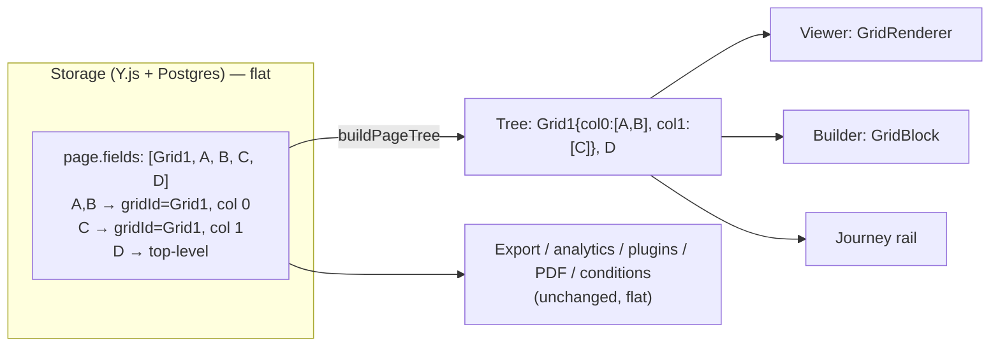

# Grid Layout (Column Containers) — Architecture & Implementation Plan

> Status: **Proposal — awaiting sign-off on the open decisions in §18**
> Scope: form-app (builder), form-viewer (public), `@dculus/types`, `@dculus/ui`, backend (Hocuspocus + consumers)
> Reference behaviour: Zoho Forms "Grid" (1 / 2 / 3-column containers, per-column % widths, drag-to-resize divider, floating settings/delete toolbar, drag fields into columns)

---

## 1. Goals and non-goals

### Goals
1. Form authors can drop a **Grid** (1, 2 or 3 columns; up to 4 via settings) onto a page and drag any non-grid field into its columns.
2. Column widths are adjustable (percentages, drag divider + numeric input).
3. The public viewer, preview, response-edit page and embeds render the same layout; columns **stack on narrow containers** (phones, narrow embeds, builder mobile frame).
4. Real-time collaboration (Y.js) keeps working, including concurrent edits to the same grid.
5. **Zero change to the response data model**: responses stay `{ [fieldId]: value }`. Analytics, exports, plugins, quiz grading, PDF templates, conditional logic keep working with no or near-zero change.

### Non-goals (v1)
- Nested grids (grid inside a grid column). Blocked in the UI and in the store.
- Row/column **spans**, per-row alignment, vertical alignment, per-column background/padding.
- Grid-level conditional logic targeting (deferred to §11, phase 5).
- Table/matrix questions (rows × columns of inputs). That is a different feature.

---

## 2. Reference behaviour

From the Zoho screenshot and general market behaviour (Zoho, Jotform, Tally, Fillout, Cognito):

| Behaviour | Zoho | Decision here |
|---|---|---|
| Palette group "Grid" with 1-/2-/3-Column tiles | Yes | Yes (new `layout` category) |
| Empty columns show a dashed "Drag and drop fields here" zone | Yes | Yes |
| Percentage label above each column (36 / 30 / 34) | Yes | Yes |
| Draggable divider between columns (yellow `<>` handle) | Yes | Yes, plus keyboard + numeric inputs |
| Floating gear + trash on the grid's edge | Yes | Yes (gear selects the grid → settings panel) |
| Fields keep their own card chrome inside the column | Yes | Yes, but a **compact** card variant (§8.3) |
| Columns stack on mobile | Yes | Yes, by container width (not viewport) |
| Nesting | Not supported | Not supported |

---

## 3. Current-state findings (verified in code)

These facts drive the architecture. Each was checked against the repository.

### 3.1 The schema is flat and read in ~90 files
- `FormPage.fields: FormField[]` ([packages/types/src/index.ts](../packages/types/src/index.ts)). A grep for `.fields` finds ~90 files that iterate `page.fields` directly (form-app, `packages/*`, backend services, plugins, PDF, export, analytics).
- Response data is keyed by field id only; `Response.data` never sees layout.

### 3.2 Unknown field types are dropped silently
- `deserializeFormField` returns `null` and only `console.warn`s for an unknown `type` (`default:` branch). `deserializeFormSchema` then filters it out. **An older client would silently lose a `grid_field`.**

### 3.3 Y.js field maps go through whitelists (3 client + 2 backend places)
Any property not listed is lost the first time a field is reordered, moved, duplicated or copied, because those actions run `extractFieldData` → `createYJSFieldMap` and recreate the Y.Map:
- Client: `FieldData` + `extractFieldData` in [CollaborationManager.ts](../apps/form-app/src/store/collaboration/CollaborationManager.ts); `createYJSFieldMap` / `serializeFieldToYMap` in [fieldHelpers.ts](../apps/form-app/src/store/helpers/fieldHelpers.ts); `updateField` in [fieldsSlice.ts](../apps/form-app/src/store/slices/fieldsSlice.ts).
- Backend: `reconstructFormSchema` (3 hard-coded branches: rich text, file upload, everything else) and `initializeHocuspocusDocument` (3 mirrored branches) in [hocuspocus.ts](../apps/backend/src/services/hocuspocus.ts).

Reorder is **delete + insert of a brand-new Y.Map**, not a move (`reorderFields`, `moveFieldBetweenPages`, `duplicateField`).

### 3.4 There are two field renderers
- Viewer / preview / response-edit: `SinglePageForm` → `FormFieldRenderer` ([packages/ui/src/renderers](../packages/ui/src/renderers)).
- Builder canvas: `FormArea` → `DraggableFieldCard` → `FieldCard` → `FieldPreview` ([PageBuilderFormArea.tsx](../apps/form-app/src/components/form-builder/tabs/PageBuilderFormArea.tsx), [PageBuilderFieldCard.tsx](../apps/form-app/src/components/form-builder/tabs/PageBuilderFieldCard.tsx)). `FormRenderer` in BUILDER mode is used only for the intro / thank-you screens.
- Consequence: a grid needs **two** renderers (viewer and builder), and a shared pure layout helper so they agree.

### 3.5 Builder drag-and-drop is flat, index-based, and has no sortable layer
- `@dnd-kit/core`. Fields use `useDraggable`; the only field drop targets are `DropIndicator` gap slots (`type: 'field-insert'`, `{pageId, insertIndex}`) and the whole-page `form-area` droppable. Cards are **not** droppable.
- `PageBuilderTab.handleDragEnd` handles `existing-field` only when `over` is `field-insert`; a new droppable payload shape would be silently ignored.
- Collision detection: `pointerWithin` first, then `rectIntersection`; the first collision wins ([PageBuilderTab.tsx](../apps/form-app/src/components/form-builder/tabs/PageBuilderTab.tsx)).
- There is a second, outer `DndContext` in `CollaborativeFormBuilder` whose `useDragAndDrop` branches look legacy/unreachable for fields (payload type `field` is never created). Do not extend it.
- Cards collapse to a header row while any drag is active (`shouldShowCompact`), so droppable rects **resize mid-drag**.
- No field-level undo; only the delete-toast `restoreField` and an AI-batch `Y.UndoManager`.
- Index anomaly: `addFieldAtIndex`, `duplicateField`, `restoreField`, `moveFieldBetweenPages` mix **raw** Y.Array indexes with **visual** (soft-delete-skipping) indexes. Grid actions must not build on these.

### 3.6 Selection, URL sync and keyboard navigation assume `page.fields` siblings
- `selectionSlice.setSelectedField`, `useBuilderSelectionUrlSync`, `RightSidebar`, and the keyboard handler in `FormArea` (Delete, Cmd+D, Alt+↑/↓, ↑/↓) all resolve fields through `page.fields`. **This keeps working for grid children** because they stay in `page.fields` (see §4); only the arrow-key logic needs grid awareness.

### 3.7 Renderer / validation hazards
- `isFillableField()` heuristics in [zodSchemaBuilder.ts](../packages/ui/src/utils/zodSchemaBuilder.ts), [FormFieldRenderer.tsx](../packages/ui/src/renderers/FormFieldRenderer.tsx), [fieldHelpers.ts](../apps/form-app/src/store/helpers/fieldHelpers.ts) and [utils.ts](../apps/form-app/src/components/form-builder/utils.ts) include `field.type !== FieldType.FORM_FIELD`, which is **true for every type**. A `GridField` would be treated as fillable: it would receive a Zod schema entry and a default `''` in `createPageDefaultValues`, leaking a `{ [gridId]: '' }` key into the store and possibly the submission payload. (Rich text already takes the same path; verify what happens to its key before shipping and exclude grids explicitly regardless.)
- `useFormValidation.showAllValidationErrors` loops `page.fields` — fine for flat storage.
- `evaluateConditions` auto-hides a page when **all** its field ids are hidden ([conditions.ts](../packages/types/src/conditions.ts)). A grid id is never hidden by rules, so a page containing a grid whose children are all hidden would not auto-hide.
- `formSchemaPublic` (public resolver) passes fields through as JSON after stripping `grading` — no change needed.

### 3.8 Responsive strategy
- Tailwind 3.4 with `tailwindcss-animate` only; **no container-query plugin**. `sm:`/`md:` are viewport media queries and **do not react to the builder's 390px phone frame**. The repo already works around this twice: `useContainerBreakpoint` (ResizeObserver, used by `IntroHero`) and the `MOBILE_CANVAS_CSS` shim ([mobileCanvasStyles.ts](../apps/form-app/src/components/form-builder/shared/mobileCanvasStyles.ts)).
- Available field width today: ~608 px (desktop, normal spacing, L1–L5/L7–L9), ~704 px (L6), ~334 px (390 px phone). Three columns on a phone would be ~100 px, so stacking is mandatory.
- Embeds render in an iframe, so viewport media queries see the iframe width; container queries also work there.

### 3.9 Consumers already tolerant of a non-fillable container
Most consumers gate on `field instanceof FillableFormField` or `'label' in field` (e.g. [unifiedExportService.ts](../apps/backend/src/services/unifiedExportService.ts) uses `'label' in field`, [responseCopyService.ts](../apps/backend/src/services/responseCopyService.ts), email plugin/handler, Responses page, `createResponsesColumns`). A `GridField` **with no `label` property** is skipped by all of them for free. The exceptions that compare against `RICH_TEXT_FIELD` explicitly are listed in §12.

---

## 4. Architecture options and decision

### Option A — Nested container
`GridField.columns: { id; width; fields: FormField[] }[]`

- ✅ Mirrors the visual model.
- ❌ ~90 consumers must recurse or flatten; any miss silently drops a field from export/analytics/validation.
- ❌ Y.js: nested `Y.Array` inside a field Y.Map; every reorder/move/duplicate must deep-copy it; whitelists must learn a recursive shape.
- ❌ Selection, URL sync, conditions, mentions, PDF designer, AI tools all need tree awareness.

### Option B — Flat list + parent pointer (**chosen**)
Grid is a non-fillable `GridField` in `page.fields`. Each child keeps its normal place in `page.fields` and gains two optional scalar props: `gridId` and `gridColumn`.

- ✅ **Membership is one scalar write** (atomic, LWW-safe in Y.js). Moving a field between columns changes two scalars.
- ✅ Every existing flat consumer keeps working and still sees all real fields. Grid is skipped like rich text.
- ✅ Selection, URL sync, conditions, response tables, export, analytics, PDF, plugins: unchanged.
- ✅ Old clients degrade gracefully (grid vanishes, children show as top-level) — with the caveat in §14.
- ⚠️ Requires a canonical-order invariant and a pure normalizer (§5.3). Mechanical whitelist plumbing for two props (§7).

### Option C — Grid holds ordered id lists
`GridField.columns: { width; fieldIds: string[] }[]`

- ✅ Children untouched.
- ❌ Two sources of truth (page order + id lists); moving a field edits two lists in one grid; duplicate/delete/restore/move-to-page must keep lists consistent; concurrent edits to an id list need `Y.Array<Y.Array<string>>` to merge well.

### Decision
**Option B.** Layout is derived from the flat list by a pure function in `@dculus/types` (`buildPageTree`), used by the viewer, the builder canvas, the rail and the server canonicalizer. Everything else keeps reading a flat list.



---

## 5. Data model

### 5.1 Types (`packages/types/src/index.ts`)

```ts
export enum FieldType { /* … */ GRID_FIELD = 'grid_field' }

export const MAX_GRID_COLUMNS = 4;
export const MIN_GRID_COLUMN_PERCENT = 10;

// Base class — optional, NOT constructor params (same pattern as FillableFormField.grading)
export class FormField {
  id: string;
  type: FieldType;
  deleted?: boolean;
  gridId?: string;      // id of the GridField this field lives in; absent = top level
  gridColumn?: number;  // 0-based column index inside that grid; absent = 0
}

export class GridField extends NonFillableFormField {
  columnWidths: number[]; // integer percentages, length 1..MAX_GRID_COLUMNS, sum === 100
  constructor(id: string, columnWidths: number[] = [50, 50]) {
    super(id);
    this.type = FieldType.GRID_FIELD;
    this.columnWidths = sanitizeGridColumnWidths(columnWidths);
  }
}
```

Notes:
- **No `label` property on `GridField`.** `'label' in field` is the export/analytics gate in several files; adding one would leak the grid into them. If a builder-only display name is ever wanted, call it `name`.
- Column **count is `columnWidths.length`** (single source of truth; no separate `columnCount`).
- Widths are integer percentages summing to 100 (matches Zoho's 36/30/34). Rendered as `minmax(0, Nfr)` tracks, so rounding never overflows.
- `deserializeFormField` gets a `GRID_FIELD` case, and a **generic post-step** that copies `gridId` / `gridColumn` for every type (validated: `gridId` string, `gridColumn` non-negative integer).

### 5.2 Invariants

| # | Invariant | Enforced by |
|---|---|---|
| I1 | A grid is always top-level. `gridId` on a `GridField` is ignored (no nesting). | `buildPageTree`, store guard |
| I2 | `gridId` must reference a live (non-deleted) `GridField` on the **same page**; otherwise the field is treated as top-level. | `buildPageTree` |
| I3 | `gridColumn` is clamped to `[0, columnWidths.length − 1]`. | `buildPageTree` |
| I4 | `columnWidths`: length 1..4, each ≥ `MIN_GRID_COLUMN_PERCENT`, sum = 100. Invalid input falls back to equal split. | `sanitizeGridColumnWidths` (types trust boundary, like `sanitizeConditions`) |
| I5 | **Canonical order**: in the flat list, a grid is immediately followed by its children ordered by (column, previous relative order). | `canonicalizeFields`; run by every grid-affecting store action and by the server on write |
| I6 | Position among siblings = relative flat index among fields sharing `(gridId, gridColumn)`. | store actions place by anchor |

Repairs are applied **on read** everywhere (tolerant) and **written back only by explicit user actions and by the server** (no client-side write storms from concurrent sessions).

### 5.3 Pure helpers — new `packages/types/src/grid.ts`

```ts
export type PageNode =
  | { kind: 'field'; field: FormField }
  | { kind: 'grid';  grid: GridField; columns: { index: number; widthPercent: number; fields: FormField[] }[] };

buildPageTree(fields: FormField[]): PageNode[]          // repairs I1–I3, drops deleted
flattenPageTree(nodes: PageNode[]): FormField[]         // canonical (I5) order
canonicalizeFields(fields: FormField[]): FormField[]    // flatten(build(fields)), keeps deleted at their relative spot
getGridChildren(fields, gridId): FormField[]
isLayoutField(field): field is GridField                // the ONE predicate consumers use
sanitizeGridColumnWidths(input: unknown, fallbackCount?: number): number[]
resizeAdjacentColumns(widths, dividerIndex, deltaPercent): number[]   // trades width between i and i+1, clamps to min
setColumnCount(widths, count): number[]                 // equalizes on change
visibleColumns(node, hiddenFieldIds): { fields, widthPercent }[]      // drops empty columns, renormalizes widths (viewer)
```

Exported from the `@dculus/types` barrel. **Do not import Tailwind/React here**; this stays pure so the backend can use it.

`deserializeFormSchema` calls `canonicalizeFields` per page, so every consumer that deserializes gets canonical order without further work.

### 5.4 Backward compatibility
- New optional props only; no migration for existing forms. Forms without a grid are byte-identical.
- `formSchema` travels as the `JSON` scalar everywhere (`schema.ts`: `formSchema: JSON`, `formSchemaPublic: JSON`), so GraphQL needs no change.

---

## 6. Canonicalization and conflict handling

Y.js merges concurrent edits at the property/array level, so the flat model can hold states no single user produced. Resolutions:

| Concurrent scenario | Resulting state | Resolution |
|---|---|---|
| A deletes a grid while B drops a field into it | child has `gridId` → deleted grid | I2: child renders top-level at its flat position |
| A shrinks 3→2 columns while B drops into column 2 | `gridColumn = 2` on a 2-col grid | I3: clamp to last column |
| A and B resize the same grid | `columnWidths` LWW (plain JSON array value, not `Y.Array`) | Last write wins; array is replaced atomically so the sum stays 100 |
| A moves field X out of grid while B reorders inside | X has no `gridId`; position from flat order | Top-level at its flat index; next grid action canonicalizes |
| A moves a grid while B adds a child | child not adjacent to grid until canonicalized | Tree is derived from pointers, so rendering is correct; server canonicalizes on store |

`columnWidths` is stored as a **plain JSON array** in the Y.Map (whole-array LWW), deliberately not a `Y.Array<number>`, so two concurrent resizes cannot interleave into a non-100 sum.

**Where canonicalization runs**
1. `deserializeFormSchema` (all readers of the DB schema).
2. `reconstructFormSchema` in Hocuspocus (so the persisted/DB copy and `getFormSchemaFromHocuspocus` consumers — export, analytics, plugins, public viewer — always get canonical order).
3. End of each grid-affecting store transaction (client).

---

## 7. Y.js, store and backend plumbing

### 7.1 Y.js shape
Field Y.Map gains scalar keys `gridId`, `gridColumn`; a grid Y.Map is `{ id, type: 'grid_field', columnWidths: number[], deleted? }`. No nested Y types.

### 7.2 Client whitelists (form-app)
| File | Change |
|---|---|
| [CollaborationManager.ts](../apps/form-app/src/store/collaboration/CollaborationManager.ts) | `FieldData` += `gridId?`, `gridColumn?`, `columnWidths?`; `extractFieldData` reads them for **every** type; `deserializePagesFromYJS` passes them to `deserializeFormField` |
| [fieldHelpers.ts](../apps/form-app/src/store/helpers/fieldHelpers.ts) | `FIELD_CONFIGS`, `createFormFieldInstance` case for `GRID_FIELD`; `createYJSFieldMap` copies the layout keys and skips validation for grids; `serializeFieldToYMap` handles the non-fillable grid branch and copies layout keys for fillable fields |
| [fieldsSlice.ts](../apps/form-app/src/store/slices/fieldsSlice.ts) | `updateField` generic `set` already handles scalars; add explicit `columnWidths` array handling (plain array, not Y.Array) |
| [fieldDataExtractor.ts](../apps/form-app/src/hooks/fieldDataExtractor.ts) | `FIELD_DATA_EXTRACTORS[GRID_FIELD]` |

Add one helper (`copyLayoutKeys(from, to)`) so future layout props are one edit, not five.

### 7.3 Backend ([hocuspocus.ts](../apps/backend/src/services/hocuspocus.ts))
- `reconstructFormSchema`: add a `grid_field` branch; in the three existing branches append `gridId` / `gridColumn` via a shared helper; run `canonicalizeFields` on each page's output.
- `initializeHocuspocusDocument`: mirrored `grid_field` branch + layout keys in all branches. This is used when creating a form from a template or duplicating one, so **templates and duplicated forms carry their grids**.
- Duplicating a form / using a template keeps field ids (JSON clone in `formService.duplicateForm`), so `gridId` references stay valid. Confirm the template-copy path (`createFormFromTemplate`) does not regenerate ids; if it ever does, it must remap `gridId`.
- [formMetadataService.ts](../apps/backend/src/services/formMetadataService.ts) counts fields per page from the Y.Doc; exclude `grid_field` from the field count (it is layout, not a question).

### 7.4 New store actions (`fieldsSlice`)
All actions run in one `ydoc.transact`, operate on **raw Y.Array indexes with id anchors** (not the visual-index APIs), and end with `canonicalize(pageMap)`.

```ts
addGrid(pageId, columns: 1|2|3|4, at?: { beforeNodeId?: string | null }): string
addFieldToGrid(pageId, type, data, target: GridTarget): string
placeField(args: { pageId; fieldId; target: PlaceTarget })          // move within page, into/out of/between columns
setGridColumnWidths(pageId, gridId, widths: number[])               // also handles count change; shrinking merges removed columns into the last column
ungroupGrid(pageId, gridId)                                         // children become top-level, in place
removeGrid(pageId, gridId, { deleteChildren: boolean })             // soft-delete grid (+ children)
restoreGrid(pageId, snapshot)                                       // undo toast
duplicateGrid(pageId, gridId)                                       // new ids for grid + children, gridId remapped

type GridTarget  = { gridId: string; column: number; beforeFieldId?: string | null };
type PlaceTarget = GridTarget | { gridId?: undefined; beforeNodeId?: string | null }; // top-level slot
```

Guards (throw/no-op with toast): dropping a grid into a grid; dropping a grid child onto another page without its grid (clears `gridId`/`gridColumn`); `moveFieldBetweenPages` / `copyFieldToPage` of a **grid** moves/copies its children with remapped ids; of a **child** clears layout keys.

Anchor-based placement (`beforeFieldId`) replaces integer insert indexes so concurrent inserts do not shift the intended slot.

### 7.5 What must NOT change
`extractFieldData` → `createYJSFieldMap` recreation on reorder stays (existing behaviour). It is safe once the layout keys are whitelisted.

---

## 8. Builder implementation

### 8.1 Palette
- New `FieldTypeConfig.category: 'layout'` in [FieldTypesPanel.tsx](../apps/form-app/src/components/form-builder/FieldTypesPanel.tsx) (also `getCategoriesConfig`, `FieldLibrary` `CATEGORY_ORDER`, `FieldPickerPopover` pills, [fieldTypeVisuals.ts](../apps/form-app/src/components/form-builder/shared/fieldTypeVisuals.ts)).
- Three tiles ("1 Column", "2 Columns", "3 Columns") share `FieldType.GRID_FIELD`. Add optional `FieldTypeConfig.preset?: { columns: number }` and make the draggable id `field-type-${idPrefix}${type}${preset ? '-' + preset.columns : ''}` to avoid dnd-kit id collisions (dnd-kit ids must be unique).
- [useFieldCreation.ts](../apps/form-app/src/hooks/useFieldCreation.ts) `createFieldData`: `GRID_FIELD` → `{ columnWidths: equalSplit(columns) }`.
- Click-to-add appends a grid at the end of the page (existing `handleAdd` path); drag-to-add uses top-level `field-insert` slots.
- `data-testid`: `field-type-1-column`, `field-type-2-columns`, `field-type-3-columns` (label-slug convention).
- Duplication trap: `getFieldTypeConfig` icon/label maps exist in `fieldTypeVisuals.ts`, `CompactFieldCard.tsx`, `FieldSettingsHeader.tsx`, `packages/utils/src/fieldTypeUtils.ts`, `field-drag-preview.tsx`. All need a `grid_field` entry.

### 8.2 Canvas: `GridBlock`
New component `tabs/PageBuilderGridBlock.tsx`, rendered by `FieldListWithDropZones` when `buildPageTree(page.fields)` yields a `grid` node. `FieldListWithDropZones` switches from iterating `page.fields` to iterating **top-level nodes**; top-level `DropIndicator` `insertIndex` becomes a *top-level node* index, converted to an anchor (`beforeNodeId`).

```
GridBlock  (data-testid="grid-block-{id}", selectable, aria-label)
├─ header: percent labels · toolbar (drag handle, settings, duplicate, delete)   ← floating on hover/selected, like Zoho
├─ columns wrapper  (CSS grid, tracks = minmax(0, Nfr))
│  ├─ GridColumn  (droppable "grid-column", data-testid="grid-column-{id}-{i}")
│  │  ├─ ColumnDropIndicator index 0  (droppable "grid-slot")
│  │  ├─ DraggableFieldCard (compact)  + ColumnDropIndicator …
│  │  └─ EmptyColumnPlaceholder  ("Drag and drop fields here")
│  └─ ColumnDivider  (resize handle between columns i and i+1)
```

The grid's own drag handle uses the existing `existing-field` payload so `PageBuilderTab.handleDragEnd` reorders it as a top-level node; the grid's card is **not** a drop target for other grids (I1).

### 8.3 Compact field card
`FieldCard` header packs grip, icon, label, badges, a Required switch and six action buttons — unusable at ~30% of ~608 px. Add `density?: 'default' | 'compact'`:
- Compact: single row; grip + type icon + truncated label; Required switch and Settings/Move-up/Move-down/Duplicate/Move-to-page/Delete collapse into a `⋯` menu (Settings also reachable by clicking the card).
- Column droppables use the compact variant automatically (prop from `GridColumn`).
- Keep `data-testid="draggable-field-{id}"` and `field-content-{n}` unchanged (they are used functionally, e.g. scroll-into-view).

### 8.4 Drag-and-drop protocol

New droppable payloads (extend the table in `handleDragEnd`):

| `over.data.current.type` | Registered by | Data | Handles |
|---|---|---|---|
| `field-insert` (existing) | top-level `DropIndicator` | `{ pageId, beforeNodeId }` | new field / existing field / new grid at top level |
| `grid-slot` (new) | `ColumnDropIndicator` | `{ pageId, gridId, column, beforeFieldId }` | new field / existing field into a column at a position |
| `grid-column` (new) | `GridColumn` body | `{ pageId, gridId, column }` | drop on empty space of a column → append |
| `form-area` (existing) | page card | `{ pageId }` | append at top level |

Rules:
1. `useDroppable({ disabled })` on `grid-slot` / `grid-column` when the active item is a grid (no nesting).
2. **Collision priority** (custom `collisionDetection`, replaces the current inline function): `grid-slot` > `grid-column` > `field-insert` > `form-area`; within the same priority use `pointerWithin` ordering, then `rectIntersection`. Implement with `data.current.priority` so it stays declarative. Today the first pointer hit wins, and the whole-page `form-area` droppable would otherwise swallow drops meant for a column.
3. **Measuring**: because cards collapse to a single row during drag (`shouldShowCompact`), set `measuring={{ droppable: { strategy: MeasuringStrategy.Always } }}` on the inner `DndContext` (or re-measure after the 300–400 ms collapse) so column rects are correct.
4. `handleDragEnd` gets two new branches that call `addFieldToGrid` / `placeField` / `addGrid`; existing top-level branches switch from integer `insertIndex` to `beforeNodeId` (the `finalPos` adjustment `insertIndex > sourceIndex ? insertIndex - 1 : insertIndex` disappears because anchors are position-independent).
5. `DragOverlay`: palette drags of a grid use `FieldTypeDisplay`; moving an existing grid uses a slim placeholder (not a full `FieldCard` with children).
6. Highlight-after-drop (`highlightNewField`) already diffs ids, so it works for children.
7. Do **not** touch the outer `DndContext` / `useDragAndDrop` / `useCollisionDetection` (legacy, unreachable for fields).

### 8.5 Column resize
Custom pointer handling (not dnd-kit), modelled on the sidebar resizer in [PageBuilderSidebar.tsx](../apps/form-app/src/components/form-builder/tabs/PageBuilderSidebar.tsx) but with `setPointerCapture`:
- Divider `role="separator" aria-orientation="vertical" aria-valuenow aria-valuemin aria-valuemax tabIndex=0`.
- During drag: keep widths in **local component state** and update CSS variable `--gc` at 60 fps; **commit once on pointer-up** via `setGridColumnWidths` (one Y transaction, avoids collab churn and full `pages` rebuild per pixel).
- Math: `resizeAdjacentColumns(widths, i, delta)` — only columns `i` and `i+1` trade width; clamp to `MIN_GRID_COLUMN_PERCENT`; snap to integers (5 % steps by default, 1 % with Shift — **decision D6**).
- Keyboard: ←/→ ±1 %, Shift+←/→ ±5 %, Home/End to min/max.
- Remote updates while dragging: ignore until pointer-up (local state wins), then reconcile.

### 8.6 Grid settings panel
`FieldSettingsV2.tsx` `switch (field.type)` gets `GRID_FIELD` → `GridSettings` in `field-settings-v2/` (export from `index.ts`):
- Column count (1–4) segmented control (shrinking merges columns, with a confirm toast "Fields in removed columns moved to column N").
- Per-column width number inputs (sum must be 100; "Distribute equally" button).
- Actions: Duplicate grid, **Ungroup** (keep fields), **Delete grid** (with fields; undo toast).
- Uses `FieldSettingsWrapper` so the delete footer and `field-settings-panel` testid behave like other fields. `useFieldEditor` needs no change (grid settings write through `setGridColumnWidths`, not the autosave form) — but add a `FIELD_DATA_EXTRACTORS` entry so it never falls into the base extractor.

### 8.7 Selection, keyboard, URL
- Selecting the grid = existing `setSelection({ kind: 'field', fieldId: gridId })` (works because the grid is in `page.fields`). Clicking a child selects the child (event `stopPropagation`).
- Keyboard handler in `FormArea`: ↑/↓ move through the **tree's reading order** (grid header → col0 fields → col1 fields → next node); ←/→ move across columns; Alt+↑/↓/←/→ reorder/move via `placeField`; Delete/Cmd+D on a grid use `removeGrid` / `duplicateGrid`.
- `useBuilderSelectionUrlSync` needs no change (children are in `page.fields`).
- Delete confirmation for a grid with children: undo toast via `restoreGrid` (consistent with fields) plus an inline "Ungroup instead" action.

### 8.8 Journey rail and thumbnails
- [JourneyRail.tsx](../apps/form-app/src/components/form-builder/rail/JourneyRail.tsx) numbering uses `page.fields.length`; count **non-layout** fields. [RailPageGroup.tsx](../apps/form-app/src/components/form-builder/rail/RailPageGroup.tsx) renders the grid as a collapsible parent chip with indented child chips; child chips keep the `existing-field` payload; `RailFieldInsertZone` gets an optional grid target.
- `PageThumbnail` / `DraggablePageItem` / `PageCard` are likely dead code (no JSX importers); add nothing there. Field-count labels (`Dashboard`, `CollaborativeFormBuilder`, `PageSelector`, …) should use a `countQuestionFields(page)` helper so grids are not counted as questions.

### 8.9 Builder mobile frame
The builder's `w-[390px]` frame uses `FormArea`, not the renderer. `GridBlock` uses the same container-query classes as the viewer (§9.2), so the frame stacks correctly **without** touching `MOBILE_CANVAS_CSS`. Add an e2e/visual check.

---

## 9. Viewer / renderer implementation

### 9.1 Rendering
[SinglePageForm.tsx](../packages/ui/src/renderers/SinglePageForm.tsx) currently maps `visibleFields` to `FormFieldRenderer`. Replace with:

```tsx
const tree = useMemo(() => buildPageTree(visibleFields), [visibleFields]);
{tree.map(node => node.kind === 'grid'
   ? <GridRenderer key={node.grid.id} node={node} …props />
   : <FormFieldRenderer key={node.field.id} field={node.field} … />)}
```

- New `packages/ui/src/renderers/GridRenderer.tsx`: computes `visibleColumns(node, hiddenFieldIds)`; if no visible field → renders nothing (no empty wrapper, no gap); else CSS grid with each column rendering its fields through the same `FormFieldRenderer` props (control, `fieldStyles`, `mode`, `requiredOverride`).
- `useForm`/RHF is name-based, so `Controller`s inside grid columns work unchanged; `zodSchemaBuilder`, `useFormInitialization`, `useFormValidation`, `useStoreSync` keep iterating flat `page.fields` — **except** they must skip layout fields (§9.3).
- The early "empty page" check stays on `page.fields.length`; change it to "no question fields and no grids with content" only if empty-grid-only pages should show the empty message (they should: use `countQuestionFields`).
- Pass `hiddenFieldIds` **before** building the tree so hidden children disappear and empty columns collapse.
- `FormRenderer.fieldToPageMap` (`page.fields?.forEach`) already maps children because they are in `page.fields`; no change.
- Add `data-testid="viewer-grid-{id}"` and `viewer-grid-column-{id}-{i}` (the wrapper currently has no field testids; e2e uses `input[name=<fieldId>]`).

### 9.2 Responsive: container queries, not viewport queries
Add `@tailwindcss/container-queries` to `packages/ui`, `apps/form-app`, `apps/form-viewer`, `apps/admin-app` (`tailwind.config.js` plugins). Pre-computed literal class strings (interpolated classes are not scanned — see the `embedShell.ts` comment):

```tsx
// wrapper: '@container w-full'
// per-column-count literal class:
2: 'grid grid-cols-1 gap-x-4 @md:[grid-template-columns:var(--gc)]'
3: 'grid grid-cols-1 gap-x-4 @lg:[grid-template-columns:var(--gc)]'
4: 'grid grid-cols-1 gap-x-4 @xl:[grid-template-columns:var(--gc)]'
style={{ '--gc': widths.map(w => `minmax(0, ${w}fr)`).join(' ') }}
```

Thresholds (`@md` 448, `@lg` 512, `@xl` 576 px) are starting points to tune in QA against ~608 px desktop card width and 334 px phones. Container queries resolve against the **form card**, so they work in the builder phone frame, `PreviewTab`, and embed iframes alike.

Fallback if the plugin is rejected: reuse `useContainerBreakpoint` with `useLayoutEffect` initial measure (avoids first-paint flash).

Horizontal gap: derive from layout spacing (compact/normal/spacious) next to the existing `withSpacing` helper in [theme.ts](../packages/ui/src/layouts/shared/theme.ts). Vertical gap remains each field's `mb-*` from `fieldStyles.container`.

### 9.3 Layout fields must be excluded from value plumbing
Replace the `type !== FieldType.FORM_FIELD` heuristic with an explicit `isLayoutField(field)` early return in:
- `createFieldSchema`, `createPageSchema`, `createPageDefaultValues`, `validatePageData`
- `useFormInitialization` (`getInitialValues` loop), `useFormValidation` (focus loop), `useFormSubmission`
- `FormFieldRenderer` (render `null` for grids defensively)
- [formHookUtils.ts](../packages/types/src/formHookUtils.ts) (`getDefaultValueForField`, `transformFormDataForSubmission`)

Acceptance: a submission through a grid form contains **no** key for the grid id.

### 9.4 Errors, focus, order
- Errors render under each field (`ErrorMessage`) and in the `viewer-page` summary; nothing changes.
- Tab/DOM order is column-major (col 0 top→bottom, then col 1). This matches the stacked mobile order and Zoho. `showAllValidationErrors` focus order follows flat canonical order = same.
- There is no scroll-to-first-error today; out of scope.

### 9.5 EDIT / PREVIEW / BUILDER modes
`GridRenderer` is mode-agnostic; `FormFieldRenderer` handles `mode`. Response-edit (`RendererMode.EDIT`) and Preview get grids automatically. BUILDER mode of `FormRenderer` is used only for intro/thank-you, so no builder-mode grid rendering is needed there.

### 9.6 Storybook
Add `grid_field` scenarios to `packages/ui/src/stories/mocks/index.ts` (`createGridPages`: 2-col, 3-col with uneven widths, hidden-children, empty grid) and stories in `PageRenderer.stories.tsx` / `FieldPreview.stories.tsx`.

---

## 10. Field-type touchpoint checklist for `GridField`

Follows [.claude/agents/new-field-generator.md](../.claude/agents/new-field-generator.md), adapted for a **layout** type (no value, no analytics, no filters, no quiz).

| Layer | File | Change |
|---|---|---|
| Types | `packages/types/src/index.ts` | `FieldType.GRID_FIELD`, `GridField`, `gridId`/`gridColumn` on `FormField`, `deserializeFormField` case + generic layout post-step, `deserializeFormSchema` canonicalize |
| Types | `packages/types/src/grid.ts` (new) + barrel | helpers in §5.3 |
| Types | `packages/types/src/validation.ts` | `getFieldValidationSchema` case (like `RICH_TEXT_FIELD`, ~L721) + `GridFormData` |
| Types | `packages/types/src/conditions.ts` | `evaluateTerm` default already rejects; exclude grids from `pageFieldIds` (auto-hide) — see §11 |
| Types | `packages/types/src/formHookUtils.ts` | skip layout fields |
| Utils | `packages/utils/src/fieldTypeUtils.ts` | icon map, translation key, `isFillableFieldType` false, **not** analytics-enabled |
| Utils | `packages/utils/src/fieldValueFormatters.ts` | `GRID_FIELD` case → `''` (~L288 beside rich text) |
| Utils | `packages/utils/src/mentionSubstitution.ts`, `packages/ui/src/utils/mentionFields.ts` | no change (filter on `label`); add a test |
| UI | `packages/ui/src/renderers/{SinglePageForm,GridRenderer,FormFieldRenderer}.tsx` | §9 |
| UI | `packages/ui/src/field-preview.tsx`, `field-drag-preview.tsx` | preview/icon/label for palette + overlay |
| UI | `zodSchemaBuilder.ts`, `useFormInitialization.ts`, `useFormValidation.ts` | §9.3 |
| Builder | `FieldTypesPanel`, `FieldLibrary`, `FieldPickerPopover`, `fieldTypeVisuals`, `CompactFieldCard`, `FieldSettingsHeader`, `useFieldCreation`, `FieldSettingsV2`, `field-settings-v2/GridSettings.tsx`, `fieldDataExtractor` | §8 |
| Builder | `PageBuilderFormArea`, `PageBuilderFieldCard` (density), `PageBuilderTab` (dnd), `PageBuilderGridBlock` (new), `rail/*` | §8 |
| Builder | `store/{collaboration/CollaborationManager, helpers/fieldHelpers, slices/fieldsSlice}` + `setupTests.ts` mock class | §7 |
| Backend | `services/hocuspocus.ts`, `services/formMetadataService.ts` | §7.3 |
| Backend | `fieldAnalytics/index.ts`, `fieldAnalyticsService.ts`, `fakeResponseService.ts`, `pdfTemplateService.ts`, `migrate-quiz-plugin-to-native.ts` | §12 |
| i18n | `apps/form-app/src/locales/{en,ta}/{fieldTypesPanel,common,…}.json` + new `gridLayout.json` (register in `locales/index.ts`) | §14 |

---

## 11. Conditional logic

### v1 (phase 2)
- Grids are **not** selectable as rule targets or triggers (`conditionFieldConfig.ts` already skips `RichTextFormField`; extend the skip to `isLayoutField`).
- `evaluateConditions` / `detectConditionCycles`: build `pageFieldIds` **excluding** layout fields, so a page whose real fields are all hidden still auto-hides. No other change: children are ordinary ids in `hiddenFieldIds`, `stripHiddenResponses` and `requiredOverrides`.
- Viewer: a grid with zero visible children renders nothing; hidden columns collapse and widths renormalize among the remaining columns (**decision D4**).

### v1.1 (phase 5, optional)
Allow `showField` / `hideField` on a grid id: expand to children inside `evaluateConditions` before the fixed-point loop (treat a hidden grid as hiding all its children so validation and `stripHiddenResponses` see them). Requires: UI target picker entry ("Group: …"), `LogicSimulator`/`logicVisuals` labels, cycle-detection expansion (`ruleAffects` includes children), and tests for oscillation with expanded targets.

---

## 12. Downstream consumers

Legend: **A** safe as-is · **B** one-line skip needed · **C** behaviour decision.

| Consumer | Verdict | Notes |
|---|---|---|
| `unifiedExportService` (`'label' in field`) | A | Grid has no `label` |
| `responseCopyService`, email plugin handler, `EmailPluginDialog`, email `ConfigForm` (`instanceof FillableFormField`) | A | |
| `Responses.tsx`, `createResponsesColumns`, `PdfTemplates.tsx`, `AutomationBuilder.tsx` (`instanceof FillableFormField`) | A | |
| `gradingEngine`, `quizGrading.ts`, quiz `ConfigForm` | A | Grid never has `grading` |
| `mentionFields`, `mentionSubstitution` (`label`) | A | Add a test |
| Google/Microsoft Sheets, webhook, ai-tagger handlers | A | Payload is `response.data` |
| `conditionalStrip.ts`, `stripHiddenResponses` | A | Children are normal ids |
| `fieldAnalytics/index.ts` (~L242: excludes `RICH_TEXT_FIELD` / `NON_FILLABLE_FORM_FIELD`), `fieldAnalyticsService.ts` (~L981: excludes only rich text + `FORM_FIELD`) | **B** | Add `GRID_FIELD` or use `isLayoutField`; otherwise `getFieldAnalytics` throws "Unsupported field type" |
| `graphql/resolvers/fieldAnalytics.ts` `supportedTypes` | A | Hard gate; grid never requested |
| `fakeResponseService.ts` (~L38) | **B** | Skip layout fields |
| `pdfTemplateService.ts` (~L284, L333, L366), `PdfTemplateDesigner.tsx` (~L142) | **B** | Skip layout fields when building palette/inputs |
| `migrate-quiz-plugin-to-native.ts` `NON_GRADABLE_FIELD_TYPES` | **B** | Add `grid_field` |
| `CompactFieldCard`, `FieldChangeCard` (response history) | **B** | Cosmetic label/icon |
| `formMetadataService` (field count) | **B** | Exclude grids |
| Field counts in `Dashboard`, `CollaborativeFormBuilder`, `PageSelector`, `JSONPreview`, `JourneyRail` | **C** | Use `countQuestionFields(page)` |
| `applyAIOp.ts`, `aiFormEditTools.ts`, `aiChat.ts` | **C** | §13 |
| `templateService` (`stripDeletedFields`) | **C** | Also drop children whose grid is deleted (or leave — I2 repairs them) |
| `formSchemaPublic` resolver | A | JSON pass-through; strips `grading` only |

Introduce a single predicate (`isLayoutField`) and migrate the "B" sites to it instead of adding more `type !== …` comparisons.

---

## 13. AI form builder

- `aiFormEditTools.ts` `listFields` should **hide grid_field entries** (AI reasons about questions) but may expose `gridId` for context. AI-added fields go top-level (unchanged).
- AI `removeFields` / `REORDER` / `relocateField` operate on ids through the store, which now guards grid membership (`moveFieldBetweenPages` clears `gridId`; `reorderFields` followed by canonicalize keeps children attached to their grid). Add regression tests in `applyAIOp.test.ts`.
- **No `addGrid` AI tool in v1.** If added later, it must be added to all six independent token maps listed in the field-generator guide (`FIELD_TYPE_TOKENS`, `STORED_TYPE_TO_TOKEN`, `listFields` `TYPE_MAP`, `addField` enum, `applyAIOp AI_TYPE_MAP`, `AIFormBar`/`CreateFormWizard` maps).

---

## 14. Rollout, compatibility, i18n, a11y, security, performance

### Rollout / mixed-version risk
- Older frontend bundles (cached tabs, Cloudflare Pages propagation) do not know `gridId`/`gridColumn`. If such a client **reorders, duplicates or moves** a child, its `extractFieldData` whitelist **drops the layout keys**, silently ungrouping the field for everyone.
- Mitigation: (1) ship types + Y.js plumbing + viewer (phases 1–2) first — invisible, no grid can be authored; (2) gate palette entries behind `VITE_ENABLE_GRID_LAYOUT` (no feature-flag system exists in the repo today; env var is the lightest option, **decision D7**); (3) enable after deploy propagation; (4) stale-bundle nudge is acceptable since the collab provider already reconnects.
- Old **viewers** ignore layout keys and render children top-level in canonical order (graceful).

### i18n (mandatory: `en` + `ta`)
New namespace `gridLayout` (`apps/form-app/src/locales/{en,ta}/gridLayout.json`, registered in `locales/index.ts`): palette labels, empty-column text, column labels, settings, delete/ungroup dialogs, toasts, aria labels ("Resize columns", "Column 1 of 3, 36 percent"). Add `fieldTypes.grid_field` to `common.json` and palette entries to `fieldTypesPanel.json`. Viewer-side strings: none visible.

### Accessibility
- Divider: `role="separator"`, keyboard operable, value announced.
- Grid block: `role="group"` with `aria-label`; column zones labelled; customize dnd-kit `accessibility.announcements` so keyboard/screen-reader drags announce "column N of M".
- Viewer: no landmark roles added (visual grouping only); DOM order == stacked order.

### Security / validation
- `columnWidths`, `gridId`, `gridColumn` come from persisted JSON / Y.js: validated at the trust boundary in `deserializeFormField` (`sanitizeGridColumnWidths`, integer/non-negative checks, id must be a string ≤ existing id length limits). Widths are emitted into a CSS custom property, so only numbers are ever interpolated (never raw strings) — no CSS injection.
- Limit: max 4 columns, and a soft cap of 50 children per grid to bound render cost.
- No new endpoints, no auth-model change; grids inherit the existing form permission checks (`EDITOR` to modify).

### Performance
- `updateFromYJS` rebuilds the entire `pages` array on every change (no incremental diff); resize commits once per gesture to avoid this.
- `buildPageTree` is O(n) per page; memoize on `page.fields` identity in `FormArea` and `SinglePageForm`.
- Container queries cost nothing at runtime; no `ResizeObserver` per grid.

---

## 15. Delivery plan

Each phase ships as its own PR(s), independently valuable and safe to merge (nothing user-visible until phase 4).

### Phase 0 — Spikes and decisions (blocking questions in §18)
- Prove container-query stacking in the builder phone frame, `PreviewTab`, and an embed iframe (add the plugin to one app first).
- Prototype the dnd-kit priority collision + `MeasuringStrategy.Always` with a hard-coded 2-column block; confirm dropping into a column beats `form-area`.
- Confirm rich-text default-value behaviour (§3.7) to decide whether a pre-existing bug needs its own fix.

### Phase 1 — Types, helpers, persistence (invisible)
**Tasks**
1. `FieldType.GRID_FIELD`, `GridField`, `gridId`/`gridColumn`, `deserializeFormField` case + layout post-step, `sanitizeGridColumnWidths`.
2. `packages/types/src/grid.ts` helpers + barrel export; `deserializeFormSchema` canonicalizes.
3. Client Y.js plumbing (§7.2) with `copyLayoutKeys`; `setupTests.ts` mock.
4. Backend `hocuspocus.ts` read/write branches + canonicalization; `formMetadataService` count.
5. `validation.ts`, `fieldTypeUtils.ts`, `fieldValueFormatters.ts` cases.

**Acceptance**: round-trip tests (types → Y.Doc → backend reconstruct → deserialize) preserve grids for all field types; reorder/duplicate/move of a child keeps `gridId`/`gridColumn`; forms without grids are byte-identical; a hand-built grid JSON loads without errors.

### Phase 2 — Viewer, preview, edit-response rendering; consumer skips
**Tasks**: §9 (GridRenderer, container queries plugin, exclusions in §9.3), §11 v1 evaluator change, §12 "B" rows, Storybook mocks.
**Acceptance**: a form seeded with a 3-column grid renders on desktop and stacks at narrow container widths in viewer, preview, embed and builder mobile frame; validation errors show in columns; submission payload has no grid key; hidden children collapse columns; analytics/export/PDF/email with a grid form are unchanged.

### Phase 3 — Builder authoring (behind `VITE_ENABLE_GRID_LAYOUT`)
**Tasks**: §8.1–§8.6, store actions §7.4, compact card, `GridBlock`, resize, settings panel.
**Acceptance**: add 1/2/3-col grid by click and drag; drop new/existing fields into columns at a position; move between columns and out; resize by divider, keyboard and inputs; changes sync between two browser sessions; nesting blocked.

### Phase 4 — Builder polish
**Tasks**: §8.7 keyboard model, §8.8 rail, ungroup / delete-with-fields / duplicate / move-to-page semantics, undo toasts, `MOBILE` preview check, empty-state and selection visuals, `ta` translations.
**Acceptance**: every action in the action matrix below works and is undoable where the equivalent field action is.

### Phase 5 — Integrations (optional/incremental)
Condition targeting of grids (§11 v1.1), AI regression tests / optional `addGrid` tool (§13), grid-aware templates (seed a "Contact details" 2-col template), grouped display in the individual-response view.

### Phase 6 — Tests, docs, rollout
E2E features, cross-browser (Safari/Firefox container query support), flag removal, update `CLAUDE.md` / `.github/copilot-instructions.md` field-class hierarchy and the new-field-generator agent notes.

### Action matrix (Phase 3/4 acceptance)

| Action | Expected |
|---|---|
| Add grid via palette click | Appended at page end, selected, empty columns show placeholder |
| Drag grid tile to top-level slot | Inserted at slot |
| Drag new field tile into column slot | Field created with `gridId`/`gridColumn`, positioned before anchor |
| Drag existing field top→column / column→column / column→top | Layout keys updated; order correct; card highlight |
| Drag grid into grid | Rejected (no drop indicator) |
| Reorder grid among top-level nodes | Children travel with it (canonical order) |
| Resize divider | Live preview, single commit on release, sum stays 100 |
| Change column count 3→2 | Removed column's fields append to last column; toast |
| Ungroup | Children become top-level in place; grid removed |
| Delete grid | Grid + children soft-deleted; undo toast restores all |
| Duplicate grid | New ids for grid and children; `gridId` remapped |
| Move grid to another page | Children move with it |
| Move a child to another page | Layout keys cleared; lands top-level |
| Conditions hide all children | Grid disappears; page auto-hides if nothing else visible |

---

## 16. Testing strategy

**Unit — `@dculus/types` (vitest/jest as per package)**
- `grid.test.ts`: `buildPageTree` repair cases (orphan, deleted grid, out-of-range column, nested grid, deleted child), `flattenPageTree` canonical order, `sanitizeGridColumnWidths` (NaN, negatives, sum ≠ 100, wrong length), `resizeAdjacentColumns` clamping, `setColumnCount`.
- Serialization round-trip for a grid form (extend `deserialization.test.ts`, `conditions.serialization.test.ts`).
- `conditions.evaluator.test.ts`: page auto-hide ignores grid; hidden-children strip.

**Unit — form-app (jest)**
- New `store/slices/__tests__/gridSlice.test.ts` built on the real `Y.Doc` pattern used by `gradingRoundTrip.test.ts`: `addGrid`, `addFieldToGrid`, `placeField` (all directions), `setGridColumnWidths` (count change), `ungroupGrid`, `removeGrid`/`restoreGrid`, `duplicateGrid`, cross-page move/copy, guards, and that `reorderFields`/`duplicateField` preserve layout keys.
- `FieldPickerPopover.test.tsx` / `FieldLibrary.test.tsx`: grid tiles, unique draggable ids.
- `applyAIOp.test.ts`: AI reorder/relocate with grid children.
- `GridSettings` component test (widths sum, count change).
- Collision-detection unit test for the priority function.

**Unit — backend (vitest, coverage thresholds 80/78 apply)**
- `hocuspocus.test.ts`: `reconstructFormSchema` / `initializeHocuspocusDocument` with a grid; canonical order output; unknown `gridId`.
- `fieldAnalytics` index/service: grid excluded (no "Unsupported field type").
- `pdfTemplateService`, `fakeResponseService`, `formMetadataService`, `responseCopyService`, `unifiedExportService`: grid form yields no extra columns/rows.

**Unit — UI/viewer (vitest)**
- `GridRenderer` and `SinglePageForm`: columns, hidden children, empty grid, widths → tracks, validation error inside column, no grid key in submitted values.
- `zodSchemaBuilder`: layout fields skipped.

**E2E (Playwright + Cucumber, `test/e2e`)**
- `grid-layout.feature` (builder): add grid by click (`field-type-2-columns` via `addFieldToPage` pattern), add fields into columns via `dragOnto`, resize via keyboard, ungroup, delete + undo, two-session collaboration check.
- `grid-layout-viewer.feature`: fill fields inside columns; required error inside a column; stacking at 390 px; submit and verify response data has field values only.
- Note: existing e2e uses click-to-add for fields and a manual `mouse` helper for drags (5 px activation distance in the live `PageBuilderTab`, although the helper comment says 8 px); column drops need the helper's slow `steps: 50` move.
- Tag `@grid`; keep out of the default run only if flaky (`@skip-ci`).

**Integration (Cucumber API)**: create form with a grid schema via GraphQL, read it back via `formSchemaPublic`, submit a response, verify export columns.

**Manual matrix**: Chrome/Safari/Firefox, embed iframe at 320/375/768, L1–L9 layouts (esp. L6 at 704 px and L4/L7 hero variants), dark theme, RTL not supported today (skip).

---

## 17. Risks

| Risk | Impact | Mitigation |
|---|---|---|
| Old clients strip `gridId` on reorder/duplicate | Silent ungrouping | Phase ordering + flag (§14); server never trusts layout for correctness |
| Collision priority breaks existing top-level drops | Regression of the core builder | Keep existing branches + payloads; tests for collision fn; e2e reorder scenarios (`journey-rail.feature`) stay green |
| Droppable rects resize mid-drag | Mis-drops into wrong slot | `MeasuringStrategy.Always`; verify in spike |
| Compact card loses discoverability | UX | `⋯` menu + click-to-select; user test |
| Container-query support (Safari < 16) | Unstacked columns on very old devices | Acceptable (Safari 16 is 2022); fallback hook available |
| Non-fillable heuristics leak grid into values | Wrong payload / validation | §9.3 + explicit test |
| Y.js concurrent edits produce odd flat order | Layout flicker | Tree derived from pointers; server canonicalization |
| 4-column grid at ~608 px is cramped | Poor UX | Stack threshold `@xl`; consider capping at 3 (D1) |

---

## 18. Open decisions (need your call)

| ID | Question | Recommendation |
|---|---|---|
| D1 | Max columns: 3 (Zoho palette) or 4? | Palette offers 1/2/3; settings allow up to 4 |
| D2 | Allow rich text (and other non-fillable) inside grids? | Yes |
| D3 | Nested grids? | No (v1) |
| D4 | Hidden/empty columns: collapse and renormalize, or keep space? | Collapse and renormalize |
| D5 | Add `@tailwindcss/container-queries` or reuse `useContainerBreakpoint`? | Plugin (declarative, works in builder frame and embeds) |
| D6 | Resize snapping: 1 % or 5 %? | 5 % default, Shift for 1 % |
| D7 | Feature-flag mechanism | `VITE_ENABLE_GRID_LAYOUT` env var until stable |
| D8 | Grid conditional targeting in v1? | Defer to phase 5 |
| D9 | Should a 1-column grid exist? | Yes (Zoho parity; acts as a visual group/section container) |

---

## 19. Suggested PR slicing

1. `feat(types): grid field type, layout props and pure layout helpers` (phase 1a)
2. `feat(collab): persist grid layout through Y.js and Hocuspocus` (phase 1b)
3. `feat(viewer): render grid layouts with container-query stacking` (phase 2, includes consumer skips)
4. `feat(builder): grid palette, columns, drag-and-drop and settings (flagged)` (phase 3)
5. `feat(builder): grid keyboard, rail, ungroup/duplicate/delete polish` (phase 4)
6. `test(e2e): grid layout scenarios` + docs updates (phase 6); phase 5 items as separate follow-ups
